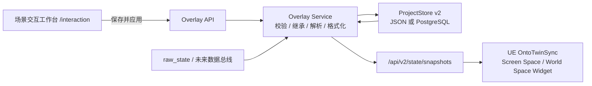

# OntoTwin 3.7 顶部信息面板垂直链路 (PRD)

> 状态：需求确认完成，待开发
> 主线：OntoTwin Nexus / 场景交互能力层 / UE Runtime
> 日期：2026-07-14
> 前置：3.6 Pixel Streaming 基线
> 目标版本：3.7

---

## 1. 背景

现有 `I3D_Behavioral.ui_label_content` 只能驱动 UE 中的单行 `TextRenderComponent`，适合兼容历史标签，但无法表达结构化信息面板、字段绑定、模板布局、类型继承、实例覆盖和批量配置。

3.7 新增独立能力接口 `I3D_Overlay`，打通以下垂直链路：

```text
ObjectType 声明能力与默认配置
  -> Instance 稀疏覆盖
  -> ProjectStore v2 持久化
  -> 后端解析继承、字段和展示格式
  -> /api/v2/state/snapshots 下发解析后的面板数据
  -> UE 在模型顶部渲染信息面板
```

本功能属于“场景交互能力层”：平台负责面板如何配置、绑定、同步和呈现；运维监控或未来数据总线负责提供业务数据、状态判断和告警语义。二者通过字段绑定连接，不把业务规则写进 UE 模板。

---

## 2. 目标

### 2.1 产品目标

- 用户可以为 ObjectType 配置标准化的顶部信息面板。
- 用户可以为单个实例覆盖内容配置，也可以批量覆盖同类型实例。
- 用户只能选择平台模板并绑定字段，不能任意修改字体、颜色或布局。
- 工作台在不启动 UE 的情况下使用真实实例数据实时预览。
- UE 支持“选中显示”和“常显”两种模式。
- 配置按 revision 增量同步，实时值变化不重建 Widget。
- JSON ProjectStore 与 PostgreSQL ProjectStore 使用同一份 v2 语义。

### 2.2 成功标准

- 类型默认配置、实例覆盖、批量覆盖、继承恢复形成完整闭环。
- 从工作台点击“保存并应用”后，UE 在下一轮快照中应用完整配置。
- 20 至 100 个 `always` 面板的典型场景可运行，不因每次轮询重建全部 Widget。
- 旧项目和 `I3D_Behavioral.ui_label_content` 保持兼容。

---

## 3. 范围

### 3.1 3.7 必做

- 新增 `I3D_Overlay` 接口定义。
- 新增四个系统模板：
  - `title_body`
  - `title_subtitle_body`
  - `title_metrics`
  - `title_status_metrics`
- 支持显式字段绑定和轻量展示格式化。
- 支持 ObjectType 默认配置和 Instance 稀疏覆盖。
- 支持同类型实例批量覆盖。
- 新增统一“场景交互工作台”及上下文快捷入口。
- ProjectStore 正式增加 `schema_version`，3.7 数据结构为 v2。
- 快照新增解析后的 `I3D_Overlay` 数据和 `config_revision`。
- UE 支持 Screen Space 选中面板和 World Space 常显面板。
- 支持模型包围盒顶部自动锚定及 XYZ 偏移。
- 支持空值、离线状态和中等规模渲染保护。

### 3.2 3.7 不做

- 不支持视频 URL 或视频播放；计划放入 3.7.x。
- 不支持用户自定义字体、字号、颜色、边框和自由布局。
- 不支持公式、阈值判断、业务状态映射和单位换算规则。
- 不支持跨 ObjectType 批量修改。
- 不支持面板固定、多选、多面板对比。
- 不支持 Hover 触发和告警自动弹出。
- 不支持复杂标签避让、聚合和远距离分层标签系统。
- 不支持 Socket 锚点的首轮验收，仅在契约中预留扩展位置。
- 不新增权限系统、审核流或草稿发布系统。
- 不替换现有 `/api/v2/state/snapshots` 同步主链路。

---

## 4. 核心决策

| 主题 | 3.7 决策 |
| --- | --- |
| 能力边界 | 新增 `I3D_Overlay`；旧 `I3D_Behavioral.ui_label_content` 保留兼容 |
| 配置归属 | ObjectType 声明能力和默认配置，Instance 保存稀疏覆盖 |
| 内容模型 | 显式字段绑定，不自动展示全部 `raw_state` |
| 设计模型 | 系统模板 + 类型化槽位，用户不控制视觉样式 |
| 工作台 | 统一场景交互工作台，上下文入口同标签页跳转 |
| 批量能力 | 类型默认传播 + 同类型实例批量覆盖 |
| 显示模式 | `selected` 与 `always`，默认 `selected` |
| 空间渲染 | `selected` 使用 Screen Space；`always` 使用 World Space |
| 锚点 | 模型 bounds 顶部 + 可选 XYZ 偏移，单位 cm |
| 数据处理 | 数据总线负责业务语义；Overlay 只做展示格式化 |
| 空值 | 必填槽位显示 `empty_text`；可选槽位隐藏 |
| 离线 | 保留最后值并显示离线状态、弱化内容 |
| 选中生命周期 | 单面板；选择其他模型切换；点击空白或 `Esc` 关闭 |
| 前端预览 | 浏览器使用真实实例值实时预览，不依赖 UE |
| 保存语义 | 本地预览，点击“保存并应用”后原子保存并同步 |
| 同步语义 | 配置 revision 变化才重建布局；实时值只更新内容 |

---

## 5. 总体架构



后端是唯一解析者：UE 不读取 ProjectStore，不解析字段路径，也不执行继承或业务格式化。

---

## 6. `I3D_Overlay` 能力契约

### 6.1 接口注册

在系统接口注册表中新增：

```json
{
  "rid": "I3D_Overlay",
  "label": "顶部信息面板接口",
  "tier": "child",
  "required": false,
  "description": "赋予三维对象按标准模板展示结构化顶部信息的能力。"
}
```

约束：

- `I3D_Overlay` 是 `I3D_Representable` 的子能力。
- 挂载和移除继续复用现有接口注入 API。
- 类型未挂载 `I3D_Overlay` 时，不生成新面板数据。
- 同时存在 `I3D_Overlay` 和旧标签时，新面板优先，避免重复显示；移除或禁用 Overlay 后恢复旧标签行为。

### 6.2 模板与槽位

| 模板 ID | 必填槽位 | 可选槽位 | 用途 |
| --- | --- | --- | --- |
| `title_body` | `title` | `body` | 简介、说明、备注 |
| `title_subtitle_body` | `title` | `subtitle`, `body` | 分层文本信息 |
| `title_metrics` | `title` | `metrics` 1-4 项 | 设备指标 |
| `title_status_metrics` | `title`, `status` | `metrics` 1-4 项 | 运行状态和关键指标 |

模板定义由平台代码维护，不写入项目数据。项目只保存 `template_id` 和槽位配置。具体字号、间距、截断行数在视觉原型阶段调整，不改变数据契约。

### 6.3 绑定来源

每个槽位必须显式选择一种来源：

```text
literal       固定文本
instance      实例元数据，如 id、display_name
object_type   类型元数据，如 name、category
raw_state     实时状态字段
```

绑定示例：

```json
{
  "source": "raw_state",
  "path": "temperature"
}
```

3.7 只允许对象字段路径，不支持数组索引、表达式、函数调用或跨实例引用。工作台字段选择器从 ObjectType 属性定义、实例元数据和当前 `raw_state` 生成候选字段目录。

不同槽位使用固定的数据形态：

- 文本槽位：一个文本绑定。
- 指标槽位：`label` + 一个值绑定，每个指标有稳定 `id`。
- 状态槽位：一个展示文本绑定 + 一个标准状态等级绑定。

状态等级只接受：

```text
normal, info, warning, critical, offline, unknown
```

数据总线负责把业务状态转换为上述等级；Overlay 只根据等级使用模板内置的状态样式。无法识别的等级统一按 `unknown` 处理。

### 6.4 展示格式化

Overlay 可以配置：

- 小数位数 `precision`
- 展示单位 `unit`
- 日期时间格式 `datetime_format`
- 空值文本 `empty_text`，默认 `--`
- 文本最大长度 `max_length`

Overlay 不执行：

- 数值计算或单位归一化
- 告警阈值判断
- 状态码翻译
- 业务枚举映射

上述业务处理由数据总线完成，Overlay 接收可直接展示的值或标准化状态。

### 6.5 空值和离线

- 必填槽位为空：保留槽位并显示 `empty_text`。
- 可选槽位为空：隐藏该槽位，模板自动收拢空间。
- 标题等关键槽位由模板默认设为必填；补充字段默认可选。
- 实例离线：保留最后一次成功值，显示“离线”标识并弱化内容。
- 3.7 使用实例级 `online` 判断，不提供字段级过期判断。

---

## 7. 配置继承与 revision

### 7.1 继承规则

```text
ObjectType 完整默认配置
  + Instance 稀疏覆盖
  = Instance 最终有效配置
```

实例允许覆盖：

- `enabled`
- `template_id`
- 标题和其他槽位内容
- 槽位字段绑定及展示格式

实例不能覆盖模板视觉样式。删除某个覆盖字段表示恢复继承；删除整份实例覆盖表示完全恢复类型默认配置。

### 7.2 revision 规则

- 类型配置和实例覆盖分别保存单调递增的 `revision`。
- 类型保存成功后只递增类型 revision。
- 实例保存或清空覆盖成功后只递增该实例 override revision。
- 快照中的 `config_revision` 是由二者组成的不可解释 token，例如 `t12-i7`。
- UE 只比较 token 是否变化，不对 token 做算术。
- `raw_state` 实时变化不增加配置 revision。
- 批量保存成功后，每个目标实例的 override revision 各增加一次。

---

## 8. 前端需求

### 8.1 页面和入口

新增页面与路由：

```text
/interaction
frontend/interaction.html
```

上下文入口：

```text
ObjectType 页面
  -> /interaction?target=type&type_rid=<rid>&from=<source>

Instance 页面
  -> /interaction?target=instance&instance_id=<id>&from=<source>
```

行为：

- 同标签页跳转。
- 工作台自动定位目标对象。
- 保留来源参数和返回入口。
- 无效或非当前激活项目的目标显示明确错误，不回退到其他项目。

### 8.2 工作台布局

工作台采用三个连续区域，不使用多层卡片：

```text
左侧：对象范围
  类型 / 实例上下文
  实例筛选与同类型批量选择

中部：配置编辑
  启用状态 / 模板 / 显示模式 / 锚点
  槽位绑定 / 格式化 / 继承状态

右侧：实时预览
  当前实例数据
  在线或离线状态
  校验问题
```

样式遵循 OntoTwin 极简黑白灰规范；状态色只用于小面积语义提示。

### 8.3 类型配置流程

1. 进入工作台并选中 ObjectType。
2. 挂载或确认已挂载 `I3D_Overlay`。
3. 选择模板和显示模式。
4. 为槽位选择固定文本或字段绑定。
5. 选择该类型的一个实例作为真实数据预览样本。
6. 在右侧即时查看空值、格式化和长文本效果。
7. 点击“保存并应用”。
8. 后端整体验证并保存，成功后 UE 在下一轮快照应用。

### 8.4 实例覆盖流程

- 工作台同时展示“继承值”和“当前覆盖值”。
- 用户只修改的字段进入稀疏覆盖。
- 每个覆盖字段都提供“恢复继承”操作。
- 清空全部覆盖后，实例继续使用类型默认配置。

### 8.5 批量覆盖

- 只允许选择同一 ObjectType 的实例。
- 批量编辑只修改用户本次明确选择的字段，不覆盖其他实例已有的无关覆盖。
- 后端先验证全部实例，再一次性保存；任一实例失败则整批不生效。
- 如果目标是该类型的全部实例，工作台提示优先修改类型默认配置。
- 3.7 不提供跨类型批量配置。

### 8.6 保存状态

- 编辑过程保留在浏览器内，只更新右侧预览。
- 有未保存修改时显示轻量脏状态。
- “保存并应用”期间禁用重复提交并显示加载态。
- 保存成功后刷新 revision 和继承结果。
- revision 冲突时不覆盖服务端新值，提示用户重新加载后再提交。

---

## 9. 后端设计

### 9.1 模块边界

新功能放入独立目录，不继续扩张 `backend/app.py`：

```text
backend/overlay/
  __init__.py
  api.py          路由和 HTTP 错误映射
  service.py      继承、解析、格式化、批量事务
  schema.py       模板、字段和请求校验
```

`app.py` 只增加模块注册和必要依赖注入。Overlay 模块通过 ProjectStore 抽象读写，不直接读写 JSON 文件或执行 SQL。

### 9.2 API

#### 模板查询

```http
GET /api/v2/overlays/templates
```

返回四个系统模板、槽位类型、必填规则和支持的格式化选项。

#### 工作台上下文

```http
GET /api/v2/overlays/context?object_type_rid=<rid>&instance_id=<id>
```

返回：

- 类型默认配置和 revision
- 实例稀疏覆盖和 revision
- 最终有效配置
- 可绑定字段目录
- 当前预览值和在线状态

#### 保存类型默认配置

```http
PUT /api/v2/overlays/object-types/<rid>
```

请求包含完整配置和 `expected_revision`。成功后持久化并返回新 revision。

#### 保存或清空实例覆盖

```http
PUT    /api/v2/overlays/instances/<instance_id>
DELETE /api/v2/overlays/instances/<instance_id>
```

`PUT` 替换该实例的完整稀疏覆盖；`DELETE` 清空覆盖值并递增 override revision，以便 UE 识别恢复继承。

#### 批量覆盖

```http
POST /api/v2/overlays/instances/batch
```

请求包含：

- `object_type_rid`
- `instance_ids`
- 各实例的 `expected_revision`
- 遵循 JSON Merge Patch 语义的 `merge_patch`

后端校验同类型、实例可见性、revision 和字段合法性，然后在当前项目内原子保存。

### 9.3 响应错误

| HTTP 状态 | 含义 |
| --- | --- |
| `400` | 请求结构或字段绑定非法 |
| `404` | 当前激活项目中不存在目标类型或实例 |
| `409` | `expected_revision` 冲突 |
| `422` | 模板必填槽位缺失、类型不兼容或批量目标不同类型 |

错误响应应包含稳定错误码和字段级问题，不只返回自然语言字符串。

### 9.4 解析职责

每次构建快照时，Overlay Service：

1. 读取类型默认配置。
2. 合并实例稀疏覆盖。
3. 按允许的绑定来源读取数据。
4. 应用展示格式化。
5. 应用必填、可选、空值和离线规则。
6. 输出 `resolved_slots`。

UE 只消费解析结果，不获取绑定路径或格式化规则。

---

## 10. ProjectStore v2

### 10.1 当前格式

现有项目没有 `schema_version`，逻辑上定义为 v1。顶层字段为：

```text
id, name, created_at, dataset, object_types, instances,
components, instance_roster, calibration, spatial_profile, frames
```

### 10.2 v2 JSON 结构

3.7 在项目顶层正式增加：

```json
{
  "schema_version": 2
}
```

类型默认配置内聚在 ObjectType：

```json
{
  "object_types": {
    "ri.obj.machine": {
      "injected_interfaces": [
        "I3D_Representable",
        "I3D_Overlay"
      ],
      "interface_configs": {
        "I3D_Overlay": {
          "revision": 12,
          "values": {
            "enabled": true,
            "template_id": "title_metrics",
            "display_mode": "selected",
            "anchor": {
              "strategy": "bounds_top",
              "offset_cm": {"x": 0, "y": 0, "z": 20}
            },
            "slots": {
              "title": {
                "required": true,
                "binding": {"source": "instance", "path": "display_name"},
                "format": {"empty_text": "--"}
              },
              "metrics": [
                {
                  "id": "temperature",
                  "label": "温度",
                  "required": false,
                  "binding": {"source": "raw_state", "path": "temperature"},
                  "format": {"precision": 1, "unit": "°C", "empty_text": "--"}
                }
              ]
            }
          }
        }
      }
    }
  }
}
```

实例覆盖内聚在现有 `render_config`：

```json
{
  "instances": {
    "machine_01": {
      "render_config": {
        "interface_overrides": {
          "I3D_Overlay": {
            "revision": 7,
            "values": {
              "slots": {
                "title": {
                  "binding": {"source": "literal", "value": "一号设备"}
                }
              }
            }
          }
        }
      }
    }
  }
}
```

不新增项目顶层 `overlays` 集合，不复制独立的类型表或实例表。

### 10.3 PostgreSQL

`project` 表新增：

```sql
schema_version INTEGER NOT NULL DEFAULT 1
```

Overlay 配置继续存入现有字段：

- 类型配置：`object_type.data` JSONB
- 实例覆盖：`instance.render_config` JSONB

不新增 Overlay 专用表。JSON 与 PG 的领域结构必须一致。

### 10.4 迁移规则

- 缺少 `schema_version` 的项目按 v1 读取。
- 激活项目时执行幂等的 `v1 -> v2` 迁移。
- v1 到 v2 只新增版本字段和可选配置容器，不自动给旧类型挂载 Overlay。
- 新建项目直接写入 `schema_version: 2`。
- JSON 在迁移后通过现有原子保存路径落盘。
- PG 在事务中更新 `schema_version`。
- 遇到高于当前程序支持版本的项目时拒绝激活并返回明确错误，禁止降级覆盖。
- JSON 和 PG 必须使用同一组迁移样例做一致性测试。

---

## 11. Snapshot 同步协议

### 11.1 下发结构

现有 `/api/v2/state/snapshots` 中按实例增加：

```json
{
  "interfaces": {
    "I3D_Overlay": {
      "enabled": true,
      "config_revision": "t12-i7",
      "template_id": "title_metrics",
      "display_mode": "selected",
      "anchor": {
        "strategy": "bounds_top",
        "offset_cm": {"x": 0, "y": 0, "z": 20}
      },
      "online": true,
      "resolved_slots": {
        "title": {
          "display_value": "一号设备",
          "state": "ok"
        },
        "metrics": [
          {
            "id": "temperature",
            "label": "温度",
            "display_value": "36.5 °C",
            "state": "ok"
          }
        ]
      }
    }
  }
}
```

`state` 至少支持：

```text
ok, empty, offline
```

状态槽位额外包含标准化的 `level` 和 `display_value`。业务告警等级由数据总线提供，Overlay 不在 UE 中计算阈值。

### 11.2 UE 更新规则

- `config_revision` 变化：重建或重新绑定模板布局。
- revision 未变化、`resolved_slots` 变化：只更新文本和值。
- 面板禁用或接口消失：销毁或隐藏对应 Widget。
- 实例销毁：同步清理 Widget 和选中引用。
- 单个实例解析失败不能阻断其他实例快照。

---

## 12. UE Runtime 需求

### 12.1 组件职责

建议新增：

```text
UOntoTwinOverlayWidget
  按 template_id 构建标准布局并更新 resolved_slots

TwinInstance
  保存 Overlay 快照状态
  管理 always 模式的 World Space WidgetComponent

TwinSceneManager
  复用现有射线检测
  管理 selected 模式的单个 Screen Space Widget
  管理点击空白和 Esc 关闭
```

Overlay 选中状态与 Runtime Editor 的编辑锁分离，避免关闭信息面板时丢失未保存的空间编辑；两者可以复用射线检测结果。

### 12.2 `selected` 模式

- 点击具备已启用 Overlay 的模型后显示一个 Screen Space 面板。
- 选择另一模型时切换内容。
- 点击场景空白处或按 `Esc` 关闭。
- 同一时间只存在一个 selected 面板。
- 锚点离开屏幕时隐藏，不把面板夹在屏幕边缘。

### 12.3 `always` 模式

- 使用 World Space WidgetComponent 放置在模型顶部。
- 面板面向当前摄像机。
- 受场景深度关系、距离和视锥裁剪影响。
- 不进入 selected 单面板互斥逻辑。

### 12.4 锚点

- 资产加载完成后计算有效渲染 bounds 顶部中心。
- 在该点叠加 `offset_cm`。
- 模型替换、缩放或 bounds 改变后重新计算。
- 资产尚未就绪时不在世界原点显示面板；等待下一次有效计算。
- 契约保留未来 `socket` 策略，但 3.7 只验收 `bounds_top`。

### 12.5 离线

- 使用最后一次成功解析的 `resolved_slots`。
- 显示平台统一的离线标识并降低内容强调度。
- 恢复在线后自动恢复，不重建模板。
- 离线变化不增加 `config_revision`。

### 12.6 性能边界

3.7 目标是单视角 20 至 100 个 `always` 面板：

- 对视锥外和超过距离阈值的 Widget 停止绘制。
- 对不可见面板降低内容刷新频率。
- 同一帧批量处理快照更新，避免集中创建 Widget。
- Widget 使用池化或等价复用策略，避免反复分配。
- 提供 `TwinSceneManager` 级最大可见数量保护，默认上限按 100 验收。
- 超过上限时优先保留距离相机更近的面板。
- 3.7 不要求复杂屏幕避让；严重重叠场景通过视角、距离裁剪和 selected 模式解决。

### 12.7 旧标签兼容

- 未挂载 `I3D_Overlay` 的类型继续执行原 `I3D_Behavioral.ui_label_content` 行为。
- 新面板启用时不重复显示旧顶部文本。
- 不迁移、不删除旧字段，不改变旧快照字段含义。

---

## 13. 安全与健壮性

- 所有文本按纯文本渲染，前端和 UE 都不执行 HTML、脚本或富文本标记。
- 字段路径必须经过允许根节点和字段类型校验。
- 限制槽位数量、文本长度和批量实例数量，具体阈值在实现时集中定义。
- 模板 ID 必须来自系统模板注册表。
- 后端解析单个槽位失败时返回字段级状态，不让整个快照接口失败。
- 3.7 没有 URL 内容，因此不引入外部媒体加载和域名白名单问题。

---

## 14. 验收标准

### 14.1 存储与迁移

- 无版本旧 JSON 项目可按 v1 激活并迁移为 v2。
- 新项目包含 `schema_version: 2`。
- PG `project.schema_version` 可正确读写。
- JSON 和 PG 对相同项目产生相同的 Overlay 有效配置。
- 高版本项目不会被低版本程序覆盖。

### 14.2 后端

- 四个模板可查询。
- 类型完整配置可保存、读取并校验 revision。
- 实例覆盖可保存、清空和恢复继承。
- 同类型批量覆盖原子生效；跨类型批量请求被拒绝。
- 必填空值显示 `--`，可选空值从解析结果中隐藏。
- 离线实例保留最后值并标记离线。
- 业务值变化不改变 `config_revision`。
- 配置变化后相关实例的 `config_revision` 改变。

### 14.3 前端

- 类型页和实例页可以携带上下文进入 `/interaction`。
- 工作台可以在类型和实例范围间定位、返回来源页。
- 四个模板均可配置并实时预览。
- 预览优先使用真实实例数据，无实例时使用清晰标识的示例值。
- 继承值、覆盖值和恢复继承操作可区分。
- 同类型实例可以批量选择和保存。
- 未点击“保存并应用”前，UE 和持久化数据不变化。

### 14.4 UE

- `selected` 模式支持点击显示、切换、空白关闭和 `Esc` 关闭。
- `always` 模式正确附着模型顶部并面向摄像机。
- 模型加载和替换后锚点可重新计算。
- 四个模板均能渲染，无文字越界或控件重叠。
- 离线时保留最后值并显示离线状态。
- revision 不变时只更新值，不重建 Widget。
- 20、50、100 个常显面板分别完成帧率和内存观察，100 个时无持续创建销毁抖动。
- 未挂载 Overlay 的旧场景标签行为不回归。

---

## 15. 实施路径与工作量

### 阶段 A：存储和领域模型，约 2-3 人日

- 增加 ProjectStore `schema_version` 和 v1 到 v2 迁移。
- 同步 JSON、PG 读写和测试样例。
- 增加 `I3D_Overlay` 接口、模板 schema、继承和 revision 服务。

### 阶段 B：后端 API 与快照，约 2-3 人日

- 新增 Overlay 独立模块和 API。
- 实现字段目录、校验、格式化、批量原子保存。
- 在快照中输出 `resolved_slots`。

### 阶段 C：场景交互工作台，约 3-4 人日

- 新增 `/interaction` 页面和上下文入口。
- 实现类型配置、实例覆盖、同类型批量选择。
- 实现真实数据预览、继承提示和保存状态。

### 阶段 D：UE Widget 与交互，约 4-6 人日

- 实现四个 UMG 模板。
- 实现 selected 与 always 两种渲染路径。
- 实现 bounds 锚点、离线状态、revision 更新和性能保护。

### 阶段 E：联调与回归，约 2-3 人日

- 完成 JSON/PG/前端/UE 垂直链路验收。
- 做 20、50、100 面板性能观察。
- 回归旧标签、Runtime Editor 和现有快照。

单人顺序开发预计共 13-19 人日；不包含视觉稿反复调整、视频能力和大规模标签聚合。

---

## 16. 风险与处理

### 16.1 Web 与 UMG 预览差异

浏览器预览只能保证内容结构和近似排版，无法完全模拟摄像机投影和三维遮挡。处理方式：四个模板共享同一份设计 token 和槽位约束，最终空间效果以 UE 验收为准。

### 16.2 `always` 面板遮挡

中等规模场景仍可能出现重叠。3.7 通过距离、视锥、数量限制和 selected 模式控制；复杂避让和聚合延后。

### 16.3 数据总线尚未接入

3.7 先绑定现有 `raw_state`。未来数据总线只要把清洗后的字段写入标准状态，Overlay 协议无需变化。

### 16.4 双存储实现漂移

JSON 和 PG 如果分别拼装配置，容易产生差异。处理方式：继承、格式化、revision 和迁移逻辑放在共享服务中，存储层只负责领域对象读写。

### 16.5 旧标签重复

同时启用旧标签和 Overlay 可能重叠。UE 明确采用 Overlay 优先规则，并保留移除 Overlay 后的旧行为。

---

## 17. 后续版本候选

- 3.7.x：视频 URL 槽位、播放状态和域名安全策略。
- 3.7.x：Socket 锚点。
- 3.7.x：面板固定和多对象对比。
- 后续：告警触发显示、Hover 模式、字段级时效。
- 后续：大规模标签聚合、优先级和屏幕避让。
- 后续：Pixel Streaming 中的 UE 实景配置预览。
