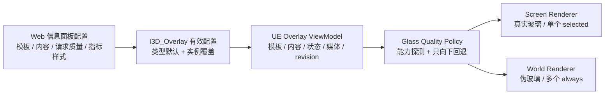

# OntoTwin 3.7.1 液态玻璃信息面板模板设计 (PRD)

> 文档性质：3.7.1 视觉与渲染功能设计增量
> 主线：OntoTwin Nexus / `I3D_Overlay` / UE Runtime
> 日期：2026-07-23
> 设计整理：2026-07-24
> 前置：3.7 顶部信息面板、3.7.1 视频 URL 面板、4.0 人物漫游选择链路
> 文档编号：3.7.1-UI
> 权威边界：视频安全、媒体生命周期和 API 以[视频 URL PRD](OntoTwin%203.7.1%20视频%20URL%20面板垂直链路%20%28PRD%29.md)为准；基础继承、revision 和选择生命周期以[3.7 PRD](OntoTwin%203.7%20顶部信息面板垂直链路%20%28PRD%29.md)为准
> 实施与验收：[实施记录](../IMPLEMENTATION/3.7.1/OntoTwin%203.7.1%20实施记录.md)、[宿主接入与验收](../IMPLEMENTATION/3.7.1/OntoTwin%203.7.1%20宿主接入与验收.md)
> 配套 Skill：[ontotwin-ue-glass-ui](../skills/ontotwin-ue-glass-ui/SKILL.md)

---

## 1. 结论

3.7.1 将现有六种 `I3D_Overlay` 信息模板统一升级为 **visionOS-inspired 液态玻璃视觉体系**，但不照搬 Apple 组件或资产。

采用两条渲染路径：

- `selected / Screen Space`：优先使用真实背景采样、模糊和轻微边缘折射，承担高保真点按面板。
- `always / World Space`：使用能够参与三维遮挡的伪玻璃，承担批量常显面板，不宣称真实背景模糊。

六种模板继续作为用户选择项，UE 内部改为“共享组件 + 六种组合配方”。前端增加高质量、均衡、性能优先三个请求档位；对象类型保存默认值，实例可以显式覆盖。UE 只允许向下回退，不把实际档位写回项目配置。

---

## 2. 背景与问题

当前 Overlay 链路已经具备模板、字段绑定、状态、指标、视频、Screen/World 两种显示方式和人物漫游选择能力，但视觉层仍接近普通 UMG 深色卡片：

- 单一近黑色圆角底板，缺少环境采样、光学层次和空间融合。
- 标题、正文、状态、指标和视频共用一个动态 C++ Widget 树，`template_id` 尚未形成真正不同的布局配方。
- `selected` 面板虽然位于 Screen Space，但视觉关联曾受固定侧边位置、DPI 和投影偏移影响。
- `always` 面板使用 World `UWidgetComponent`，无法通过普通 `BackgroundBlur` 获取其背后的三维工厂画面。
- 现有指标运行数据以格式化的单值为主，无法直接支持真实仪表几何和时间趋势图。
- 常显与点按、人物漫游和视频控制都已形成输入链路，视觉升级不得再次破坏 E、左键、WASD、鼠标焦点和关闭后的输入恢复。

本设计解决的是“如何形成可交付的液态玻璃模板体系”，不是单独给某一张卡片增加透明度。

---

## 3. 目标与非目标

### 3.1 目标

- 统一设计现有六种信息模板，不要求用户舍弃任何一种。
- 建立中性玻璃基底、语义状态光边、清晰内容层和克制动效。
- 为 Screen/World 明确不同且诚实的实现方案。
- 建立高质量、均衡、性能优先三级请求与自动向下回退。
- 让点按面板保持和模型的明确视觉关联。
- 在同一指标模板内定义大数字、仪表、趋势图三种表现；当前交付启用 Value/Gauge，Trend 在真实历史数据源接入前保持禁用。
- 视频保持清晰，玻璃只作用于容器和控制层。
- 保持类型默认、实例稀疏覆盖、revision、媒体和输入生命周期。
- 给出 UE 5.6、Standalone 和打包版可执行的验收标准。

### 3.2 非目标

- 不在本 PRD 中记录代码改动、宿主迁移、构建日志或阶段验收结果。
- 不把 Web 场景交互工作台改成毛玻璃风格。
- 不允许用户任意配置 HEX、模糊半径、折射、噪声、辉光或字体。
- 不为每个 World 面板创建 `SceneCapture2D` 或独立场景缓冲。
- 不把 Retainer Box 当作三维背景采样来源。
- 不在 UE 中根据数值私自推断业务告警阈值。
- 不在缺少历史数据时绘制虚假的趋势曲线。
- 不复制 Apple 标识、专有素材、Figma 组件或未获许可的 SF 字体。

---

## 4. 已确认决策

| 主题 | 决策 |
| --- | --- |
| 视觉方向 | 中性透明玻璃 + 小面积语义状态光边 |
| 渲染结构 | selected 使用 Screen 高保真；always 使用 World 性能伪玻璃 |
| 模板范围 | 一次设计现有全部六种模板 |
| UE 组织 | 共享组件 + 六种组合配方，不复制六套独立 Widget |
| 指标数据 | 向后兼容扩展原始数值和范围；时间序列只在真实历史提供者接入后启用 |
| 指标选择 | 模板不膨胀；面板级选择 Value/Gauge/Trend，当前启用 Value/Gauge |
| 指标强调 | 每个指标独立显式配置，默认不强调，不按数组顺序推断 |
| 状态外观 | 六级状态允许配置显示文字和受控颜色 token，不允许任意 HEX |
| 点按关联 | 模型投影锚点 + 智能位置 + 连接线 + 边缘避让 |
| 动效 | 事件触发、短时、静止后停止 |
| 质量 | 高质量 / 均衡 / 性能优先，运行时只向下回退 |
| 前端配置 | 信息面板中明确提供三个质量选项 |
| 配置层级 | ObjectType 默认，Instance 可显式覆盖 |
| 视频 | 玻璃外壳 + 清晰视频窗口；World 只显示封面 |
| 尺寸 | 分级尺寸 + 受限自适应 |
| 明暗 | High Screen 读取局部后景自适应；Balanced 使用保守对比策略；World 使用深色伪玻璃 |
| Skill | `docs/skills/ontotwin-ue-glass-ui` 作为文档侧规范源 |

---

## 5. 设计原则

### 5.1 玻璃不是透明黑卡

高保真玻璃至少由以下层次组成：

1. 后景采样与模糊。
2. 中性染色和适度降饱和。
3. 连续圆角遮罩。
4. 外边缘和顶部内高光。
5. 只位于边缘的轻微折射或色散。
6. 极弱细噪声，避免纯色塑料感。
7. 独立的清晰内容层。

World Space 无法获取真实后景时，保留 3–7 的伪玻璃语言，但不得以静态噪声冒充真实模糊。

### 5.2 状态色只做语义强调

玻璃基底不随状态整块变绿、橙或红。状态色只用于：

- 1 px 左右的局部边缘或环形进度。
- 状态图标和状态文字。
- 关键数值。
- 状态变化时的一次短脉冲。

状态同时使用文字或图形，不能只靠颜色区分。

### 5.3 内容永远清晰

标题、正文、图标、数值、图表线、视频和交互按钮必须位于玻璃/折射层之上。正文不使用辉光、挤压或持续动画。

### 5.4 Apple-inspired，而非 Apple clone

采用空间层次、自适应材质、克制深度和可读性原则。OntoTwin 保留自己的工业状态语义、模板结构和交互，不复制 Apple 标识或资源。

---

## 6. 总体架构



UE 架构保持现有 SceneManager 和选择生命周期，并按以下边界组织：

- 规范化 Overlay ViewModel。
- Screen Renderer Profile。
- World Renderer Profile。
- 共享 Glass Theme/Profile。
- Title、Subtitle、Body、Status、Metric、Chart、Media、Controls 组件。
- 六种只描述组合和密度的模板配方。

这不是要求一次建立大型 UI 框架，而是解决当前“一个全集 Widget 隐藏空槽”无法产生真正模板差异的问题。

---

## 7. 六种模板

| Template ID | 用户名称 | 配方 | 首选尺寸族 |
| --- | --- | --- | --- |
| `title_body` | 标题 + 正文 | Glass + Title + Body | 信息卡片 |
| `title_subtitle_body` | 标题 + 小标题 + 正文 | Glass + Title + Subtitle + Body | 信息卡片 |
| `title_metrics` | 标题 + 指标 | Glass + Title + MetricRegion | 紧凑胶囊或指标卡 |
| `title_status_metrics` | 标题 + 状态 + 指标 | Glass + Title + Status + MetricRegion | 状态胶囊或指标卡 |
| `title_video` | 标题 + 视频 | Glass + Title + MediaWell + Controls | 宽媒体卡 |
| `title_video_body` | 标题 + 视频 + 正文 | Glass + Title + MediaWell + Body + Controls | 宽媒体卡 |

### 7.1 共同空值规则

- 标题维持既有必填/空值语义。
- 可选槽为空时，整行和相邻间距一起折叠。
- 切换模板后清除不再允许的旧槽位视觉状态，不能出现“幽灵视频、指标或正文”。
- 中文、英文、单位、负值、大数值和离线最后值均需独立验收。

### 7.2 分级尺寸

采用 DPI 缩放前的逻辑像素：

- 紧凑胶囊：宽 320–440，适合一个主指标或状态 + 主指标。
- 信息卡片：宽 340–480，正文有最大行数或受控滚动。
- 媒体卡片：360 为 1080p/窄窗口最小收起宽度，480 为 2K 及空间允许时的推荐宽度，展开上限 720，并受视口安全区约束。

Screen 面板不得超过约 42% 视口宽度和 70% 视口高度。World 面板沿用相同层级，但减少正文、坐标轴和控制密度。

---

## 8. 指标表现

指标样式是**面板级布局选择**，不是让四个指标各自随意选择不同图形。选择 `gauge` 或 `trend` 时必须指定 `primary_metric_id`：主指标占据仪表或趋势主体，其余最多三个指标以紧凑大数字作为辅助信息。这样既覆盖参考图中的“主图 + 关键百分比”，也避免一张卡片同时出现多个仪表和趋势图。

### 8.1 大数字 `value`

- 支持现有 1–4 个指标。
- 单指标使用一个主值；多指标使用确定的主次或 2×2 布局。
- `display_value` 继续作为最终展示文本。

### 8.2 仪表 `gauge`

- 首版一个面板最多一个主仪表。
- 编辑人员从当前指标列表中明确选择一个主指标。
- 使用原始数值和 min/max 计算弧线或环形几何。
- 超出范围时可夹紧图形，但文字仍显示真实值。
- 状态由后端提供，UE 不自行判断告警阈值。
- 缺少有效数值或范围时回退为大数字，并显示明确的数据不足状态。

### 8.3 趋势图 `trend`

- Trend 是保留的设计能力；真实历史提供者未接入时，Web 必须置灰且不得保存 Trend 配置。
- 启用后一个面板最多一个真实时间序列。
- 编辑人员明确选择主指标和对应的时序数据源；其余指标只显示紧凑当前值。
- selected Screen 可显示面积趋势、当前值、可选坐标轴和时间范围。
- always World 只显示简化 sparkline，尺寸不足时回退为大数字。
- 空序列显示“暂无趋势数据”，离线显示最后采样和离线语义。
- 每个解析序列首版最多 120 点，后端在进入快照前降采样。
- 不把当前单值重复复制成假历史。

### 8.4 指标强调与状态外观

- 每个指标提供独立 `emphasized` 布尔配置，缺失或未勾选时按普通 Value 显示。
- 强调指标才使用更大字号、较高字重和解析后的状态强调色；不得默认强调数组第一项。
- 状态模板为 `normal / info / warning / critical / offline / unknown` 分别保存展示文字和受控颜色 token。
- 默认映射为在线/绿色、信息/青蓝色、注意/橙色、告警/红色、离线/灰色、未知/灰色。
- 状态颜色只进入状态灯、图标、Gauge/Trend 主体或明确强调的指标，不形成整块彩色底板。

---

## 9. 视频模板

视频绑定、来源安全、解析、重试、播放和释放规则由[视频 URL PRD](OntoTwin%203.7.1%20视频%20URL%20面板垂直链路%20%28PRD%29.md)统一定义。本节只记录液态玻璃带来的视觉和布局变化。

视频采用双层结构：

```text
玻璃外壳：标题 / 边缘 / 控制区 / 状态
清晰媒体层：16:9 视频纹理或封面
```

- 视频纹理不进入背景模糊或折射材质。
- `always` World 的封面或占位图保持清晰，不进入背景模糊。
- `selected` Screen 的媒体控制区使用中性玻璃样式，但实际按钮仍位于可交互内容层。
- `title_video_body` 收起时正文最多三行并截断；展开时视频在上、正文在下，正文区域最大高 160 逻辑 px并在区域内滚动；World 最多两行且不滚动。

本文件将旧视频 PRD 的“收起固定 360”细化为“360 最小、480 推荐”的受限自适应；展开上限 720、媒体安全、播放和释放规则不变。

---

## 10. 视觉 Token 与动效

### 10.1 基线范围

| 项目 | 基线 |
| --- | --- |
| High Screen 表面 | 中性蓝黑染色，模糊后约 28–44% 视觉不透明度 |
| Balanced Screen | 中性蓝黑染色，约 44–58% |
| Performance | 约 72–88%，以可读性为先 |
| 主文字 | 近白 92–100% |
| 次文字 | 白 66–76% |
| 外边缘 | 1 逻辑 px，白 18–34% |
| 卡片圆角 | 20–24 逻辑 px |
| 胶囊圆角 | 半高或 28–36 逻辑 px |
| 折射位移 | 只在边缘，视觉约 1–2 逻辑 px 内 |
| 细噪声 | 低于约 3% 不透明度 |

这些数值属于平台主题，不作为用户配置项。

### 10.2 动效

- 打开：180–240 ms 淡入、0.97→1.0 轻缩放和一次短高光移动。
- 关闭：120–180 ms。
- Hover/Focus：120–160 ms 局部边缘变化。
- 状态变化：一次不超过 900 ms 的柔和脉冲。
- Idle：不持续波动、流光或色散。
- 减少动态模式：只保留淡入淡出。

### 10.3 自适应明暗

- High Screen 在 UI Material 中使用 Slate Postbuffer 的局部后景采样，以无历史状态的保守亮度曲线调整染色、边缘和文字 scrim。
- Balanced Screen 的 `UBackgroundBlur` 没有可直接交给业务层的局部亮度输出，因此首版使用经过亮暗背景验收的保守 scrim。若需要跟随全局曝光，只能在 Renderer Spike 验证稳定数据源和收益后启用，不能在 PRD 中视为现成能力。
- Performance 和 World 使用固定、偏深、高对比表面。

普通 UI Material 没有前一帧状态，首版不得为实现时间平滑而增加历史 RT 或 GPU→CPU readback。若 Renderer Spike 证明存在稳定的全局曝光参数，可由 CPU/材质参数做约 150–300 ms 平滑和死区；否则保持无时间状态的保守 scrim。

### 10.4 字体、图标与可访问性

- 采用插件内显式 Cook 的 Composite Font：Inter 负责拉丁字符和表格数字，Noto Sans SC 负责中文 fallback；同时随资产保留各自开源许可证文件。
- 状态图标使用 OntoTwin 自有的简单单色 SDF/SVG 图标，不引用 Apple SF Symbols。
- 首版不增加每面板可访问性字段。插件 Project Settings/开发 CVar 提供 `ReduceMotion`、`ReduceTransparency` 和 `HighContrast` 验收开关。
- `ReduceMotion` 关闭缩放、高光移动和状态脉冲，只保留淡入淡出；Performance 自动采用该行为。
- `ReduceTransparency` 强制 Performance 表面；`HighContrast` 提高 scrim 和边缘对比，但不改变业务状态色语义。

---

## 11. 三档渲染与回退

| 请求档位 | selected / Screen | always / World | 回退 |
| --- | --- | --- | --- |
| `high` 高质量 | 一个宿主显式预留的 `SlatePostRT_N` + shared blur processor + UI Glass Material | 增强伪玻璃、高密度 RT、静态高光 | balanced → performance |
| `balanced` 均衡 | `UBackgroundBlur` + tint/rim/noise 分层 | 标准伪玻璃 | performance |
| `performance` 性能优先 | 静态半透明或近不透明渐变 | 静态可读表面 | 不升档 |

### 11.1 High Screen

- UE 5.6 使用一个共享 Slate Postbuffer；当前宿主可约定 N=0，新宿主必须在集成配置中显式选择并预留 N=0–4。
- UI Material 必须采样与预留索引一致的 `GetSlatePostN`，不能在选择 RT1–RT4 时仍固定读取 `GetSlatePost0`。实施采用对应索引的预编译材质变体，或仅在 Renderer Spike 证明可靠后采用编译期静态分支；任一运行配置仍只启用、复制并采样一个 Postbuffer。
- 开启 `Slate.CopyBackbufferToSlatePostRenderTargets=1`。
- UI Material 从共享后景取样，在圆角遮罩内执行染色、降饱和和边缘轻折射。
- 内容在后续 Slate 层绘制。
- 该能力在 UE 5.6 属 Experimental，必须通过 Standalone、Development 和 Shipping 验证。
- UE 5.6 的每个 Postbuffer 会产生全帧复制，不使用更新版本才有的半分辨率说明。
- Slate Postbuffer 是宿主级全局资源，而且 UE 5.6 没有完整的消费者所有权注册表。插件只能检查所选 RT 是否启用、Processor 配置是否兼容，不能发现所有正在采样该 RT 的其他 UI Material。
- 因此宿主必须显式声明预留的 `SlatePostRT_N`。选择 RT1–RT4 时需在 Slate Renderer 初始化前按 UE 5.6 项目配置启用；确切开关由阶段 A Spike 在目标引擎源码中核实。预留不明确、处理器不兼容或初始化过晚时直接降级 Balanced。

### 11.2 Balanced Screen

使用 `UBackgroundBlur` 和独立 tint/rim 层。必须配置低质量 fallback brush，但它不能代替平台的能力判定。质量策略需要显式检查 Widget、材质、Postbuffer、渲染后端和打包能力；不支持或加载失败时进入 Performance，不能显示透明空板。

### 11.3 World 伪玻璃边界

World `UWidgetComponent` 先把 UI 渲染到自己的 RenderTarget，再放入三维场景。其内部普通 Background Blur 无法看到工厂场景。因此：

- World 保留真实遮挡、深度、距离和视锥裁剪。
- 通过半透明表面、顶部内高光、静态细噪声和状态灯表达玻璃。World Billboard 始终朝向相机，不伪造没有有效变化的动态 Fresnel。
- 禁止每个面板一个 SceneCapture、场景 RT 或 MediaPlayer。
- High World 只是更精细的伪玻璃，不对用户宣传为真实后景模糊。

---

## 12. 前端信息面板配置

不新增路由，在 `/interaction` 现有“信息面板”中增加以下功能。

### 12.1 展示效果

在“显示规则”附近新增普通白底表单区：

- 字段：`玻璃渲染质量`。
- 选项：`高质量`、`均衡（推荐）`、`性能优先`。
- 常驻说明回退顺序，明确“请求质量可能因 UE 能力向下回退”。
- ObjectType 保存默认；Instance 使用一组“覆盖展示效果”开关。
- 恢复继承时删除实例差异，不复制类型当前值。
- 批量覆盖显示影响实例数并使用 OntoTwin 模态确认。

Web 表单继续遵循 `ontotwin-ui`：黑白灰、显式保存、可继续编辑、Toast、模态、无 emoji、无原生 alert/confirm。Web 不使用玻璃、渐变或霓虹。

### 12.2 指标样式

只有指标模板出现“大数字 / 仪表 / 趋势图”选择：

- 大数字：不增加额外字段。
- 仪表：先选择主指标，再展开最小值、最大值和视觉夹紧选项。
- 趋势图：先选择主指标，再展开该指标的时序绑定、时间窗口、采样/聚合和可选坐标轴。
- 其余指标保持紧凑数值，不再各自选择 Gauge 或 Trend。
- 数据源没有真实历史能力时，趋势图置灰并常驻说明。
- `series_binding` 只能引用未来注册的数值时序字段；当前 scalar `raw_state` 不能直接作为历史来源。
- 隐藏的条件字段不得残留提交。

### 12.3 状态与指标强调

- 每个指标提供独立“强调”开关，默认关闭。
- 未强调指标使用普通字号和白色文字；强调指标使用主值层级和当前状态强调色。
- 状态模板提供六级状态映射表，每级可编辑显示文字并选择绿色、青蓝色、橙色、红色或灰色 token。
- 不提供任意 HEX 输入；持久化左侧状态色边不作为配置项。

### 12.4 Web 预览

右侧只做结构预览，验证组合、密度、空值、状态和大致尺寸。继续使用 Web 黑白灰样式，并常驻提示：

> 透明、模糊、曝光和遮挡效果以 UE 运行端为准。

---

## 13. 向后兼容数据契约

本节只定义液态玻璃增量使用的兼容配置和运行载荷；实现状态与迁移证据不在 PRD 中记录。

### 13.1 持久化配置

```json
{
  "presentation": {
    "quality_tier": "balanced",
    "metrics": {
      "style": "gauge",
      "primary_metric_id": "utilization",
      "gauge": {
        "min": 0.0,
        "max": 100.0,
        "clamp_visual": true
      }
    }
  }
}
```

- 枚举：`high | balanced | performance`。
- 缺失时解析为 `balanced`。
- 位于现有 `I3D_Overlay` 配置内部，不新增 ProjectStore 顶层业务结构。
- 实例只保存差异。
- `metrics.style` 是面板级样式；`primary_metric_id` 必须引用当前 `slots.metrics` 中的稳定 ID。

以上 JSON 只描述将来可能持久化的**用户请求配置**，不包含 UE 实际使用的渲染器或降级原因。

Trend 的持久化配置形态：

```json
{
  "presentation": {
    "quality_tier": "balanced",
    "metrics": {
      "style": "trend",
      "primary_metric_id": "temperature",
      "trend": {
        "series_binding": {
          "source": "telemetry_history",
          "path": "temperature"
        },
        "window_seconds": 600,
        "sample_interval_seconds": 5,
        "aggregation": "avg",
        "show_axis": true,
        "y_min": null,
        "y_max": null
      }
    }
  }
}
```

`telemetry_history` 是未来注册的数值时序来源占位名，并非当前已存在的 Binding Source；历史提供者未落地时前端不得保存该配置。

### 13.2 UE 本地运行诊断

UE 可在日志或未来诊断接口中输出以下本地状态，但它不进入 ProjectStore，也不要求后端快照回传：

```json
{
  "requested_quality": "high",
  "effective_quality": "balanced",
  "renderer": "screen_background_blur",
  "degrade_reason": "slate_postbuffer_unavailable"
}
```

`effective_quality` 和 `degrade_reason` 不写回项目配置。

### 13.3 后端解析后的运行载荷

保留现有 `id`、`label`、`display_value`、`state`，增加可选字段：

```json
{
  "status": {
    "display_value": "需要关注",
    "accent_token": "amber",
    "level": "warning",
    "state": "ok"
  },
  "metrics": [
    {
      "id": "utilization",
      "label": "负载率",
      "display_value": "68%",
      "emphasized": true,
      "state": "ok",
      "numeric_value": 68.0
    }
  ],
  "metrics_visual": {
    "style": "gauge",
    "primary_metric_id": "utilization",
    "range": {"min": 0.0, "max": 100.0, "clamp_visual": true}
  }
}
```

现有 `metric.state` 只表示数据可用性：`ok | empty | offline`。业务语义来自 `status.level`，颜色使用后端解析后的 `accent_token`。`emphasized` 只控制指标视觉层级；没有 status 槽位的 `title_metrics` 默认使用中性强调色。UE 不得把 `metric.state` 当成告警等级，也不得接受项目任意 HEX。

Trend 的解析载荷同时包含主指标序列和面板级视觉信息：

```json
{
  "metrics": [
    {
      "id": "temperature",
      "label": "温度",
      "display_value": "36.5 °C",
      "state": "ok",
      "numeric_value": 36.5,
      "series": {
        "unit": "°C",
        "sample_interval_seconds": 5,
        "points": [
          {"timestamp": "2026-07-23T10:00:00Z", "value": 35.8},
          {"timestamp": "2026-07-23T10:00:05Z", "value": null},
          {"timestamp": "2026-07-23T10:00:10Z", "value": 36.5}
        ]
      }
    }
  ],
  "metrics_visual": {
    "style": "trend",
    "primary_metric_id": "temperature",
    "window_seconds": 600,
    "sample_interval_seconds": 5,
    "show_axis": true,
    "y_min": null,
    "y_max": null
  }
}
```

规则：

- UE 不从 `display_value` 反解析数值。
- `metric.state` 继续使用 `ok | empty | offline`；语义强调只读取面板 `status.level`。
- `metrics_visual.primary_metric_id` 决定 Gauge/Trend 主体，其余指标保持紧凑 Value。
- 时间戳使用 ISO 8601 UTC，点按时间升序。
- 重复、乱序、采样和降采样由后端处理。
- `value: null` 明确编码缺口；`sample_interval_seconds` 描述期望采样周期，降采样必须保留 null 分段，不用连线掩盖断线。
- 实时值/序列更新不改变配置 revision；质量档、模板、指标样式、`primary_metric_id`、范围、时序绑定、窗口、采样/聚合或坐标轴配置修改才改变。
- 后端历史能力未落地前，趋势图不进入“可用”状态。

这些配置保存在既有 `I3D_Overlay.values.presentation` 与实例稀疏覆盖中，不增加 ProjectStore 顶层字段、`schema_version`、PostgreSQL 列或独立迁移脚本。JSON 继续保存嵌套对象，PostgreSQL 继续使用既有 JSONB。

---

## 14. 智能锚定与模型关联

`selected` Screen 面板使用模型顶部有效锚点：

1. 将三维锚点投影为 DPI-aware 逻辑坐标。
2. 优先选择距离锚点 16–32 px 的可用象限。
3. 与安全区至少保持 24 px。
4. 面板和目标分离时显示低对比细连接线及锚点。
5. 使用死区和阻尼，避免镜头轻动时左右跳边。
6. 锚点在摄像机后方或投影失败时隐藏，不夹到错误屏幕边缘。
7. 目标离屏或持续被遮挡时短暂延迟后淡出。
8. 视频展开后保留实例名称/关联标识，收起回到模型锚点。

DPI/分辨率换算只能应用一次，避免再次出现固定右侧或偏移随分辨率增长的问题。

---

## 15. 输入与互斥

选择入口、关闭恢复和 `selected/always` 生命周期沿用[3.7 PRD](OntoTwin%203.7%20顶部信息面板垂直链路%20%28PRD%29.md)；视频控件和媒体释放沿用[视频 URL PRD](OntoTwin%203.7.1%20视频%20URL%20面板垂直链路%20%28PRD%29.md)。本增量只增加以下玻璃层 Hit Test 约束：

Hit Test 规则：

- Glass、Blur、Rim、Noise、Glow、Connector、Chart Fill 全部 `Self Hit Test Invisible`。
- 普通文字面板不抢焦点。
- 只有播放、暂停、静音、展开、关闭等真实控件拦截输入。
- 控件点击不得冒泡为场景空白点击。
- 既有 Esc、关闭、切换目标、输入恢复及 `selected/always` 互斥行为不得因玻璃层改变。

---

## 16. 性能约束

- 同时最多一个 selected Screen Widget。
- OntoTwin 最多占用一个共享 Slate Postbuffer。
- 同时最多一个共享 MediaPlayer/MediaTexture/MediaSound 会话。
- 禁止每面板 SceneCapture、独立全屏背景缓冲或独立视频播放器。
- World 动效不得依赖每帧重绘；本设计默认 Idle 无动画。
- 继续使用距离、视锥、数量上限和按需重绘保护 always 面板。

验收机在相同场景和镜头下记录无 Overlay 基线：

- 单 selected High：1080p Overlay GPU 增量目标不超过 1.5 ms，2K 不超过 2.5 ms；超出则调整阈值或回退。
- 20、50、100 个 always 分别测量；100 个时不得出现每帧持续创建销毁、SceneCapture 或媒体解码。
- 连续切换 100 次实例后，Widget、RenderTarget、回调和 MediaPlayer 不持续增长。

测试记录必须写明 GPU、驱动、CPU、目标 60 fps、分辨率和质量档；预热 30 秒后采样至少 60 秒，同时记录 median 与 p95。100 个已配置 always 面板在当前可见性上限下，p95 总帧时间相对无 Overlay 基线目标增幅不超过 20%，Game Thread 增量不超过 1 ms，持续 5 分钟后显存/内存不继续增长；超出时必须降低可见上限或档位，不能删掉测试结果。

具体硬件和场景必须写入测试记录，不能把该数值解释为所有 GPU 的绝对承诺。

---

## 17. 验收标准

### 17.1 六种模板

- 六个 template ID 产生真正不同的组合和尺寸，而不是一个全集布局隐藏空行。
- 模板切换无幽灵槽位；空可选槽折叠间距。
- 中文、英文、长标题、正文上限、空值、离线和 1–4 指标无越界。
- `normal/info/warning/critical/offline/unknown` 均有颜色之外的语义。
- Gauge 数据无效时可读回退；Trend 未接入真实历史提供者时保持禁用，不伪造数据。
- 指标默认不强调；只有显式 `emphasized=true` 的指标进入主值层级。
- 六级状态的显示文字、受控颜色 token 和非颜色语义均正确生效。
- 视频纹理、封面和控件保持清晰，不进入背景模糊或折射层。

### 17.2 渲染

- 开发期可以强制切换 High/Balanced/Performance。
- High Screen 只使用一个共享 Postbuffer。
- 不可用时按批准顺序只向下回退，并只记录一次原因。
- World 不尝试或宣称真实场景模糊。
- Performance 不出现透明空底、黑棋盘或不可读内容。
- 文本对比度：普通文字至少 4.5:1，大文字和关键图形至少 3:1。

### 17.3 锚定和分辨率

- 覆盖 720p、1080p、2K、4K；100%、125%、150%、200% DPI；窗口和全屏。
- 面板不固定在屏幕右侧，不发生重复 DPI 缩放。
- 上下左右安全区、象限切换、离屏、摄像机背后、遮挡、目标销毁均有确定行为。
- 连接线指向正确模型，锚点跟随无明显抖动或拖尾。

### 17.4 输入

- 近身 E 与上帝视角左键都能选择同一实例。
- 玻璃装饰不挡点击；媒体控件不触发清除选择。
- Esc/关闭/切换后鼠标、WASD 和镜头控制恢复。
- always 与点按副本不同时出现。

### 17.5 打包与兼容

- PIE、Standalone、Development、Shipping 分别验收。
- 显式 Cook 字体、材质、纹理和主题资产；中文不变方框。
- 覆盖 SDR/HDR、自动曝光、Bloom、TAA/TSR 和项目启用的上采样器。
- 旧项目缺少新 presentation/visual 字段时仍以 Balanced + Value 方式可读运行。

### 17.6 Web 编辑器

- 三档质量明确可选，类型默认和实例覆盖/恢复可区分。
- 指标样式只在相关模板出现，条件字段无残留。
- 没有历史源时趋势选项不可误导。
- 预览明确是结构预览，Web 不变成玻璃 UI。
- 保存显式、可继续编辑、无原生 alert/confirm。

---

## 18. 风险与处理

| 风险 | 处理 |
| --- | --- |
| Slate Postbuffer 在 UE 5.6 为 Experimental | Spike 优先；High 不可用自动降级 |
| 明亮厂房导致透明面板不可读 | 自适应染色、局部 scrim、高对比兜底 |
| World 无法真实模糊后景 | 明确采用伪玻璃，不用每面板 SceneCapture |
| 当前 Widget 不按 template_id 真正分支 | 先稳定 ViewModel/update 接口，再落六种配方 |
| 浏览器预览与 UE 不一致 | Web 只做结构预览，最终以打包版验收 |
| 趋势图缺少真实历史数据 | 选项置灰；契约和历史链路完成后再开放 |
| 字体依赖编辑器资源 | 插件内显式字体资产和 Cook 验收 |
| 玻璃装饰破坏鼠标/E/WASD | 装饰层不可命中，仅真实控件拦截 |
| 过度动态影响工业可读性 | 只做事件动效，Idle 静止 |

---

## 19. 设计参考

- [Apple：Designing for visionOS](https://developer.apple.com/design/human-interface-guidelines/designing-for-visionos)
- [Apple：Materials](https://developer.apple.com/design/human-interface-guidelines/materials)
- [Apple Design Resources](https://developer.apple.com/design/resources/)
- [用户提供的 visionOS Figma Design Resources](https://www.figma.com/community/file/1253443272911187215/apple-design-resources-visionos)
- [Epic：Using Slate Postbuffers（UE 5.6）](https://dev.epicgames.com/documentation/unreal-engine/using-slate-postbuffers-in-unreal-engine?application_version=5.6)
- [Epic：Background Blur Widget](https://dev.epicgames.com/documentation/unreal-engine/using-the-background-blur-widget-in-unreal-engine)
- [Epic：Widget Components（UE 5.6）](https://dev.epicgames.com/documentation/en-us/unreal-engine/widget-components-in-unreal-engine?application_version=5.6)
- [Epic：URetainerBox](https://dev.epicgames.com/documentation/unreal-engine/API/Runtime/UMG/URetainerBox?application_version=5.6)
