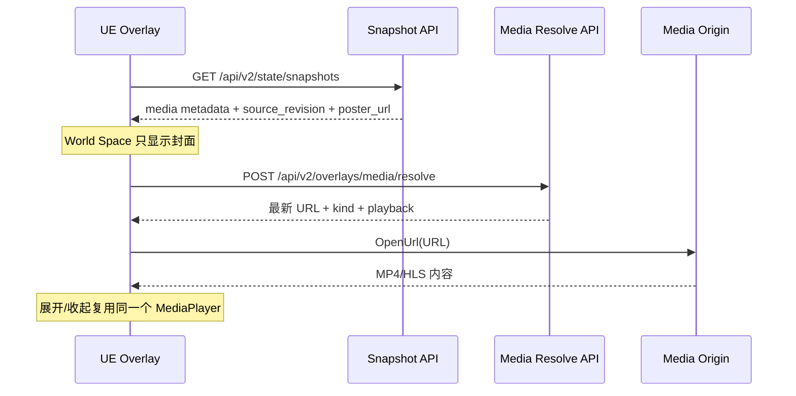

# OntoTwin 3.7.1 视频 URL 面板垂直链路 (PRD)

> 状态：开发完成，待 UE PIE/打包验收  
> 主线：OntoTwin Nexus / `I3D_Overlay`  
> 日期：2026-07-21  
> 前置：3.7 顶部信息面板、4.0.1 人物漫游选择链路  
> 数据结构：ProjectStore v4 -> v5

---

## 1. 背景

3.7 已打通结构化顶部信息面板，但只支持文字、状态和指标。本增量为 `I3D_Overlay` 增加受控的视频 URL 槽位，使用户能够在现有信息面板工作台中配置单路 MP4 点播或 HLS 直播，并在 UE 中完成以下体验：

- `always` 的 World Space 面板只展示静态封面，不持续解码视频。
- 用户选中对象后，Screen Space 面板按策略自动播放或等待手动播放。
- 展开与收起共用同一个媒体会话，不重新打开视频。
- 关闭面板或切换对象时停止并释放当前媒体流。

视频仍属于 Overlay 内容能力，不迁入运维监控层。运维系统或未来数据总线负责提供 URL 字段，Overlay 负责绑定、来源校验、同步和呈现。

---

## 2. 目标与非目标

### 2.1 目标

- 新增 `title_video`、`title_video_body` 两个受控模板。
- URL 和封面支持固定值、实例字段、类型字段、`raw_state` 字段绑定。
- 支持 MP4 和 HLS，每个面板只允许一个视频源。
- 提供受限播放策略，默认自动播放、静音、不循环。
- 建立平台上限与项目子集两级来源白名单。
- 快照不下发播放 URL，UE 打开面板时通过专用接口懒解析最新 URL。
- JSON 与 PostgreSQL ProjectStore 使用同一份 v5 语义。
- 不破坏原有四种非视频模板及旧 `I3D_Behavioral.ui_label_content`。

### 2.2 非目标

- 不支持网页、iframe、WebBrowser Widget 或任意 HTML。
- 不支持 DASH、RTSP、WebRTC、摄像头凭据、DRM 或自定义请求头。
- 不通过 Flask 代理、转码或缓存媒体内容。
- 不支持多路视频、播放列表、时间轴拖动、清晰度切换和画中画。
- 不保存永久账号、密码、Cookie、Token 或 Authorization Header。
- 不允许项目绕过平台白名单新增来源。
- 不在本版本处理 HLS 清单内部子资源的逐段服务端校验。

---

## 3. 核心决策

| 主题 | 3.7.1 决策 |
| --- | --- |
| 能力归属 | 继续扩展 `I3D_Overlay`，不新增监控接口 |
| 工作台 | 继续使用 `/interaction` 信息面板编辑器 |
| 模板 | `title_video`、`title_video_body` |
| 媒体数量 | 每个面板一个视频源 |
| 类型 | MP4 点播、HLS 直播 |
| World Space | 只展示封面或系统占位图 |
| Screen Space | 选中后播放，可展开到固定大尺寸 |
| 会话 | 展开/收起不重建 `MediaPlayer` |
| 默认策略 | `autoplay=true`、`muted=true`、`loop=false` |
| 策略约束 | 自动播放必须静音；HLS 禁止循环 |
| 控件 | 播放/暂停、静音、展开/收起、关闭；失败时显示重试 |
| 关闭行为 | 关闭或切换对象立即停止并释放媒体流 |
| 重试 | 重新解析最新 URL，按 2/5/15 秒重试，之后转手动 |
| URL 安全 | 平台允许列表为上限，项目只能继承或缩小 |
| 协议 | 默认 HTTPS；HTTP 必须是显式批准的 host/IP + port |
| 凭据 | 只接受公开 URL 或短期签名 URL |
| 同步 | 快照发引用和元数据，播放 URL 通过专用接口懒解析 |
| 存储 | ProjectStore v5 顶层新增 `media_policy` |

---

## 4. 用户链路

### 4.1 类型默认配置

1. 用户进入 `/interaction` 的“信息面板”。
2. 选择已挂载 `I3D_Overlay` 的 ObjectType。
3. 选择“标题 + 视频”或“标题 + 视频 + 正文”。
4. 绑定视频地址、可选封面地址并选择媒体类型。
5. 调整受限播放策略。
6. 确认项目媒体来源策略。
7. 保存后进入既有 revision 和快照同步链路。

### 4.2 UE 播放链路



### 4.3 失败恢复

1. URL 解析或打开失败后显示当前状态。
2. UE 分别在 2、5、15 秒后重新调用解析接口。
3. 每次都重新获取最新绑定值或短期签名 URL。
4. 三次失败后停止自动重试并显示“重试”按钮。
5. 用户手动重试后重新开始一轮计数。

---

## 5. 配置模型

视频模板的 `slots.media` 结构：

```json
{
  "required": true,
  "url_binding": {
    "source": "literal",
    "value": "https://media.example.com/demo.mp4"
  },
  "poster_binding": {
    "source": "literal",
    "value": "https://media.example.com/demo.webp"
  },
  "kind": "auto",
  "playback": {
    "autoplay": true,
    "muted": true,
    "loop": false
  }
}
```

### 5.1 绑定来源

`url_binding` 与 `poster_binding` 使用 3.7 既有绑定模型：

- `literal`：固定 URL。
- `instance`：实例标准字段。
- `object_type`：类型字段。
- `raw_state`：实时状态或未来数据总线写入字段。

### 5.2 类型识别

- `auto`：根据 URL 路径的 `.mp4` 或 `.m3u8` 判断。
- `mp4`：显式声明 MP4，扩展名存在时必须一致。
- `hls`：显式声明 HLS，扩展名存在时必须一致。
- URL 无标准扩展名时必须显式选择类型。
- 封面只支持 JPEG、PNG、WebP。

### 5.3 播放约束

- `autoplay=true` 时强制 `muted=true`。
- `kind=hls` 时强制 `loop=false`。
- 修改模板时按模板定义补齐或移除槽位。
- 实例覆盖与批量覆盖继续使用 3.7 的稀疏覆盖语义。

---

## 6. 来源安全策略

### 6.1 两级白名单

平台部署配置：

```text
ONTOTWIN_MEDIA_ALLOWED_HOSTS=media.example.com,*.streams.example.com,10.20.1.15:8080
ONTOTWIN_MEDIA_HTTP_EXCEPTIONS=10.20.1.15:8080
```

项目配置：

```json
{
  "revision": 1,
  "mode": "restricted",
  "allowed_hosts": ["media.example.com", "10.20.1.15:8080"],
  "http_exceptions": ["10.20.1.15:8080"]
}
```

- `inherit_platform`：项目继承平台全部允许来源。
- `restricted`：项目显式选择平台允许来源的子集。
- 项目不能添加平台未批准的域名、通配范围或 HTTP 例外。
- 域名匹配按规范化 host 和有效端口执行，不使用简单字符串前缀。
- `*.example.com` 匹配子域名，不匹配 `example.com` 或伪装后缀。
- URL 中禁止 username/password，最长 2048 字符。

### 6.2 安全边界

- 后端只校验和返回 URL，不拉取、不代理媒体数据。
- 普通快照不包含播放 URL，降低 URL 在高频同步链路中的暴露面。
- `poster_url` 可随快照下发，用于 World Space 静态展示；封面应使用公开或低敏短期 URL。
- 播放 URL 只在打开 Screen Space 面板时由 UE 懒解析。
- UE 日志不得输出完整播放 URL，特别是查询参数和签名。
- HLS 清单引用的分片、密钥和二级清单由播放器直接请求，当前后端无法逐项复核其域名。生产环境应要求同源 HLS，或由受信任 CDN 在源站侧约束子资源。

---

## 7. ProjectStore v5

### 7.1 迁移

当前真实基线为 v4，本版本执行加法迁移：

```text
v4 -> v5
  project.media_policy = {
    revision: 0,
    mode: "inherit_platform",
    allowed_hosts: [],
    http_exceptions: []
  }
```

- JSON 项目启动加载时自动迁移并写回。
- PostgreSQL `project` 表新增 `media_policy JSONB NOT NULL DEFAULT '{}'`。
- 新建项目直接写入 `schema_version: 5` 和默认策略。
- 不改写现有类型、实例、场景交互和 Overlay 配置。
- 高于 v5 的项目仍拒绝降级读取。

### 7.2 存储归属

- 平台白名单：部署环境变量，不进入项目文件。
- 项目子集：ProjectStore 顶层 `media_policy`。
- 类型默认：`object_types[*].interface_configs.I3D_Overlay.values.slots.media`。
- 实例覆盖：`instances[*].render_config.interface_overrides.I3D_Overlay`。
- 播放状态：UE 运行时内存，不持久化。

---

## 8. API 契约

### 8.1 媒体策略

```text
GET /api/v2/overlays/media/policy
PUT /api/v2/overlays/media/policy
```

PUT 请求：

```json
{
  "expected_revision": 0,
  "policy": {
    "mode": "restricted",
    "allowed_hosts": ["media.example.com"],
    "http_exceptions": []
  }
}
```

使用独立 revision 做乐观并发控制。来源策略有未保存修改时，前端禁用 Overlay 主保存按钮，避免用户误以为两组配置已经同时生效。

### 8.2 播放地址懒解析

```text
POST /api/v2/overlays/media/resolve
```

请求：

```json
{"instance_id": "unit-1"}
```

响应：

```json
{
  "instance_id": "unit-1",
  "config_revision": "t2-i0",
  "source_revision": "4f3c7ec7d6902c01",
  "kind": "mp4",
  "url": "https://media.example.com/demo.mp4?signature=...",
  "expires_at": null,
  "playback": {"autoplay": true, "muted": true, "loop": false},
  "retry": {"delays_seconds": [2, 5, 15], "max_attempts": 3}
}
```

接口在每次调用时重新执行字段绑定、类型识别和有效白名单校验。当前版本保留 `expires_at` 字段但不负责签发 URL；未来数据总线或签名服务可在不改变 UE 调用方式的前提下接入。

### 8.3 快照媒体片段

```json
{
  "available": true,
  "state": "ready",
  "kind": "mp4",
  "playback_ref": "unit-1",
  "source_revision": "4f3c7ec7d6902c01",
  "poster_url": "https://media.example.com/demo.webp",
  "poster_state": "ready",
  "playback": {"autoplay": true, "muted": true, "loop": false}
}
```

普通快照不得出现 `url` 或 `preview_url`。仅工作台的定向预览接口可返回 `preview_url`。

---

## 9. 前端方案

### 9.1 页面位置

不新增路由。在 `/interaction` 的现有信息面板编辑区中：

- 模板选择器增加两个视频模板。
- “内容绑定”内增加视频、封面和播放策略。
- 选择视频模板时增加“项目媒体来源”区块。
- 右侧预览对 MP4 使用浏览器原生 `<video>`；HLS 显示封面或明确的 UE 播放占位状态。

### 9.2 交互状态

- 自动播放勾选后，静音自动勾选并锁定。
- HLS 模式下循环自动关闭并锁定。
- 项目 restricted 模式只展示平台批准来源。
- HTTP 开关只有在来源已选中且平台批准时可用。
- 策略保存成功后更新 policy revision。
- 页面离开保护同时覆盖 Overlay 草稿和媒体策略草稿。

---

## 10. UE 方案

### 10.1 World Space

- 继续使用现有 `UWidgetComponent` 和统一 Overlay Widget。
- 视频槽位只显示封面或系统深色占位图。
- 不创建播放器、不解析播放 URL、不产生批量视频解码开销。

### 10.2 Screen Space

- `ATwinSceneManager` 管理单个共享 `UMediaPlayer`、`UMediaTexture` 和 `UMediaSoundComponent`。
- 用户选中视频面板后按 autoplay 策略决定是否调用 resolve API。
- 展开到 720px 固定宽度，收起回 360px；媒体会话和播放位置保持不变。
- 控件只在 Screen Space 可交互。
- 面板接管鼠标时不触发场景空白点击清除。
- 人物漫游选择和普通选择共用 Overlay 生命周期。

### 10.3 生命周期

| 事件 | 行为 |
| --- | --- |
| 选中视频对象 | 应用快照元数据，按策略懒解析 URL |
| 展开/收起 | 只改 Widget 布局 |
| 暂停/播放 | 操作当前共享播放器 |
| 静音切换 | 修改媒体声音组件音量 |
| 切换对象 | 取消请求、停止旧流、清理纹理，再解析新对象 |
| 关闭/Esc | 停止并释放当前流，移除 Screen Space Widget |
| 配置 source_revision 改变 | 停止旧源并重新解析 |

---

## 11. 错误状态

| 场景 | 前端/后端 | UE |
| --- | --- | --- |
| URL 为空 | 保存校验失败 | 不可播放 |
| 来源不在白名单 | 422 + 明确错误码 | 显示来源被阻止，可手动重试 |
| HTTP 未批准 | 422 `media_http_not_allowed` | 显示来源被阻止 |
| 类型无法识别 | 要求显式选择 MP4/HLS | 不打开播放器 |
| 网络或 5xx | 保持配置 | 2/5/15 秒重试 |
| 播放器打开失败 | 无后端写入 | 2/5/15 秒重试 |
| 封面失败 | 保持视频可用 | 使用系统占位图 |
| URL 更新 | 新 `source_revision` | 停止旧源并解析最新 URL |

---

## 12. 验收标准

### 12.1 后端与存储

- v4 JSON 项目可无损迁移到 v5。
- 新建 JSON/PG 项目包含默认 `media_policy`。
- PG `media_policy` 可读取、更新并参与 revision 冲突检查。
- 保存固定 URL 时执行平台与项目两级校验。
- 普通快照不包含播放 URL。
- 定向预览和懒解析接口可在授权范围内返回 URL。
- 通配域名不能匹配伪装后缀。
- HTTP 必须同时存在于允许来源与 HTTP 例外中。

### 12.2 前端

- 两个视频模板可选，切换后字段结构正确。
- URL、封面四类绑定来源可配置。
- autoplay/muted 与 HLS/loop 联动正确。
- 项目策略未保存时主保存按钮禁用。
- 来源策略和 Overlay 配置可分别保存并给出明确反馈。
- MP4 可定向预览；HLS 不误报为浏览器已播放。
- 1440px 桌面和 390px 窄屏无横向溢出或控件重叠。

### 12.3 UE

- World Space 只显示封面，不创建并发视频流。
- Screen Space 默认自动播放且静音。
- 手动播放模式在点击播放前不解析 URL。
- 播放、暂停、静音、展开、收起、关闭可用。
- 展开/收起不中断播放。
- 切换对象和关闭面板后不残留声音或网络流。
- 网络失败按 2/5/15 秒重试，三次后只允许手动重试。
- PIE 和打包版均不记录完整签名 URL。

---

## 13. 发布与回滚

### 13.1 发布步骤

1. 为部署环境设置平台媒体白名单。
2. 应用 PostgreSQL `media_policy` 加法列变更。
3. 部署后端和无构建前端静态文件。
4. 编译启用 `ElectraPlayer` 的 OntoTwinSync 插件。
5. 使用 HTTPS MP4、HTTPS HLS、批准的内网 HTTP HLS 各验收一次。
6. 验证关闭、切换、重试和日志脱敏。

### 13.2 回滚

- 前端可停止提供视频模板，不影响既有模板。
- 后端可保留 v5 数据但不下发可播放媒体状态。
- UE 可忽略未知 `media` 槽位，继续展示标题和正文。
- `media_policy` 为加法字段，回滚业务代码时无需删除 PG 列。

---

## 14. 后续迭代

- 接入数据总线签名服务并填写 `expires_at`。
- 为 HLS 引入可信 CDN 同源约束或清单代理审计能力。
- 增加播放器缓冲、直播延迟和码率可观测指标。
- 根据实际项目需要评估时间轴、清晰度或全屏，不提前扩展当前控件集。
