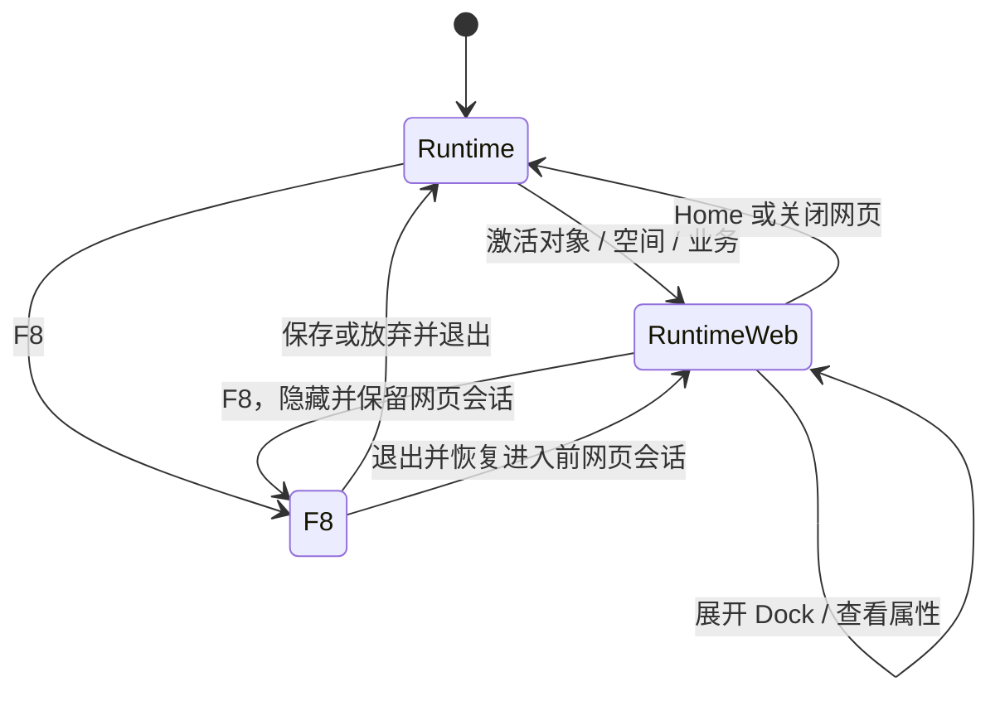

# OntoTwin 3.8.2 业务配置与运行交互重构（PRD）

> 文档性质：产品需求与交互重构设计
> 主线：OntoTwin Nexus / UE Runtime / F8 Runtime Editor
> 日期：2026-08-14
> 状态：一期开发完成，待目标关卡人工验收
> 前置版本：3.8 Web 交互与业务视图联动、3.8.1 开箱即用交互入口

---

## 1. 背景

3.8 与 3.8.1 已完成页面资源、业务管理、页面绑定、解析、发布、UE 单例网页宿主及运行入口，但实际验收暴露出产品形态问题：

1. Web 配置被拆成页面资源、业务管理、页面绑定、解析预览和发布等多个页面，用户需要在概念之间往返。
2. Web 配置台要求用户理解规则组、实例 ID、设备类型 ID、作用域和版本等技术字段。
3. 当前 Demo 的“即时效果”是模拟场景，不是真实 UE 结果，无法帮助用户判断配置，反而与“当前选择 / 属性”的目标结构冲突。
4. UE 的 Web 业务入口被放进漫游控制抽屉，普通场景操作和人物漫游混在同一个 Widget 中。
5. 空间和业务采用“先选下拉项，再点打开”的二段操作；实例详情还要求重复点击同一对象。
6. 网页打开后占有主要输入，用户必须关闭网页才能继续使用其他运行功能。
7. F8 只允许编辑场景变换，无法针对场景中已选对象直观配置业务归属。

3.8.2 不再围绕旧工作台做局部修补，而是统一 Web 配置、UE 运行导航和 F8 场景内编辑的交互心智。

---

## 2. 产品目标

3.8.2 完成后，用户应能：

1. 在一个 Web 页面内完成业务创建、成员管理、页面与场景行为配置。
2. 不填写实例 ID、类型 ID 或规则表达式，通过真实对象目录管理业务成员。
3. 在 UE 中使用一个可收缩 Dock 抽屉，在 Home、空间、业务和漫游之间切换。
4. 单击场景对象即可查看当前对象信息并执行详情页面绑定，不再重复点击同一对象。
5. 保持网页显示的同时使用运行 Dock 和对象属性面板。
6. 在 F8 中通过“场景编辑 / 业务编辑”两个标签直接管理已选对象。
7. 使用统一的“保存并应用”完成校验、版本更新和 UE 热更新。

### 2.1 完成定义

- Web 配置主流程不再跨多个工作页。
- UE 运行 Dock 与漫游内容解耦。
- F8 中网页和运行 Dock 均不显示，退出后恢复进入前的运行状态。
- 所有对象、空间和业务主操作均不依赖重复点击或“选择后再打开”。
- 网页、场景范围、镜头和返回历史保持一致。
- F8 与 Web 配置台使用同一业务版本并阻止静默覆盖。

---

## 3. 产品原则

### 3.1 对象优先

用户操作名称、分区、设备和业务，不直接操作 ID、JSON 或规则字段。稳定 ID 只在系统内部传递。

### 3.2 单页完成

业务目录、业务成员和属性编辑同时存在于同一工作台。复杂校验、版本和回滚放入高级设置，不参与日常主流程。

### 3.3 运行与编辑分离

- 运行模式负责浏览、激活空间或业务、打开页面和查看对象。
- F8 编辑模式负责修改场景和业务归属。
- 进入 F8 后不得继续显示运行网页或运行 Dock。

### 3.4 明确动作，一次完成

- 单击空间或业务即激活，不再增加“打开”按钮。
- 单击实例即选中并显示对象属性，不再要求重复点击同一实例。
- 打开实例详情仍是“当前对象”面板中的明确动作，避免误点模型替换现有网页。

### 3.5 网页不阻断运行操作

网页保持显示时，Dock、对象属性和场景的合法交互仍然可用。打开功能抽屉或查看属性不得自动关闭网页。

---

## 4. 总体信息架构

3.8.2 包含三个互相分离、数据一致的界面：

| 界面 | 主要职责 | 不承担 |
| --- | --- | --- |
| Web 单页业务配置台 | 创建业务、管理成员、配置页面与场景行为、保存应用、版本回滚 | 三维场景变换、网页业务数据编辑 |
| UE 运行 Dock 抽屉 | Home、空间、业务、漫游的快捷导航 | 页面资源配置、实例属性编辑、网页控制中心 |
| F8 Runtime Editor | 场景变换与已选对象的业务归属编辑 | 页面绑定、复杂业务规则、运行网页展示 |

运行状态关系：



---

## 5. Web 单页“业务配置台”

### 5.1 页面位置

- 继续位于现有“场景交互”模块下，不新增 Nexus 顶级模块。
- 保留现有入口路由，用户进入后直接看到单页业务配置台。
- 原“页面资源 / 业务管理 / 页面绑定 / 解析预览 / 发布与回滚”不再作为五个并列工作页。

### 5.2 最终三区布局

```text
┌──────────────┬────────────────────────────┬──────────────────┐
│ 业务目录      │ 成员工作区                  │ 当前选择 / 属性   │
│              │                            │                  │
│ 搜索          │ 当前业务成员                │ 业务属性          │
│ 业务列表      │ 按空间分组                  │ 或设备属性        │
│ 新建业务      │ 搜索 / 多选 / 添加 / 移除   │                  │
├──────────────┴────────────────────────────┴──────────────────┤
│ 状态与校验                                      保存并应用     │
└─────────────────────────────────────────────────────────────┘
```

#### 左侧：业务目录

- 搜索业务。
- 展示业务名称、启用状态和成员数量。
- 单击业务后，中间与右侧同步切换。
- 提供“新建业务”。
- 当前选中业务直接显示“删除”入口；删除须二次确认，并作为待应用草稿，只有“保存并应用”后才写入后端。
- 不显示 `business_view_id`，页面文案统一使用“业务”。

#### 中间：成员工作区

- 展示当前业务最终成员，默认按空间分组。
- 支持按设备名称、类型和分区搜索。
- 支持单选、多选、批量添加和批量移除。
- 添加对象时使用项目内真实对象目录，不要求用户输入实例 ID。
- 空业务显示明确空状态和“添加对象”入口。

#### 右侧：当前选择 / 属性

- 选中业务时显示：名称、说明、启用状态、入口页面、场景行为、成员统计。
- 选中设备时显示：名称、类型、空间分区、所属业务、只读关键属性，以及“点击对象时打开”的页面选择。
- 多选设备时显示：选中数量、共同分区、共同类型和业务归属摘要。
- 删除当前 Demo 中的模拟场景和“即时效果”。
- 右侧不是 UE 预览，不宣称能够模拟真实镜头、显隐或网页加载效果。

### 5.3 页面与场景行为

业务属性中的普通配置只暴露：

1. 显示名称。
2. 简短说明。
3. 是否启用。
4. 打开页面，可为空。
5. 场景行为：
   - 仅显示并自动取景。
   - 保留全场并高亮。
   - 只打开页面。

“场景行为”仅用于激活业务上下文：运行 Dock、Web Bridge 或同一运行接口激活业务时生效；直接点击单个对象时不读取该字段。

设备“点击对象时打开”提供三类选择：

1. 继承已有规则：按 `分区+类型 → 类型 → 分区 → 项目默认` 继续解析。
2. 不打开网页（仅此对象）：创建实例级阻止规则。
3. 指定页面：创建实例级详情页面覆盖；运行时自动传入实例 ID。

主界面不展示或要求输入实例 ID、绑定 ID 与解析字段。

以下内容收进高级设置：

- 动态成员策略。
- 页面参数映射。
- 解析链和技术 ID。
- 版本记录与回滚。
- 高级校验详情。

### 5.4 新建业务

Web 端新建业务时：

1. 第一步只要求名称。
2. 创建后直接留在同一页，并自动选中新业务。
3. 用户可在中间工作区添加成员，在右侧补充页面和场景行为。
4. 没有页面绑定是合法状态；业务仍可用于场景筛选。

### 5.5 保存模型

主流程只保留一个黑色主按钮：`保存并应用`。

点击后依次执行：

1. 本地必填校验。
2. 服务端结构与引用校验。
3. 使用 `expected_revision` 提交。
4. 生成新 revision。
5. 通知 UE 运行投影热更新。
6. 页面停留在当前业务与当前选择，不跳转到发布结果页。

校验失败时：

- 不离开当前页面。
- 错误显示在对应字段或对象附近。
- 页面底部显示简短摘要。
- 不使用原生 `alert`、`confirm` 或 `prompt`。

### 5.6 版本与回滚

- 当前 revision 以低强调状态显示。
- “版本记录 / 回滚上一版本”放在高级设置。
- 回滚仍创建新 revision，不把 revision 数字减一。
- 不在主流程要求用户理解“草稿”和“已发布”两个并列状态。

---

## 6. UE 运行 Dock 抽屉

### 6.1 产品形态

Dock 是屏幕下方的一个整体可收缩抽屉，不是多个浮动抽屉，也不是功能窗口系统。

```text
展开：
┌─────────────────────────────────────┐
│ Home   空间   业务   漫游            │
├─────────────────────────────────────┤
│ 当前标签对应的内容区域                │
└─────────────────────────────────────┘

收起：
                     [展开]
```

- `Tab` 可切换抽屉展开/收起及其鼠标交互状态。
- 抽屉也必须提供可点击的展开/收起入口，不能只依赖键盘。
- “空间 / 业务 / 漫游”在同一个内容区域内使用标签切换。
- 切换标签不会创建、叠加或保留第二个抽屉。

### 6.2 Dock 中保留的内容

| 标签或动作 | 行为 |
| --- | --- |
| Home | 直接恢复项目默认运行状态，不打开内容标签 |
| 空间 | 浏览并激活空间分区 |
| 业务 | 浏览并激活业务，可指定明确作用空间 |
| 漫游 | 人物、路线、视角等漫游操作 |

Dock 中明确移除：

- 项目：无独立操作价值，由 Home 承担默认状态恢复。
- 当前对象：由场景单击产生的上下文属性面板负责。
- 网页：网页与对象、空间或业务上下文绑定，不作为 Dock 应用管理。
- 页面资源：只允许在 Web 配置台管理。

### 6.3 Home

点击 Home 后一次完成：

1. 恢复项目默认镜头。
2. 恢复默认模型可见范围。
3. 清除当前对象选择。
4. 收起 Dock 内容区。
5. 隐藏当前网页，但保留轻量会话，避免销毁页面状态。

Home 不等于“打开项目主页网页”。原 `project_home_activated` 可保留为兼容 API，但不再占据 Dock 主入口。

### 6.4 空间标签

- 展示空间名称和层级，不展示 `zone_id`。
- 单击空间立即激活，不再出现“选择空间 → 打开分区”。
- 激活后执行已配置的模型范围和镜头行为。
- 当前空间使用低面积状态点或选中底色标识。
- 空间无页面绑定时只执行场景行为，并显示轻量提示。

### 6.5 业务标签

- 展示已启用业务名称、成员数量和当前状态。
- 单击业务立即激活，不再出现“选择业务 → 打开业务”。
- 标签顶部固定显示作用范围：
  - `全部空间`，默认值。
  - `当前空间：{空间名称}`。
- 用户必须看见当前作用范围；不得静默继承历史 Zone。
- 点击业务时，将 `business_view_id` 与可选 `zone_id` 一次提交。
- 业务未配置页面时，仍执行场景筛选，并提示“该业务未配置页面”。

### 6.6 漫游标签

- 人物、路线、视角、重载人物等漫游功能只出现在“漫游”标签。
- Web 业务内容不得继续拼接在漫游操作的上方或下方。
- 普通运行状态也可以打开 Dock；是否允许进入漫游由现有漫游配置决定。

---

## 7. 单击对象与上下文面板

### 7.1 取消重复点击

废弃 3.8.1 的“同一实例再次点击才打开详情”规则。

新的单击链路：

1. 用户单击一个实例。
2. 系统立即选中、高亮并聚焦该实例的当前对象上下文。
3. 系统立即触发一次 `open_detail` 解析，不要求再次点击或点击额外按钮。
4. 命中实例、分区+类型、类型、分区或项目默认绑定时，打开对应页面并传入实例 ID。
5. 没有可用绑定时保持对象已选，并给出“当前对象没有可用网页详情绑定”的轻量提示。

点击空白区域清除当前对象，但不因此关闭正在显示的网页。

### 7.2 当前对象 / 属性面板

至少展示：

- 对象显示名称。
- 对象类型。
- 所属空间。
- 所属业务摘要。
- 关键只读属性。
- 当前解析到的详情页面与绑定来源。

该面板：

- 不放入 Dock 标签栏。
- 不要求先进入人物漫游。
- 始终位于网页之上。
- 不遮挡网页时，网页保持可交互。
- 可由用户收起；选择新对象后重新显示并更新内容。

---

## 8. 网页持续显示与输入规则

### 8.1 运行模式

网页显示时允许：

- 展开、收起和切换 Dock 标签。
- 查看当前对象属性。
- 操作 Dock、系统 Toast 和网页宿主控件。
- 在网页透明且未声明交互的区域继续点选或操控场景。

层级从下到上：

```text
UE 三维场景
→ 网页装饰层
→ 网页像素与网页交互区
→ 当前对象 / 属性面板
→ Dock 抽屉
→ 系统 Toast、确认与错误层
```

网页真实交互区继续由 `data-ontotwin-interactive` 与 Web Bridge 上报。未完成 Bridge 握手的普通网页仍按安全规则接收整个网页区域的输入，但 Dock 和系统面板必须保持最高命中优先级。

### 8.2 哪些操作不改变网页

- 只展开或收起 Dock。
- 在空间、业务、漫游标签间切换但尚未激活条目。
- 查看当前对象属性。
- 调整漫游视角或路线，除非动作显式触发新的页面上下文。

### 8.3 哪些操作更新网页

- 单击具有对象详情绑定的实例。
- 激活具有页面绑定的空间。
- 激活具有页面绑定的业务。
- Web Bridge 发起合法的 `request_open_scope` 或 `request_open_page`。

新上下文有页面绑定时切换到新页面；没有绑定时隐藏旧网页但保留会话，并提示“当前范围没有页面”。不得继续展示与当前场景范围不一致的旧网页。

### 8.4 F8 模式

进入 F8 时：

- 网页立即隐藏，但不销毁浏览器会话。
- 运行 Dock 立即隐藏并禁止输入。
- 当前对象运行面板隐藏。
- 不允许网页像素、网页控件或 Dock 与 F8 UI 同时出现。

退出 F8 后：

- 恢复进入前的网页显示状态与轻量导航会话。
- 恢复进入前 Dock 的展开状态与当前标签。
- 若 F8 保存导致业务 revision 更新，则先重新解析当前上下文；最终 URL 未变化时不刷新网页。

---

## 9. 网页宿主与统一返回

### 9.1 统一导航历史

每次成功激活对象、空间或业务时，记录：

- 页面 ID 与最终 URL。
- 作用域类型及稳定 ID。
- 当前模型可见范围。
- 镜头状态。

建议最多保留最近 10 次轻量导航。返回时同时恢复页面、场景范围和镜头，禁止只返回网页而留下新场景。

### 9.2 极简宿主控制

网页宿主始终保留一个低强调控制胶囊：

- 返回：仅有历史时显示。
- 关闭：隐藏当前网页。
- 加载、失败或重试：仅在对应状态发生时临时展开文字。

返回键要求：

- 小尺寸线性箭头图标。
- 不使用大面积“返回”文字按钮。
- 默认低对比度，悬停或键盘聚焦时增强。
- 位于网页宿主边缘，不放进 Dock，不占页面业务内容区。
- 可兼容 `Alt + ←`，但快捷键不是主操作路径。

网页不得自行承担宿主关闭和场景历史恢复。

---

## 10. F8 双标签 Runtime Editor

### 10.1 总体布局

沿用现有 F8 Runtime Editor 面板，在其现有 UI 内增加两个顶级标签：

```text
┌────────────────────────────────┐
│ 场景编辑        业务编辑        │
├────────────────────────────────┤
│ 当前标签内容                    │
├────────────────────────────────┤
│ 待保存修改                      │
│ 取消全部修改     保存全部修改    │
└────────────────────────────────┘
```

- 不新增底部工具条。
- 不另建第二个独立编辑器窗口。
- 两个标签共享当前场景选择、撤销/重做、待保存摘要和退出确认。

### 10.2 场景编辑

继续提供现有能力：

- 单选和多选。
- 位置与旋转调整。
- 墙面和网格吸附。
- 从场景移除。
- 撤销、重做、取消全部、保存全部。

3.8.2 不改变场景变换的数据含义。

### 10.3 业务编辑

业务编辑以场景选择为中心，只负责“对象属于哪些业务”：

- 将所选对象加入已有业务。
- 将所选对象移出业务。
- 使用所选对象新建业务。
- 所选对象名称属于必要状态，应常驻显示；归属状态解释、同步说明和创建说明使用控件 hover 提示，避免重复占用面板层级。
- 业务下拉只在业务目录、选择集合或归属状态变化时重建，不得由逐帧刷新关闭用户已经打开的下拉浮层。

F8 不提供：

- 页面资源注册。
- 页面绑定与参数配置。
- 场景行为详细配置。
- 动态规则组编辑。
- 版本历史和回滚。
- 设备分区写入。分区是项目的空间与加载边界，继续由 Web“实例绑定台 → 分区管理”维护；F8 可显示只读分区，但不在业务归属操作中顺带改分区。

### 10.4 多选三态

现有 F8 最多选择 20 个对象的限制继续生效。

选中多个对象后，业务列表使用三态：

| 状态 | 含义 | 点击结果 |
| --- | --- | --- |
| 已选 | 全部对象都属于该业务 | 将全部移出 |
| 半选 | 只有部分对象属于该业务 | 将全部加入 |
| 未选 | 全部对象都不属于该业务 | 将全部加入 |

每次批量操作必须进入撤销栈和待保存摘要。

### 10.5 F8 新建业务

用户只填写业务名称：

- 当前所选对象自动成为成员。
- 默认启用。
- 默认场景行为为“仅显示并自动取景”。
- 页面保持未配置。
- 保存后可以立即用于运行场景筛选。
- 页面和其他属性之后在 Web 配置台补充。

### 10.6 成员规则映射

F8 不改变现有 BusinessView 存储结构：

- 加入业务：将实例加入专用显式 `instance_ids` 规则组，并从 `exclude_instance_ids` 移除。
- 移出业务：从显式规则组移除；若实例仍被动态规则命中，则加入 `exclude_instance_ids`。
- F8 新建业务：创建一个仅包含所选 `instance_ids` 的规则组。

普通用户不接触上述字段。

### 10.7 保存与退出

业务修改纳入现有 F8 待保存会话：

- `撤销 / 重做` 同时覆盖场景与业务修改。
- `取消全部修改` 恢复进入 F8 前的场景和业务状态。
- `保存全部修改` 保存并立即应用。
- `保存并退出 / 放弃并退出 / 继续编辑` 沿用现有退出确认结构。

若场景修改或业务修改任一部分失败：

- 保持在 F8。
- 不清空失败部分的待保存状态。
- 明确显示哪一类修改失败。
- 不得把部分成功伪装成“全部保存成功”。

---

## 11. Revision、冲突与失败恢复

### 11.1 统一版本

- Web 配置台和 F8 业务编辑共同使用 `web_interactions.revision`。
- 两端保存均携带读取时的 `expected_revision`。
- 成功保存后 revision 加一，UE 通过现有运行投影轮询获取更新。

### 11.2 冲突策略

3.8.2 不实现自动合并器。

当 revision 不一致时：

1. 阻止覆盖。
2. 保留本地待保存修改。
3. 提示“业务配置已在其他入口更新”。
4. 展示本地变更摘要。
5. 用户加载最新版本后重新确认应用。

禁止后保存者静默覆盖先保存者。

### 11.3 失败反馈

| 情况 | 反馈与恢复 |
| --- | --- |
| Web 配置校验失败 | 定位到字段或成员，保持当前选择 |
| F8 业务保存失败 | 保留待保存业务修改，停留 F8 |
| Revision 冲突 | 保留本地摘要，要求加载最新版本 |
| 业务未配置页面 | 场景行为照常执行，显示轻量提示 |
| 新上下文没有页面 | 隐藏旧网页但保留会话，不显示错误页 |
| 页面加载失败 | 宿主显示重试；场景范围保持已激活状态 |
| Web Bridge 未握手 | 网页正常显示，按安全输入模式降级 |

---

## 12. 对现有实现的替换关系

### 12.1 Web 前端

现有：

```text
页面资源 → 业务管理 → 页面绑定 → 解析预览 → 发布与回滚
```

3.8.2：

```text
单页业务配置台
├─ 业务目录
├─ 成员工作区
├─ 当前选择 / 属性
├─ 保存并应用
└─ 高级设置：页面资源、解析、版本与回滚
```

现有 API 和存储结构优先复用；前端不得直接写项目文件。

### 12.2 UE 运行 HUD

现有 `UOntoTwinRoamingHUDWidget` 同时承担漫游和 Web 业务入口。3.8.2 应：

- 新增或拆出独立运行 Dock Widget。
- 将 Home、空间、业务和漫游作为同一抽屉的标签或动作。
- 从漫游布局中删除 `WebProjectButton`、`WebZoneSelector`、`WebZoneOpenButton`、`WebBusinessSelector`、`WebBusinessZoneSelector` 和 `WebBusinessOpenButton` 这类二段式入口。
- 保留 `TwinInteractionManagerComponent` 的解析与运行调用能力，但改为列表项单击直接提交上下文。

### 12.3 F8 Runtime Editor

现有 `UOntoTwinRuntimeEditorPanel` 已具备：

- 选择与属性。
- 撤销、重做。
- 待保存列表。
- 保存、取消与退出确认。

3.8.2 在该面板中增加标签容器和业务编辑内容，复用已有会话机制，不新增底部工具条。

---

## 13. 不在 3.8.2 范围内

- 不构建桌面式多窗口系统。
- 不允许同时打开多个 WebBrowser 实例。
- 不让 OntoTwin 编辑网页内部业务数据。
- 不在 F8 中配置页面 URL、参数映射或完整业务规则。
- 不实现多人协作锁或自动冲突合并。
- 不改变 Zone、Type、Instance 的基础存储语义。
- 不引入前端构建工具或新的异步任务系统。
- 不解决 Zone Level Streaming 或首次全量加载性能问题。

---

## 14. 验收标准

### AC-1 Web 单页配置

- [ ] 进入场景交互下的业务配置后，不需要切换工作页即可创建和配置一个业务。
- [ ] 左侧是业务目录，中间是成员工作区，右侧是当前选择 / 属性。
- [ ] 页面不再显示模拟 UE 的“即时效果”。
- [ ] 用户不需要输入实例 ID、类型 ID 或规则 JSON。
- [ ] “保存并应用”成功后 revision 加一，UE 获取新配置。
- [ ] 版本和回滚位于高级设置。

### AC-2 运行 Dock

- [ ] Dock 是一个可展开、可收缩的整体抽屉。
- [ ] Dock 只包含 Home、空间、业务、漫游。
- [ ] 空间与业务均为单击立即激活，不存在额外“打开”按钮。
- [ ] 业务标签始终显示“全部空间”或明确的当前空间。
- [ ] 漫游和业务不再混排在同一内容区。

### AC-3 Home

- [ ] 点击 Home 恢复默认镜头和默认模型范围。
- [ ] Home 清除当前对象并收起内容区。
- [ ] Home 隐藏网页但不销毁网页会话。
- [ ] Home 不打开项目主页网页。

### AC-4 单击对象

- [ ] 第一次单击实例即选中并执行对象详情页面绑定。
- [ ] 不要求再次点击同一实例。
- [ ] 实例级配置可选择继承、仅此对象不打开或指定页面。
- [ ] 点击空白清除对象选择，但不关闭当前网页。

### AC-5 网页与其他操作并存

- [ ] 网页显示时可以展开和操作 Dock。
- [ ] 网页显示时可以查看当前对象属性。
- [ ] 仅打开 Dock 或切换标签不会关闭或刷新网页。
- [ ] 激活新上下文时，网页与场景同步切换。
- [ ] 新上下文无页面时隐藏旧网页并保留会话。

### AC-6 返回

- [ ] 返回同时恢复上一网页、场景范围和镜头。
- [ ] 没有历史记录时不显示返回控件。
- [ ] 返回控件是低强调图标，不使用明显的大按钮或文字条。
- [ ] 加载或错误时宿主控制可以临时展开状态文字。

### AC-7 F8 模式隔离

- [ ] 进入 F8 后网页、运行 Dock 和运行对象面板全部隐藏。
- [ ] F8 只显示一个编辑器面板，包含“场景编辑 / 业务编辑”标签。
- [ ] 退出 F8 后恢复进入前网页和 Dock 状态。
- [ ] F8 中不出现底部工具条。

### AC-8 F8 业务编辑

- [ ] 单选对象可以加入或移出已有业务。
- [ ] 多选对象显示已选、半选、未选三态。
- [ ] 批量业务修改支持撤销、重做和取消全部。
- [ ] 使用所选对象新建业务时只要求填写名称。
- [ ] 新业务默认“仅显示并自动取景”，允许页面未配置。
- [ ] 保存后业务立即可在运行 Dock 中使用。

### AC-9 冲突与失败

- [ ] Web 和 F8 保存均携带 `expected_revision`。
- [ ] Revision 冲突不会覆盖远端版本，也不会丢失本地待保存摘要。
- [ ] 场景或业务保存失败时 F8 不退出。
- [ ] 系统不会在部分失败时提示“全部保存成功”。

---

## 15. 建议开发顺序

1. Web 单页布局与“保存并应用”主流程。
2. 运行 Dock 从漫游 Widget 解耦，并完成空间、业务单击激活。
3. 单击对象与当前对象 / 属性面板。
4. 网页、Dock 和场景输入共存，以及统一返回历史。
5. F8 双标签与业务归属编辑。
6. Revision 冲突、失败恢复和完整验收。

每一步应保持现有 3.8 API 可用，避免一次性替换全部前后端与 UE 链路。
