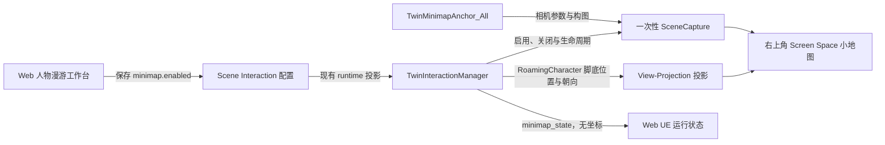

# OntoTwin 3.9 插件化只读小地图（PRD）

> 状态：需求确认完成，待开发  
> 主线：OntoTwin Nexus / Scene Interaction / UE Runtime  
> 目标版本：3.9  
> 日期：2026-07-30  
> 开发基线：现有人物漫游、三视角、漫游 HUD、Scene Interaction 配置与运行状态链路

---

## 1. 版本定义

3.9 在现有 `OntoTwinSync` 插件中新增项目级只读小地图能力。终端用户进入人物漫游后，可以在右上角看到当前场景的一次性捕获画面，以及漫游人物的实时位置和方向。

本版本采用“能力归插件、场景数据归项目”的分层方式：

- `OntoTwinSync` 提供 Anchor 类型、场景捕获、坐标投影、HUD、配置解析、运行状态和降级逻辑。
- 宿主 UE 项目只在关卡中放置并调整一个 `TwinMinimapAnchor` 实例。
- OntoTwin Web 只提供当前项目的“启用小地图”开关和运行状态，不承担地图构图编辑。

小地图背景只在启用或进入漫游时捕获一次；随后停止场景捕获，仅实时更新人物标记。3.9 的“实时”特指人物位置和方向实时，不包含场景灯光、设备、车辆或模型变化的实时画面。

---

## 2. 当前事实、确认结论与提案边界

### 2.1 当前事实

- `frontend/interaction.html` 已有“人物漫游”工作台、运行开关、显式“保存并应用”、脏状态和 UE 运行状态区域。
- 人物漫游配置保存在当前项目的 `scene_interactions.roaming` 中，并通过现有 Scene Interaction revision 防止并发覆盖。
- UE 通过 `/api/v2/scene-interactions/runtime` 获取当前项目的运行投影，通过同一路径回报无人物坐标的运行状态。
- `UTwinInteractionManagerComponent` 已统一管理漫游人物、三视角、输入、HUD、配置热更新和退出清理。
- 切换到全局视角后，PlayerController 控制的是全局观察 Pawn；真正的漫游人物仍由 `UTwinInteractionManagerComponent::RoamingCharacter` 持有。
- 当前漫游 HUD 是 Screen Space 全视口 UMG，右上角没有现有业务控件。
- 当前 HUD 使用 Performance 级静态半透明表面，不依赖 Slate Postbuffer 或 Background Blur。

### 2.2 已确认产品决策

| 决策项 | 3.9 结论 |
|---|---|
| 版本号 | 3.9 |
| 代码归属 | 现有 `OntoTwinSync` 插件，不单独新建插件 |
| 使用方式 | 只读，不支持点击、传送、寻路、缩放、拖拽或关闭 |
| 地图数量 | 单张地图、单楼层 |
| 地图视角 | 使用项目中已调好的视角参数，复制到独立 Anchor |
| Anchor | 新建 `ATwinMinimapAnchor`；项目实例命名为 `TwinMinimapAnchor_All` |
| 地图方向 | 地图固定，人物标记旋转 |
| 三视角行为 | 第一人称、过肩、全局视角均显示；始终追踪漫游人物 |
| HUD 行为 | 进入漫游后常驻右上角，无展开、收起或关闭按钮 |
| 越界行为 | 标记吸附地图内边缘，并指向人物所在的地图外方向 |
| Web | 在现有“人物漫游”工作台增加项目级开关 |
| 默认值 | 旧项目和缺少字段的配置默认关闭；当前项目显式开启 |
| Web 配置范围 | 只提供开关和运行状态，不提供预览、Anchor 选择或样式参数 |
| 跟踪对象 | 单个本地 `RoamingCharacter`，不显示其他用户或设备 |
| 标记内容 | 只显示方向标记，不显示名称、坐标或速度 |
| 故障策略 | 小地图降级隐藏，不阻断人物漫游、路线或视角切换 |

### 2.3 本 PRD 提出的技术契约

以下内容是为实现已确认产品决策而提出的稳定契约：

- `scene_interactions.roaming.minimap.enabled`：项目级开关。
- `minimap.default`：3.9 唯一小地图的稳定 ID。
- `minimap_state`：UE 回报小地图运行状态，不回传人物位置。
- `minimap_anchor_missing`、`minimap_anchor_ambiguous`、`minimap_capture_failed`：非阻断降级代码。
- `ATwinMinimapAnchor`：插件提供的关卡 Actor 类型。

这些契约不新增 ProjectStore 顶层字段，不提升 `schema_version`，不新增前端路由，也不新增独立 HTTP 资源体系。

---

## 3. 目标与非目标

### 3.1 产品目标

1. 漫游用户能在右上角快速判断人物位于场景的什么位置、面向什么方向。
2. 第一人称、过肩和全局视角切换时，小地图语义保持一致，不因 Pawn possession 改变而跳点。
3. 小地图能力可随 OntoTwinSync 插件复用，宿主项目只需提供场景专属 Anchor。
4. 项目管理员可在 Web 人物漫游工作台显式开启或关闭小地图。
5. 小地图关闭、配置缺失或捕获失败时，人物漫游主链路仍然可用。
6. 稳态不维持第二路场景渲染，适配本机运行和 Pixel Streaming。

### 3.2 成功标准

- 当前项目开启小地图并放置有效 Anchor 后，进入漫游即可看到地图和人物标记。
- 人物标记与捕获相机的透视投影一致，在地图中心和边缘均无明显漂移。
- 切到全局视角后，标记仍追踪漫游人物，不追踪 `GodViewPawn`。
- 关闭 Web 开关后，无须退出漫游或重生人物，小地图即可热关闭。
- 开启开关但缺少 Anchor 时，Web 显示可理解的降级状态，UE 漫游仍正常。
- 一次捕获完成后不再持续执行 SceneCapture。

### 3.3 非目标

- 不支持点击地图传送、点击寻路、路线编辑或地图选点。
- 不支持用户缩放、拖拽、旋转或关闭小地图；只提供面板折叠为图标和重新展开。
- 不支持多楼层、楼层自动切换、多地图分页或室内外地图切换。
- 不支持多人位置、设备位置、业务事件、告警点或实例聚合标记。
- 不显示人物名称、世界坐标、速度、路线轨迹或目的地。
- 不持续捕获场景，不保证地图背景反映启用后的动态变化。
- 不在 Web 预览 UE 最终捕获画面，不在 Web 编辑 Anchor、FOV、宽高比或视觉样式。
- 不修改宿主 Pawn，不替换现有三视角或漫游输入体系。
- 不新建独立 Minimap 插件，不引入前端构建工具或新 Python 依赖。

---

## 4. 用户故事

### 4.1 项目配置人员

1. 配置人员打开 `/interaction`，进入“人物漫游”。
2. 在“运行开关”中开启“启用小地图”。
3. 点击现有“保存并应用”。
4. 页面显示新的配置 revision。
5. UE 在线时，右侧运行状态显示“小地图：已生效”；若 Anchor 缺失或捕获失败，显示对应降级说明。

### 4.2 UE 项目集成人员

1. 在目标关卡放置插件提供的 `ATwinMinimapAnchor`。
2. 将 Actor 实例命名为 `TwinMinimapAnchor_All`，稳定 ID 保持 `minimap.default`。
3. 把已调好的全局视角 Transform、FOV、投影模式和构图复制到该 Anchor。
4. 在 PIE、Standalone 和打包版中检查地图画面与人物投影。

### 4.3 终端漫游用户

1. 用户按现有入口进入人物漫游。
2. 小地图捕获完成后出现在右上角。
3. 人物移动、自动路线行走或改变朝向时，标记实时更新。
4. 用户切换第一人称、过肩和全局视角，小地图保持显示并追踪同一个人物。
5. 人物走出地图覆盖范围时，标记停在内边缘并指向地图外的实际方向。
6. 用户点击地图按钮可把面板平滑折叠为图标，再次点击重新展开。
7. 用户退出漫游后，小地图与相关资源一起清理。

---

## 5. 端到端链路



关键约束：

- Web 只下发是否启用，不下发人物位置。
- 人物位置只在 UE 进程内用于 HUD 投影，不进入 HTTP、WebSocket、日志或持久化。
- 地图背景由 Anchor 相机一次捕获；人物标记来自实际 `RoamingCharacter`，两者使用同一投影参数。

---

## 6. Web 工作台设计

### 6.1 页面与位置

沿用现有 `/interaction` 页面和“人物漫游”功能，不新增页面或一级页签。

在左侧“运行开关”区域按以下顺序显示：

1. 启用人物漫游
2. 运行时自动进入
3. 启用小地图

“启用小地图”使用现有 `check-row` 黑白灰控件配方，不使用 emoji、彩色主交互或原生弹窗。

### 6.2 开关交互

- 开关修改只进入当前草稿并产生脏状态。
- 只有点击现有“保存并应用”后才持久化并递增 Scene Interaction revision。
- 保存中沿用现有按钮 loading 和禁用状态。
- revision 冲突沿用现有 `409` 处理，不覆盖服务端新值。
- 当“启用人物漫游”关闭时，小地图开关不可操作，但保留草稿中的已选值；重新开启人物漫游后恢复，不做破坏性清空。
- 小地图运行时的实际有效条件为：`roaming.enabled && roaming.minimap.enabled`。

### 6.3 范围限制

3.9 Web 不提供以下字段：

- 地图预览
- Anchor 下拉选择
- 地图尺寸或宽高比
- 捕获分辨率
- FOV、相机位置或旋转
- 标记颜色、图标或更新频率
- 多楼层或高度范围

这些项目若未来开放配置，必须另行设计，不能把 UE 技术字段直接暴露给普通配置人员。

### 6.4 运行状态

右侧“UE 运行状态”卡片增加一行：

```text
小地图    未开启 / 等待 UE / 捕获中 / 已生效 / 缺少地图视角 / 地图视角重复 / 捕获失败
```

用户文案与稳定状态映射：

| `minimap_state` | Web 文案 | 性质 |
|---|---|---|
| `disabled` | 未开启 | 正常 |
| `waiting` | 等待 UE | 中性 |
| `capturing` | 捕获中 | 中性 |
| `ready` | 已生效 | 正常 |
| `anchor_missing` | 缺少地图视角 | 降级 |
| `anchor_ambiguous` | 地图视角重复 | 降级 |
| `capture_failed` | 捕获失败 | 降级 |

降级提示使用小面积状态点、左边框或文字，不使用整块红黄背景。页面不显示 C++ 类名、Render Target 或 SceneCapture 等技术黑话。

---

## 7. 项目配置与后端契约

### 7.1 存储结构

在现有 `scene_interactions.roaming` 内新增：

```json
{
  "enabled": true,
  "auto_enter": false,
  "minimap": {
    "enabled": true
  }
}
```

规则：

- `minimap` 缺失、为 `null` 或 `enabled` 缺失时，读取为 `false`。
- `minimap.enabled` 只接受布尔值；其他类型返回字段级 `422`。
- 不新增 ProjectStore 顶层字段。
- 不提升 `schema_version`。
- JSON 与 PostgreSQL 均继续复用现有 `scene_interactions` 存储路径。
- 保存仍递增同一个 Scene Interaction revision，不创建 Minimap 独立 revision。

### 7.2 API

不新增 API。沿用：

```http
GET /api/v2/scene-interactions/roaming
PUT /api/v2/scene-interactions/roaming
GET /api/v2/scene-interactions/runtime
POST /api/v2/scene-interactions/runtime
```

`GET/PUT roaming` 的 `config` 原样包含规范化后的 `minimap` 对象。

运行投影示例：

```json
{
  "revision": 18,
  "config": {
    "enabled": true,
    "minimap": {
      "enabled": true
    }
  }
}
```

### 7.3 后端规范化

`default_roaming_config()` 补充默认值：

```json
{
  "enabled": false,
  "auto_enter": false,
  "minimap": {
    "enabled": false
  }
}
```

`validate_roaming_config()` 负责：

- 将缺失的 `minimap` 规范化为对象。
- 校验 `minimap.enabled` 为布尔值。
- 保留其他已知 roaming 字段的现有验证行为。
- 不因为小地图开启而要求后端知道 UE Anchor 是否存在。

Anchor 是否存在只能由 UE 运行端判断，不能由 Web 保存阶段伪校验。

### 7.4 运行状态心跳

UE 心跳新增顶层字段：

```json
{
  "minimap_state": "ready",
  "degraded_features": []
}
```

规则：

- `minimap_state` 只接受第 6.4 节定义的稳定枚举。
- `anchor_missing`、`anchor_ambiguous`、`capture_failed` 同时加入对应 `degraded_features` 代码，便于诊断。
- 小地图故障不得把整体 `runtime_state` 改为 `blocked`。
- 心跳继续禁止 `position`、`world_position`、`character_position`、`location` 或其他人物坐标字段。
- Web 离线时显示“等待 UE”，不把上一次 `ready` 永久当作当前事实。

---

## 8. UE 插件设计

### 8.1 代码归属

所有通用代码进入现有 Runtime 模块的独立目录，避免继续扩大人物管理器和 HUD 文件：

```text
ue_project/Plugins/OntoTwinSync/Source/OntoTwinSync/
  Public/SceneInteraction/Minimap/
    TwinMinimapAnchor.h
    TwinMinimapTypes.h
    OntoTwinMinimapWidget.h
  Private/SceneInteraction/Minimap/
    TwinMinimapAnchor.cpp
    TwinMinimapRuntime.cpp
    OntoTwinMinimapWidget.cpp
```

现有文件只承担必要接线：

- `TwinRoamingTypes.h`：增加最小运行配置字段。
- `TwinInteractionManagerComponent`：解析开关、持有小地图运行对象、热开关和状态回报。
- `OntoTwinRoamingHUDWidget`：在现有全视口 Canvas 中挂载右上角小地图 Widget。

不新建 Unreal 模块，不新建 `.uplugin`，不引入第三方依赖。

### 8.2 `ATwinMinimapAnchor`

`ATwinMinimapAnchor` 继承 `ACameraActor`，由插件提供并可在关卡中放置。

3.9 暴露的项目侧属性：

| 属性 | 默认值 | 用途 |
|---|---:|---|
| `MinimapId` | `minimap.default` | 稳定查找 ID |
| `CaptureWidth` | `1024` | 一次性捕获宽度 |
| `CaptureHeight` | `768` | 一次性捕获高度 |
| `CropFractionPerEdge` | `0.20` | 捕获投影四边各裁剪 20% |

Inherited CameraComponent 继续承载：

- Transform
- Perspective / Orthographic 投影模式
- FOV 或 Ortho Width
- Aspect Ratio
- 必要的 Post Process 参数

项目集成人员把已调好的视角复制到 `TwinMinimapAnchor_All`。以后调整全局视角不会改变小地图，调整小地图也不会影响全局视角出生相机。

3.9 只解析 `minimap.default`：

- 找不到：`anchor_missing`。
- 找到一个：正常使用。
- 找到多个同 ID Anchor：`anchor_ambiguous`，不任意选择第一个。

### 8.3 一次性场景捕获

插件为当前本地漫游会话最多创建：

- 1 个临时 `USceneCaptureComponent2D`。
- 1 个 `UTextureRenderTarget2D`。
- 1 个小地图 Widget。

捕获规则：

1. 开关有效且进入漫游后解析 Anchor。
2. 等待关卡和人物初始化完成。
3. 从 Anchor 复制 Transform、投影模式、FOV/Ortho Width、宽高比和必要的相机设置。
4. 使用 `RTF_RGBA8`、无 HDR、无自动 Mip 的 Render Target。
5. 捕获时隐藏本地 `RoamingCharacter`、全局观察 Pawn 和 OntoTwin 临时运行控件，避免把人物或调试对象烘进底图。
6. 显式调用一次 `CaptureScene()`。
7. 捕获成功后关闭 `bCaptureEveryFrame` 和 `bCaptureOnMovement`；稳态不得继续渲染第二路场景。
8. 只有重新进入漫游、运行中从关闭切到开启、关卡切换或 Anchor 明确重建时才重新捕获。

捕获中不显示透明空框、黑块或棋盘格；Widget 在贴图可用后整体出现。捕获失败时隐藏 Widget 并上报状态。

### 8.4 世界坐标到地图坐标

不得使用简单世界 XY 线性归一化。已调好的地图视角允许透视和倾斜，必须使用与捕获相机一致的 View-Projection 矩阵。

人物位置取：

- `RoamingCharacter` 的脚底世界位置，而不是相机、胶囊中心或当前被 Possess 的 Pawn。
- 人物水平方向取角色 Forward Vector，不使用全局相机方向。

投影流程：

1. 把脚底世界位置投影到 Anchor 的 Clip Space。
2. 做齐次除法得到 NDC。
3. 将 NDC 映射到与 Render Target 一致的 UV。
4. 使用同一矩阵投影“脚底位置 + 水平 Forward Vector 探针点”，由两点差计算屏幕内朝向。
5. 地图内时，标记位于真实 UV 并按人物朝向旋转。
6. 地图外时，把位置限制在地图内边缘安全区，箭头改为指向真实越界点方向。
7. 投影在相机后方、矩阵无效或产生非有限数值时，不显示错误标记并进入降级状态。

位置和朝向更新目标频率为 `20 Hz`。地图本身保持静止，不随人物旋转。

### 8.5 三视角与生命周期

| 状态 | 小地图 | 跟踪来源 |
|---|---|---|
| 漫游未进入 | 隐藏 | 无 |
| 第一人称 | 显示 | `RoamingCharacter` |
| 过肩视角 | 显示 | `RoamingCharacter` |
| 全局视角 | 显示 | `RoamingCharacter`，不是 `GodViewPawn` |
| 自动路线 | 显示并更新 | `RoamingCharacter` |
| Tab 操作抽屉打开 | 保持显示 | `RoamingCharacter` |
| 相机切换过渡 | 保持显示并更新 | `RoamingCharacter` |
| 退出漫游 | 销毁/隐藏 | 无 |

`UTwinInteractionManagerComponent` 是唯一人物引用来源。小地图不得在 Tick 中调用 `GetPlayerPawn()` 推断人物，因为全局视角下该调用返回的是全局观察 Pawn。

### 8.6 配置热更新

小地图开关属于非结构配置：

- 关闭 → 开启：解析 Anchor，执行一次捕获，成功后显示。
- 开启 → 关闭：立即隐藏并释放小地图会话资源。
- 开关变化不得设置 `reload_required`，不得重生人物或重置路线。
- 人物资产、出生点、路线或关卡结构变化仍沿用现有重载规则。

若启用时失败，后续配置 revision、重新进入漫游或关卡重新加载可再次尝试；不得每帧无限重试或刷日志。

### 8.7 清理

以下事件必须清理 Widget、Render Target、捕获组件、定时器和引用：

- Web 开关关闭
- `F7` 退出漫游
- `EndPlay`
- 关卡切换
- PlayerController 失效
- 插件组件销毁

清理后不得留下不可见的命中区域、SceneCapture、Render Target 或对已销毁人物的引用。

---

## 9. HUD 与视觉规范

### 9.1 渲染路径

小地图是 Screen Space HUD，不提供 World Space WidgetComponent 版本。

3.9 沿用现有漫游 HUD 的 Performance 质量：

- 使用静态中性深灰半透明表面、细描边和圆角。
- 不新增 Slate Postbuffer。
- 不新增 Background Blur。
- 不使用 Retainer Box 伪装场景模糊。
- 地图贴图、人物标记和边缘箭头保持清晰，不能被折射或模糊。

未来若漫游 HUD 接入 High / Balanced，共享外壳可以向下复用质量档位；地图内容本身仍保持锐利，失败时最终回退到 Performance 可读表面。

### 9.2 布局

- 锚点：视口右上角。
- 默认安全边距：`24` logical px。
- 默认地图内容：`320 × 240` logical px，4:3。
- 允许随 DPI 和安全区缩小，但最小不低于 `240 × 180` logical px。
- 不能与系统标题栏、右上安全区或现有 HUD 产生硬编码分辨率偏移。
- 捕获画面必须保持 Anchor 的原始宽高比，不拉伸。

### 9.3 视觉层级

```text
Minimap root（Self Hit Test Invisible）
├─ Performance glass shell / rim
├─ sharp captured map image
├─ subtle inner scrim for edge contrast
└─ sharp player marker / off-map marker
```

- 地图为主要内容，不增加标题、坐标、图例或说明文字。
- 人物标记使用高对比白色主体和深色轮廓，保证在白地面、暗设备和高频背景上可识别。
- 标记尺寸约 `16–20` logical px，轮廓与核心图形满足必要图形 `3:1` 对比度。
- 地图内标记表达人物朝向；越界标记采用边缘吸附和向外形态变化，不能只依赖颜色表达。
- 无持续呼吸、旋转光泽、流动噪声或其他空闲动画。
- 出现可使用 `180–240 ms` 短淡入；ReducedMotion 下直接短淡入，不缩放。

### 9.4 输入

小地图装饰层设置为 `Self Hit Test Invisible`：

- 不获取键盘焦点。
- 不阻断鼠标看向、全局视角拖动、场景点选或 Pixel Streaming 输入。
- 只有右上角地图按钮参与命中测试，用于折叠和展开；第一人称下沿用 Tab HUD 交互模式获得鼠标。
- 不改变当前 Input Mode、鼠标可见性或光标捕获状态。
- 不新增按钮或点击目标。

---

## 10. 故障与降级

| 故障 | UE 行为 | Web 状态 | 是否阻断漫游 |
|---|---|---|---|
| Web 未开启 | 不创建小地图 | 未开启 | 否 |
| UE 离线 | 无当前事实 | 等待 UE | 否 |
| Anchor 缺失 | 隐藏小地图，单次日志 | 缺少地图视角 | 否 |
| Anchor ID 重复 | 隐藏小地图，列出冲突数量 | 地图视角重复 | 否 |
| Render Target 创建失败 | 隐藏并清理半成品 | 捕获失败 | 否 |
| Capture 失败 | 隐藏并清理半成品 | 捕获失败 | 否 |
| 投影矩阵无效 | 隐藏标记和地图，记录降级 | 捕获失败 | 否 |
| 人物暂时无效 | 暂停标记更新，不读取其他 Pawn | 等待 UE/当前状态 | 否 |
| 人物越界 | 边缘吸附并指向地图外 | 已生效 | 否 |

日志要求：

- 每次状态变化最多记录一次。
- 不在 Tick 中重复输出 Anchor 缺失、越界或投影失败日志。
- 日志不得包含人物实时坐标。

---

## 11. 性能预算

### 11.1 资源上限

- 每个本地漫游会话最多 1 个小地图 Widget。
- 最多 1 个 Render Target。
- 最多 1 个临时 SceneCapture。
- 默认 RGBA8 `1024 × 768` 纹理约 3 MiB 原始像素数据，不使用 HDR 或 Mip 链。
- 位置和方向投影以 20 Hz 更新，不要求每帧重建 Widget 或 Brush。

### 11.2 运行预算

- 捕获完成后的稳态不得存在 `CaptureEveryFrame` 或 `CaptureOnMovement`。
- 稳态新增 GPU 开销目标不高于 `0.2 ms`，Game Thread 投影与 UI 更新目标不高于 `0.1 ms`，以目标 DX12 机器 1080p/2K 实测为准。
- 一次性捕获在参考场景的附加 GPU 时间目标不高于 `20 ms`，且同一次漫游进入不得重复发生。
- 如果目标场景的一次捕获超过预算，应延后到关卡稳定后执行或降低 Anchor 捕获分辨率；不得退回持续低频捕获。

性能验收必须同时观察 `stat GPU`、`stat Slate`、Game Thread 和 Render Target 生命周期，不能只看平均帧率。

---

## 12. 兼容性与迁移

1. 旧项目没有 `minimap`：默认关闭，运行行为不变。
2. 新项目没有显式开启：默认关闭。
3. 不提升 ProjectStore `schema_version`，不执行批量数据迁移。
4. 不改变现有 `/interaction` 路由、人物配置 API 或 Scene Interaction revision 语义。
5. 不改变人物出生、路线、换肤、三视角、Overlay 点选或 Runtime Editor 互斥关系。
6. 不复用 `TwinGodViewAnchor`，避免后续全局视角调整污染地图构图。
7. 宿主未放置 `TwinMinimapAnchor_All` 时只降级小地图，不影响旧场景运行。
8. 插件资源必须在 Development 和 Shipping 构建中正确 Cook；本版本不依赖编辑器字体或项目外本机路径。

---

## 13. 验收标准

### 13.1 Web 与后端

- “人物漫游 > 运行开关”中出现“启用小地图”。
- 开关遵循现有脏状态、“保存并应用”、loading、Toast 和 revision 冲突流程。
- 缺少 `minimap` 的旧配置读取为关闭，并可无损保存。
- `minimap.enabled` 为布尔值时可保存；字符串、数字、数组或对象值被字段级拒绝。
- 保存开关只递增现有 Scene Interaction revision，不提升项目 schema。
- `/runtime` 输出规范化后的 `minimap.enabled`。
- Web 不提供地图预览、Anchor 选择或样式字段。
- Web 能把 `minimap_state` 显示为用户可理解的中文状态。
- UE 心跳不包含任何人物位置、方向或轨迹数据。

### 13.2 Anchor 与捕获

- 插件可在关卡中放置 `ATwinMinimapAnchor`。
- `TwinMinimapAnchor_All` 使用 `minimap.default` 时能被唯一解析。
- 独立 Anchor 调整不会改变全局视角，反之亦然。
- 捕获画面与 Anchor 视角、投影模式、FOV/Ortho Width 和宽高比一致。
- 默认从 Anchor 原始构图的四边各裁剪 20%，人物投影使用同一裁剪后的矩阵。
- 捕获画面中不包含本地漫游人物、全局观察 Pawn 或 OntoTwin 调试控件。
- 一次捕获成功后，后续 60 秒观察中 SceneCapture 不再持续更新。
- 缺失、重复 Anchor 或捕获失败均只降级小地图，不阻断漫游。

### 13.3 定位准确性

- 人物在地图中心、四个边缘附近和至少四个中间采样点移动时，标记对应其脚底在捕获画面中的位置。
- 1080p 下，标记中心与相机数学投影位置的误差不超过 `6` logical px。
- 人物原地旋转时，地图保持固定，标记方向与人物水平 Forward Vector 一致。
- 切换第一人称、过肩和全局视角，标记不跳到相机或 `GodViewPawn`。
- 自动路线运行中，标记连续移动且不因相机切换暂停。
- 人物超出地图范围时，标记保持在内边缘并指向真实越界方向；返回范围后恢复人物朝向标记。

### 13.4 HUD、DPI 与输入

- 小地图位于右上角，默认 4:3，不拉伸、不裁错宽高比。
- 在 720p、1080p、1440p/2K、4K，100%、125%、150%、200% DPI，窗口和全屏下均不越出安全区。
- 地图内容和人物标记保持锐利，玻璃装饰不模糊或折射内容。
- 白色地面、暗设备、直射灯和高频管线背景上，人物标记仍可辨认。
- 人物标记为最高 70% 不透明度的实心红色方向三角，并以克制的呼吸明暗和整体尺寸变化增强识别；三角各边不得在动画中开裂，ReduceMotion 下保持稳定红色。
- 小地图无名称、坐标、速度或图例；只保留一个折叠/展开按钮。
- 完整面板约 220ms 平滑收拢为地图图标，再次点击按相同节奏展开；ReduceMotion 下立即切换。
- 小地图不阻断第一/过肩视角鼠标观察、全局视角拖动、场景点选、Tab 抽屉或 Pixel Streaming 输入。
- ReducedMotion 和 ReduceTransparency 条件下仍清晰可用。

### 13.5 热更新与清理

- 漫游中从 Web 开启小地图：新 revision 应用后执行一次捕获并显示，无须重生人物。
- 漫游中关闭小地图：立即隐藏并释放会话资源，不改变人物、路线或当前视角。
- 连续开关 20 次、进入退出漫游 100 次、切换关卡后，不残留 Widget、Render Target、SceneCapture、定时器或人物引用。
- 缺少 Anchor 后补放并重新进入关卡，可恢复为 `ready`。

### 13.6 构建与回归

- PIE、Standalone、Packaged Development、Packaged Shipping 均通过。
- 目标 Windows DX12 环境和 Pixel Streaming 浏览器链路均通过。
- 人物出生、自动路线、手动接管、换肤、三视角、中心准星、全局点选和信息面板无回归。
- 项目未开启小地图时，性能和视觉行为与当前版本一致。

---

## 14. 实施拆分

### 阶段 A：配置契约与 Web 开关

- 扩展 roaming 默认值和校验。
- 扩展运行投影与运行状态校验。
- 在现有人物漫游工作台增加开关和状态行。
- 补充 JSON / PostgreSQL 一致性与旧配置测试。

### 阶段 B：插件 Anchor 与一次捕获

- 新增 `ATwinMinimapAnchor`。
- 新增单实例捕获与 Render Target 生命周期。
- 在宿主项目放置 `TwinMinimapAnchor_All`，复制已调好的视角。
- 验证打包 Cook、宽高比和一次捕获停止条件。

### 阶段 C：实时标记与 HUD

- 新增 View-Projection 投影。
- 新增地图内人物朝向和地图外边缘指示。
- 接入现有漫游 HUD 右上角和 DPI 安全区。
- 接入三视角、自动路线、配置热开关和退出清理。

### 阶段 D：状态、性能与打包验收

- 回报 `minimap_state` 和降级代码。
- 完成 DPI、输入穿透、Pixel Streaming 和明暗背景验收。
- 完成一次捕获、稳态开销、反复开关和资源泄漏检查。
- 输出当前项目的简略验收记录。

---

## 15. 风险与处理

### 15.1 透视视角导致标记漂移

风险：使用世界 XY 比例映射时，倾斜或透视视角边缘会产生明显误差。

处理：捕获和标记共享同一 View-Projection 矩阵；使用脚底点与 Forward 探针双点投影，不使用二维线性近似。

### 15.2 一次捕获造成瞬时 GPU 峰值

风险：复杂场景的 1024 × 768 SceneCapture 可能造成一次性帧时上升。

处理：关卡稳定后再捕获；保持单次、RGBA8、无 HDR、无 Mip；实测超预算时降低 Anchor 捕获分辨率。

### 15.3 地图标记在复杂背景上不可见

风险：白地面、暗设备或高频纹理会吞没单色图标。

处理：使用白色主体、深色轮廓和非颜色形态；地图边缘增加克制 scrim，保持内容锐利。

### 15.4 全局视角错误读取 Pawn

风险：`GetPlayerPawn()` 在全局视角返回 `GodViewPawn`，导致标记跳到全局相机。

处理：小地图只接受 `TwinInteractionManager` 持有的 `RoamingCharacter` 引用。

### 15.5 Anchor 缺失或重复

风险：宿主项目迁移时漏放 Anchor，或复制关卡后出现同 ID Actor。

处理：唯一 ID 校验；缺失和重复都明确降级，不选择不确定对象，不阻断漫游。

### 15.6 静态背景与动态场景不一致

风险：捕获后移动设备或灯光变化不会体现在地图中。

处理：这是 3.9 的明确边界。只有后续出现已验证的强业务需求，才评估手动刷新或低频捕获，并重新制定 GPU 预算。

---

## 16. 后续版本候选

- 多楼层与按 Z 高度切换地图。
- 多 Anchor、多区域或室内外地图切换。
- 手动刷新地图背景。
- 路线轨迹、目的地或事件点，只读叠加。
- 多人或设备位置聚合。
- 交互式缩放、拖拽、点击定位、传送或寻路。
- Web 中的只读 Anchor 健康检查与结构化项目接入向导。
- 预烘焙地图纹理，以完全消除启动时 SceneCapture 峰值。

以上均不进入 3.9 验收。

---

## 17. 已确认结论

- 3.9 交付插件化、项目级、单人物、单地图、单楼层的只读小地图。
- 地图背景一次捕获，人物位置与朝向 20 Hz 更新。
- 使用独立 `TwinMinimapAnchor_All`，不长期复用全局视角 Anchor。
- 第一人称、过肩和全局视角均追踪同一个 `RoamingCharacter`。
- Web 只提供项目级开关和运行状态，默认关闭，不提供预览或样式参数。
- 小地图无地图选点或文字读数，只提供图标折叠/展开；越界时使用边缘指示。
- 小地图故障只降级自身，不阻断人物、路线、相机或场景交互。
- 本轮没有遗留产品决策问题。
