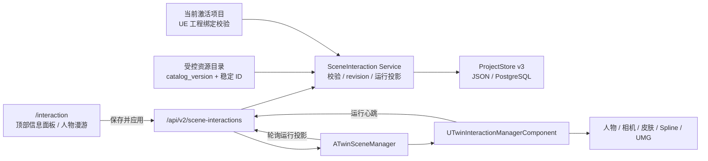

# OntoTwin 4.0 场景交互层与人物漫游 (PRD)

> 状态：需求确认完成，待开发  
> 主线：OntoTwin Nexus / 场景交互能力层 / UE Runtime  
> 日期：2026-07-14  
> 前置：3.5 Runtime Editor、3.6 Pixel Streaming、3.7 顶部信息面板在制基线  
> 目标版本：4.0

---

## 1. 版本定义

4.0 在 OntoTwin Nexus 中正式建立独立的“场景交互能力层”，并交付一个可运行的单人观察者漫游闭环：

```text
场景交互工作台配置
  -> Scene Interaction 后端校验与持久化
  -> 当前激活项目的运行配置投影
  -> UE 解析已打包资源
  -> 生成人物、进入默认路线
  -> 近身视角 / 上帝视角切换
  -> 人工接管、换肤、选中信息面板
  -> UE 回报配置应用状态
```

4.0 不是通用游戏框架，也不把普通观察者建成 OntoTwin 业务实例。平台提供通用运行能力；具体项目提供人物资源、皮肤、动画、测试 Spline、上帝视角出生相机和场景碰撞配置。

人物、Overlay 和未来路线编辑都属于场景交互能力，但保持独立的数据归属和同步链路：

- 顶部信息面板继续使用 3.7 的 `I3D_Overlay`、`/api/v2/overlays/...` 和 Overlay revision。
- 人物漫游使用新增的 `scene_interactions.roaming`、`/api/v2/scene-interactions/...` 和 Scene Interaction revision。
- 未来图片路线进入独立版本；4.0 只读取 UE 关卡中预放置的测试 Spline，不保存路线点。

---

## 2. 背景与当前基线

### 2.1 已有能力

当前仓库已经具备以下基础：

- `/interaction` 和 `frontend/interaction.html` 正在承载 3.7 顶部信息面板工作台。
- `backend/overlay/` 已形成独立 Overlay 模块。
- ProjectStore 已进入 `schema_version = 2`，Overlay 配置随 ObjectType 和 Instance 保存。
- JSON ProjectStore 和 PostgreSQL ProjectStore 同时存在；Docker 默认走 PostgreSQL。
- `ATwinSceneManager` 已负责快照轮询、UE 工程绑定检查、实例生命周期、Overlay 和 Runtime Editor。
- UE 已存在原生 UMG Overlay 与 Runtime Editor 面板。
- 3.6 已提供 Pixel Streaming 本机链路基线。

4.0 必须在这些在制能力上增量开发，不能重建 `/interaction`，不能把 `I3D_Overlay` 搬入 `scene_interactions`，也不能继续把完整人物逻辑堆进 `backend/app.py` 或 `ATwinSceneManager`。

### 2.2 当前绑定机制的真实含义

OntoTwin Web 是编辑器，不是 UE Runtime 的运行依赖：

- JSON 模式通过 `backend/data/active.json` 恢复激活项目。
- PostgreSQL 模式通过 `app_singleton.active_project_id` 恢复激活项目。
- 只要后端启动并正确恢复激活项目，Web 页面不打开时 UE 仍可轮询并运行。
- 当前“UE 工程绑定”是对后端当前激活项目的访问校验，不是 UE 自动选择项目的握手机制。

4.0 沿用当前激活项目机制，不在本版本重做项目绑定。未来自动绑定/自动选项目方案另立专项。

### 2.3 当前图片标定约束与 4.0 修正

现有项目可能存在多个图片来源共用 `frame_image`、缺少原图身份信息，以及像素值被兼容性恒等矩阵解释为规范毫米的问题。矩阵指纹一致只能证明配置未变化，不能证明图片与当前 UE 场景真实对齐。

因此 4.0 人物出生点不再依赖图片换算，改由 UE 项目预放置 `ATwinRoamingSpawnAnchor` 提供位置与朝向。旧图片出生配置保持可读，但人物页新草稿默认切换为 `ue_anchor`，不会静默沿用未经验证的图片点位。

图片打点在 4.1 路线专项中补齐唯一 Frame、原图身份、控制点和像素到规范毫米的完整标定链路。

---

## 3. 产品目标与成功标准

### 3.1 产品目标

- 用户可以在现有场景交互工作台配置一个项目级观察者人物。
- 用户可以选择 UE 项目预放置的人物出生锚点。
- UE 可以自动或手动进入人物漫游，并在退出时恢复项目原有 Pawn。
- 近身视角和上帝视角可随时切换，两种视角具有明确且不冲突的输入语义。
- 人物可以沿 UE 预放置的默认 Spline 自动行走，并允许用户接管。
- 用户可以从项目允许的同 Skeleton 皮肤中切换当前会话皮肤。
- 人物可点选 3.7 顶部信息面板对象，不与 WASD、鼠标看向或 HUD 操作冲突。
- 配置保存后即使 UE 离线也能成功持久化；UE 上线后报告实际应用结果。
- Web 不打开时，UE 在后端可用且项目绑定有效的前提下仍可运行。

### 3.2 成功标准

- v2 项目可迁移为 v3，JSON 与 PostgreSQL 产生相同的 `scene_interactions` 语义。
- 项目只保存稳定资源 ID，不保存 `/Game/...` 路径或用户本机文件路径。
- 配置 revision 可防止覆盖并发修改，UE 能区分已应用和待重载 revision。
- 近身视角下 WASD 不会误点面板；上帝视角下点击面板不会触发摄像机移动或 HUD 按钮穿透。
- 缺失非关键资源时按规则降级；绑定不匹配或关键资源缺失时明确阻断。
- Runtime Editor 与人物漫游不会同时占用输入。
- Pixel Streaming 桌面浏览器中键盘和鼠标操作与本机一致。

---

## 4. 范围

### 4.1 4.0 必做

- 新增独立 Scene Interaction 后端模块。
- ProjectStore 升级为 `schema_version = 3`。
- 项目顶层新增 `scene_interactions`，PostgreSQL `project` 表新增对应 JSONB 字段。
- 新增项目级人物漫游配置和单调递增 revision。
- 新增受控资源目录：人物、皮肤、人物出生锚点、测试路线和上帝视角相机使用稳定 ID。
- 在现有 `/interaction` 工作台增加一级功能页签和“人物漫游”编辑区。
- 在 Web 选择人物出生锚点，由 UE 项目维护真实位置和朝向。
- UE 新增人物、皮肤、相机模式、路线跟随和交互 HUD 组件。
- 使用 UE CharacterMovement、Enhanced Input 和原地位移动画。
- 支持走、跑、跳、蹲，不支持人物飞行。
- 支持近身视角和独立自由上帝视角。
- 支持 UE 关卡预放置 Spline 的默认路线、人工接管、继续路线和从头开始。
- 支持与 3.7 Overlay 共用对象选择结果。
- 支持 UE 配置热更新、结构变更待重载、运行状态心跳和离线降级。
- 支持 PIE/开发环境与打包环境的差异化绑定规则。

### 4.2 4.0 不做

- 不做图片路线点编辑、路线列表管理或路线持久化。
- 不做 NavMesh 自动绕障、动态避障或跨楼层路线。
- 不做 NPC、多人物、联机同步或多客户端调度。
- 不把普通观察者注册为 OntoTwin Instance。
- 不保存或回传人物实时位置，不提供“定位人物”。
- 不绑定真实员工或数字员工；`bound_instance_id` 留待后续业务版本。
- 不支持上传人物、上传皮肤或在 Web 中输入 UE 资产路径。
- 不支持不同 Skeleton 之间的动画重定向。
- 不使用 Root Motion 驱动普通移动。
- 不做触摸屏、手柄或移动端输入；只验收桌面键盘和鼠标。
- 不做视频 URL、网页嵌入或 `I3D_Overlay` 视频模板。
- 不修改现有前端路由，不新增 `/interaction` 之外的页面。
- 不重做当前激活项目与 UE 工程的绑定方案。

---

## 5. 术语与产品语义

| 用户语言 | 技术标识 | 定义 |
| --- | --- | --- |
| 人物漫游 | `roaming` | 本地单人观察者的运行能力 |
| 第一人称 / 近身视角 | `near_follow` | 相机位于人物头部后上方，可绕人物观察；不是眼睛位置的严格 FPS 相机 |
| 第三人称 / 上帝视角 | `god` | 独立自由飞行摄像机；人物不随摄像机 WASD 移动 |
| 自动路线 | `auto_route` | 人物沿 UE 关卡中匹配稳定 ID 的 Spline 移动 |
| 人工接管 | `manual` | 用户在近身视角用有效移动输入暂停自动路线并控制人物 |
| 当前会话皮肤 | `active_skin_id` | 仅保存在 UE 本次运行内存中的选择，不写入 ProjectStore |
| 默认皮肤 | `default_skin_id` | 项目配置中的初始皮肤 |
| 允许皮肤 | `allowed_skin_ids` | 当前项目允许用户在 UE 中选择的皮肤范围 |

为避免技术歧义，接口和代码只使用 `near_follow` / `god`；Web 和 UMG 可以显示“近身视角（第一人称）”和“上帝视角（第三人称）”。

---

## 6. 核心决策

| 主题 | 4.0 决策 |
| --- | --- |
| 人物身份 | 每个 UE 客户端最多一个本地观察者，不是 OntoTwin Instance |
| 配置粒度 | 每项目一份人物漫游配置 |
| 资源归属 | UE 项目提供已打包资源；OntoTwin 通过受控目录保存和下发稳定 ID |
| 皮肤范围 | 第一版只切换共用同一 Skeleton 的 Skeletal Mesh，可带受控材质覆盖 |
| 动画 | 每个人物资源必须具备完整地面位移动画集合；CharacterMovement + In-place |
| 出生点 | UE 关卡预放置 `ATwinRoamingSpawnAnchor`，Web 保存稳定 `anchor_id` |
| 坐标事实 | UE Anchor Transform 是 4.0 人物出生位置与朝向的运行事实 |
| 高度 | Anchor 默认位于地面附近；UE 向下探地，命中后加胶囊半高 |
| 路线来源 | UE 关卡预放置测试 Spline，OntoTwin 保存稳定 `route_id` |
| 路线 Z 语义 | `bSplineAtGroundLevel=true` 时，Spline Z 是楼层地面高度；路线负责平面位置和朝向，CharacterMovement 负责人物实际贴地 Z |
| 路线接管 | 近身视角有效移动输入暂停路线；显式继续或从头开始 |
| 路线结束 | `stop` / `loop` 可配置，默认 `stop`；仅闭合 Spline 可循环 |
| 路线恢复 | 同楼层、距离安全、视线和碰撞扫掠通过时平滑归线，否则只能从头开始 |
| 视角 | 近身跟随 + 独立自由上帝视角 |
| 上帝视角出生 | 第一次使用项目配置的 UE CameraActor；本次会话后续恢复上次自由相机位置 |
| 默认进入 | 默认视角为近身，进入后默认尝试自动路线 |
| 飞行 | 人物不飞行；空中观察由上帝视角承担 |
| 输入 | Enhanced Input，插件提供默认映射并允许项目覆盖 |
| 选中 | 近身视角准星 + `E`；上帝视角鼠标左键；共用选择服务 |
| HUD | 原生 UMG，轻量状态条 + 可展开帮助/控制面板，毛玻璃半透明 |
| Runtime Editor | 与人物漫游互斥，不允许同时捕获输入 |
| Web 保存 | 本地草稿 + “保存并应用”，使用 `expected_revision` 原子保存 |
| UE 应用 | 普通字段热更新；结构字段进入“待重载”而不强制打断用户 |
| 配置版本 | `scene_interactions.revision` 单调递增；与 Overlay revision 完全分离 |
| 运行状态 | UE 心跳保存在后端内存，不写 ProjectStore |
| 后端断线 | 已运行时继续最后一份已验证配置；启动时离线则不生成人物 |
| 项目绑定 | 当前版本沿用激活项目；不匹配始终阻断，未绑定只在 PIE/开发环境放行 |

---

## 7. 总体架构



职责边界：

- Web 负责编辑、校验提示、图片回显和保存，不直接控制 UE Actor。
- 后端负责当前项目选择、资源 ID 校验、坐标投影、revision 和运行配置裁剪。
- UE 负责真实资源解析、碰撞、人物运动、相机、Spline 和 UMG。
- 项目资源负责人负责模型、Skeleton、动画、碰撞通道、Spline 和 CameraActor。

---

## 8. 后端模块边界

新增独立目录：

```text
backend/scene_interaction/
  __init__.py
  api.py                 HTTP 路由与错误映射
  service.py             当前项目配置、revision、状态汇总
  validators.py          配置、资源 ID、数值范围和标定校验
  runtime_projection.py  规范坐标到 UE 运行配置投影
  catalog.py             受控资源目录读取与版本计算
  resource_catalog.json  项目维护的稳定资源清单
```

约束：

- `backend/app.py` 只注册 `register_scene_interaction_routes(...)` 并注入现有依赖。
- 模块只通过 ProjectStore 抽象读写，不直接读项目 JSON 或执行项目 SQL。
- 不新增异步队列、权限系统或 Python 第三方依赖。
- Overlay 继续留在 `backend/overlay/`，不由本模块代理。

---

## 9. 受控资源目录

### 9.1 目录原则

资源目录是平台与具体 UE 项目的契约，不是用户上传区：

- 每个资源有不可随显示名变化的稳定 ID。
- 后端通过目录向 Web 提供显示名、静态缩略图和可选择关系。
- UE 通过同一目录中的 Primary Asset ID 解析已打包资源。
- ProjectStore 只保存稳定 ID。
- Web 不显示或编辑原始 `/Game/...` 路径。
- 目录变化增加 `catalog_version`，不增加项目 `scene_interactions.revision`。

### 9.2 目录示例

```json
{
  "catalog_version": "2026.07.3",
  "characters": [
    {
      "id": "character.observer.base",
      "display_name": "默认观察者",
      "thumbnail_url": "/scene-interaction-assets/character-observer-base.png",
      "ue_primary_asset_id": "TwinCharacter:ObserverBase",
      "skeleton_id": "skeleton.observer.v1",
      "capsule": {"radius_cm": 34, "half_height_cm": 88},
      "mesh_offset_cm": {"x": 0, "y": 0, "z": -88},
      "mesh_yaw_offset_deg": -90,
      "locomotion_profile_id": "locomotion.observer.v1"
    }
  ],
  "skins": [
    {
      "id": "skin.observer.gray",
      "character_id": "character.observer.base",
      "display_name": "灰色工装",
      "thumbnail_url": "/scene-interaction-assets/skin-observer-gray.png",
      "ue_primary_asset_id": "TwinSkin:ObserverGray",
      "skeleton_id": "skeleton.observer.v1",
      "material_variant_ids": []
    }
  ],
  "spawn_anchors": [
    {
      "id": "spawn.character.default",
      "display_name": "默认人物出生点",
      "ue_spawn_id": "spawn.character.default"
    }
  ],
  "routes": [
    {
      "id": "route.test.default",
      "display_name": "默认测试路线",
      "ue_route_id": "route.test.default"
    }
  ],
  "god_cameras": [
    {
      "id": "camera.god.default",
      "display_name": "默认上帝视角",
      "ue_camera_id": "camera.god.default"
    }
  ]
}
```

### 9.3 人物资源最低要求

每个人物资源必须提供：

- 一个可打包解析的基础 Skeletal Mesh。
- 一个稳定 Skeleton ID。
- 兼容的 Animation Blueprint 或等价动画状态机。
- Idle、Walk、Run、Jump Start、In Air、Land、Crouch Idle、Crouch Move 动画。
- 胶囊半径、胶囊半高、Mesh 相对位移和朝向偏移。
- 至少一个基础皮肤；4.0 验收资源包含一个基础人物和不少于两个可切换皮肤。

胶囊体决定碰撞、能否穿门、台阶和地面接触；Mesh 偏移只把视觉模型的脚底对齐到胶囊底部，不改变碰撞体。二者配置错误分别会造成“人物卡住/穿墙”和“人物悬空/陷地”。

---

## 10. ProjectStore v3

### 10.1 版本迁移

- 无版本项目按 v1 读取。
- 3.7 Overlay 结构为 v2。
- 4.0 新增 `scene_interactions` 后升级为 v3。
- 迁移必须按 `v1 -> v2 -> v3` 顺序执行，且重复执行结果一致。
- v2 到 v3 只补充禁用态默认容器，不伪造人物、皮肤、出生点或路线 ID。
- 高于程序支持版本的项目拒绝写回，防止旧程序破坏新结构。

迁移后的最小默认值：

```json
{
  "schema_version": 3,
  "scene_interactions": {
    "revision": 0,
    "roaming": {
      "enabled": false,
      "auto_enter": false
    }
  }
}
```

### 10.2 完整漫游配置

```json
{
  "schema_version": 3,
  "scene_interactions": {
    "revision": 8,
    "roaming": {
      "enabled": true,
      "auto_enter": true,
      "character_id": "character.observer.base",
      "allowed_skin_ids": [
        "skin.observer.gray",
        "skin.observer.green"
      ],
      "default_skin_id": "skin.observer.gray",
      "spawn": {
        "mode": "ue_anchor",
        "anchor_id": "spawn.character.default"
      },
      "camera": {
        "default_mode": "near_follow",
        "near_follow": {
          "distance_cm": 120.0,
          "height_cm": 35.0,
          "look_sensitivity": 1.0
        },
        "god": {
          "camera_id": "camera.god.default",
          "move_speed_cm_s": 1800.0,
          "look_sensitivity": 1.0
        }
      },
      "movement": {
        "walk_speed_cm_s": 250.0,
        "sprint_speed_cm_s": 500.0,
        "auto_route_speed_cm_s": 180.0,
        "jump_height_cm": 80.0
      },
      "route": {
        "enabled": true,
        "route_id": "route.test.default",
        "auto_start": true,
        "completion_mode": "stop",
        "takeover_enabled": true
      }
    }
  }
}
```

不保存：

- UE 世界坐标缓存。
- 当前会话皮肤。
- 人物实时位置或视角位置。
- 路线进度。
- UE 运行心跳。
- Primary Asset 路径副本。

### 10.3 revision

- `scene_interactions.revision` 是项目级单调递增整数。
- 4.0 只有人物漫游一项内容，保存成功后 revision 增加一次。
- 请求必须带 `expected_revision`；不匹配返回 `409`，不得覆盖服务端新值。
- Overlay 的类型 revision、实例 revision 和 `config_revision` 不参与本 revision。
- 资源目录版本变化只改变 `catalog_version`；如果目录变化导致项目引用无效，工作台和 UE 显示降级状态，但不静默修改项目配置。

### 10.4 PostgreSQL

`project` 表新增：

```sql
scene_interactions JSONB NOT NULL DEFAULT '{}'
```

要求：

- `_read_project()` 将其重组成项目顶层 `scene_interactions`。
- `_save_current()` 与项目其他低频 JSONB 在同一事务保存。
- JSON 和 PostgreSQL 的默认值、迁移、校验和 revision 行为完全一致。
- 不把人物配置拆成多张业务表；4.0 的查询规模不需要过度建模。

---

## 11. 人物出生锚点规则

### 11.1 编辑语义

用户在 Web 选择受控目录中的人物出生点；具体 UE 项目在当前运行关卡预放置 `ATwinRoamingSpawnAnchor`，并让 `SpawnId` 与目录的 `ue_spawn_id` 一致。

Anchor 的 Transform 决定人物位置与朝向。普通项目默认只提供 `spawn.character.default`；未来可增加多个项目侧锚点，而不把 `/Game/...` 路径写入 OntoTwin。

### 11.2 旧图片出生配置兼容

后端继续读取 `spawn.mode=image` 或无 mode 但带 `frame_id` 的旧配置，并维持原标定指纹阻断规则。人物页不会把旧图片点静默解释为 UE 锚点；用户保存新草稿时明确改为 `ue_anchor`。

### 11.3 UE 高度解析

```text
Anchor XY / Z 附近
  -> 从 Anchor 上方向下进行地面碰撞检测
  -> 命中地面：Actor Z = Hit Z + CapsuleHalfHeight
  -> 未命中：阻断人物生成
```

地面检测通道、最大探测距离、可行走坡度和台阶高度属于 UE 项目配置，不开放到 Web。

---

## 12. Web 场景交互工作台

### 12.1 页面结构

4.0 复用已有：

```text
/interaction
frontend/interaction.html
```

不新增前端路由。在现有页面顶部增加一级功能页签：

```text
顶部信息面板 | 人物漫游
```

- 3.7 原有类型默认、单实例和批量 Overlay 交互保留在“顶部信息面板”。
- 人物漫游是项目级配置，不显示 ObjectType/Instance 范围选择。
- 未来路线编辑上线时再增加“漫游路线”页签；4.0 不展示不可用的空功能。
- 现有类型页和实例页快捷入口默认进入 `feature=overlay`。
- `/interaction?feature=roaming` 可直接进入人物漫游。

### 12.2 人物漫游布局

```text
左侧：资源选择
  基础人物
  允许皮肤与默认皮肤
  静态缩略图

中部：UE 项目出生点
  受控锚点选择
  UE 放置约束
  旧图片配置迁移提示

右侧：配置与运行状态
  启用 / 自动进入
  默认路线与结束方式
  视角参数
  安全移动参数
  UE 在线、revision、降级项
  保存并应用
```

Web 不做人物三维预览；缩略图由资源目录提供。

### 12.3 Web 可编辑字段

允许编辑：

- `enabled`、`auto_enter`
- 基础人物、允许皮肤、默认皮肤
- 人物出生锚点
- 默认路线、自动开始和 `stop/loop`
- 默认视角
- 近身距离、高度和观察灵敏度
- 上帝视角相机、移动速度和观察灵敏度
- 行走速度、奔跑速度、自动路线速度、跳跃高度

不允许编辑：

- Skeleton、Skeletal Mesh、Anim Blueprint、Primary Asset 路径
- 胶囊尺寸、Mesh 偏移、碰撞通道、坡度、台阶高度
- 动画重定向、Root Motion 或 NavMesh 参数

后端集中定义数值范围。`jump_height_cm` 是期望跳跃高度，UE 根据当前重力计算 Jump Z Velocity，避免 Web 暴露引擎内部速度参数。

### 12.4 编辑和保存

- 页面加载服务端配置后创建本地草稿。
- 点击、拖动和表单修改只更新草稿与画布，不直接写后端。
- 页面持续显示未保存状态。
- 点击“保存并应用”时发送完整漫游配置和 `expected_revision`。
- 保存中禁用重复提交并显示加载态。
- 保存成功后刷新 revision；UE 离线不阻止保存。
- UE 在线时显示“已应用”“待重载”“降级运行”或“阻断”状态。
- revision 冲突时保留本地草稿，提示重新加载和人工合并，不静默覆盖。
- 离开有未保存修改的页签前使用自定义模态确认。

Web 继续遵循 `ontotwin-ui`：极简黑白灰、显式保存、Toast、自定义模态、无 Emoji、无原生 `alert/confirm/prompt`。

---

## 13. Scene Interaction API

所有接口始终使用当前激活项目。基础资源路径保持三组：

```http
GET      /api/v2/scene-interactions/catalog
GET/PUT  /api/v2/scene-interactions/roaming
GET/POST /api/v2/scene-interactions/runtime
```

### 13.1 查询资源目录

```http
GET /api/v2/scene-interactions/catalog
```

返回 `catalog_version`、人物、皮肤、人物出生锚点、测试路线和上帝视角相机。Web 使用显示信息；UE 使用稳定 ID、Primary Asset ID 或关卡 Actor ID。

### 13.2 查询编辑配置

```http
GET /api/v2/scene-interactions/roaming
```

返回：

```json
{
  "project_id": "ds_xxx",
  "schema_version": 3,
  "revision": 8,
  "catalog_version": "2026.07.3",
  "config": {},
  "calibration_state": "not_required",
  "calibration_context": {},
  "runtime_status": {}
}
```

`calibration_context` 只为旧图片出生配置兼容返回；UE 锚点模式不依赖图片标定。

### 13.3 保存配置

```http
PUT /api/v2/scene-interactions/roaming
Content-Type: application/json

{
  "expected_revision": 8,
  "config": {}
}
```

后端按以下顺序处理：

1. 确认当前激活项目存在。
2. 校验请求结构和数值范围。
3. 校验人物、皮肤、出生锚点、路线和相机 ID 属于当前 catalog。
4. 校验皮肤与基础人物和 Skeleton 兼容。
5. 校验默认皮肤位于允许皮肤集合。
6. 校验出生锚点 ID；旧图片模式才校验标定指纹。
7. 校验 `expected_revision`。
8. 原子写入项目并将 revision 增加一次。
9. 返回新配置和新 revision。

### 13.4 UE 运行投影

```http
GET /api/v2/scene-interactions/runtime
```

UE 请求携带：

```text
X-OntoTwin-UE-Project-Id
X-OntoTwin-UE-Project-Name
X-OntoTwin-UE-Context: editor | packaged
```

成功响应示例：

```json
{
  "project_id": "ds_xxx",
  "revision": 8,
  "catalog_version": "2026.07.3",
  "binding": {"mode": "matched"},
  "config": {
    "enabled": true,
    "auto_enter": true,
    "character_id": "character.observer.base",
    "spawn_ue": {
      "mode": "ue_anchor",
      "anchor_id": "spawn.character.default"
    }
  },
  "last_client_status": {}
}
```

该响应是 UE 运行投影，不是 ProjectStore 原文。UE 按 `anchor_id` 在当前 World 中解析出生点，不解析图片像素、标定矩阵或项目迁移结构。

### 13.5 UE 运行心跳

```http
POST /api/v2/scene-interactions/runtime
```

请求示例：

```json
{
  "applied_revision": 8,
  "pending_revision": null,
  "catalog_version": "2026.07.3",
  "runtime_state": "auto_route",
  "camera_mode": "near_follow",
  "route_state": "following",
  "active_skin_id": "skin.observer.gray",
  "degraded_features": [],
  "error": null
}
```

心跳不得包含人物世界坐标。后端只在内存保存最近一次状态和 `last_seen_at`；后端重启后状态清空。4.0 只面向一个预期 UE Runtime 客户端，多客户端时不做调度或状态聚合。

### 13.6 错误响应

| HTTP | 稳定错误码 | 场景 |
| --- | --- | --- |
| `400` | `invalid_request` | JSON 结构、类型或数值格式错误 |
| `403` | `ue_project_mismatch` | UE 工程与当前激活项目绑定不匹配 |
| `403` | `ue_project_unbound` | 打包运行时访问未绑定项目 |
| `404` | `active_project_not_found` | 当前无激活项目 |
| `404` | `catalog_resource_not_found` | 引用不存在的受控资源 ID |
| `409` | `scene_interaction_revision_conflict` | `expected_revision` 已过期 |
| `422` | `roaming_validation_failed` | 配置组合、Skeleton 或标定非法 |

错误响应包含字段级问题和用户可理解的 `message`，不只返回技术异常字符串。

---

## 14. UE 模块设计

### 14.1 组合关系

为避免继续扩大 `ATwinSceneManager`，4.0 使用组合式实现：

```text
ATwinSceneManager
  └─ UTwinInteractionManagerComponent
       ├─ ATwinRoamingCharacter
       │    ├─ UTwinCameraModeComponent
       │    ├─ UTwinSkinComponent
       │    └─ UTwinRouteFollowerComponent
       ├─ ATwinGodViewPawn
       ├─ ATwinRoamingRoute
       ├─ UOntoTwinRoamingHUDWidget
       └─ 共享选择与输入仲裁
```

建议新增类：

```text
UTwinInteractionManagerComponent
ATwinRoamingCharacter
UTwinCameraModeComponent
UTwinSkinComponent
UTwinRouteFollowerComponent
ATwinGodViewPawn
ATwinRoamingRoute
UOntoTwinRoamingHUDWidget
```

`ATwinSceneManager` 只承担以下集成：

- 复用 Backend URL、UE 工程身份和绑定结果。
- 创建并持有 Interaction Manager Component。
- 向交互组件提供受管 `ATwinInstance` 查询/选择入口。
- 在销毁、切项目、绑定失败和 Runtime Editor 切换时通知交互组件。

### 14.2 插件依赖

在现有插件模块中增加 UE 内置 `EnhancedInput` 依赖。继续复用 `UMG`、`Slate` 和 `SlateCore`，不引入第三方插件。

### 14.3 项目资源扩展点

项目可以通过 Blueprint 子类或 Primary Asset 提供：

- 具体人物 Mesh、Animation Blueprint 和皮肤。
- 地面、可交互对象和视线检测碰撞通道。
- 预放置 `ATwinRoamingRoute` 或等价 Spline Actor。
- 带稳定 ID 的上帝视角 CameraActor。
- 项目自定义 Enhanced Input Mapping Context。

插件提供可运行默认值，不要求用户修改插件 C++ 才能换项目资源。

---

## 15. 漫游生命周期

### 15.1 开关语义

- `enabled=false`：不加载人物资源，不显示进入提示，不捕获漫游输入。
- `enabled=true, auto_enter=false`：能力可用，用户可用默认 `F7` 或项目 Blueprint 调用进入。
- `enabled=true, auto_enter=true`：绑定和配置验证通过后自动进入。
- 两个字段默认均为 `false`，避免升级后自动接管现有项目 Pawn。

项目可以覆盖进入/退出按键；`F7` 只是插件默认映射。

### 15.2 进入流程

```text
请求进入
  -> 检查当前项目绑定
  -> 获取并验证 runtime projection
  -> 解析基础人物、默认皮肤和动画资源
  -> 解析出生 XY、地面和胶囊高度
  -> 记录原 Pawn、控制器、输入模式和鼠标状态
  -> 生成人物并 Possess
  -> 添加漫游 Input Mapping Context
  -> 创建 UMG HUD
  -> 尝试挂接默认路线
```

任一关键步骤失败时恢复原 Pawn 和输入，不留下半初始化人物。

### 15.3 退出流程

- 停止路线跟随和漫游输入。
- 移除漫游 HUD、上帝视角 Pawn 和临时人物。
- 清理当前选择和会话皮肤状态。
- 重新 Possess 进入前的原 Pawn。
- 恢复原输入模式、鼠标显示和 Mapping Context。
- 原 Pawn 已失效时回退项目默认 Pawn/PlayerStart，并显示错误。

### 15.4 运行状态

建议状态集合：

```text
disabled
available
starting
auto_route
manual
god_view
ui_interaction
reload_required
degraded
blocked
offline
```

状态用于 HUD 和心跳，不持久化。

---

## 16. 人物运动、动画与皮肤

### 16.1 地面运动

- 使用 `ACharacter` 和 `UCharacterMovementComponent`。
- WASD 为相机相对移动。
- 近身视角下人物朝实际移动方向旋转，相机可独立绕人物观察。
- Shift 奔跑，Space 跳跃，C 下蹲。
- 自动路线使用独立 `auto_route_speed_cm_s`，不复用手动行走或奔跑速度。
- 不允许人物飞行；上帝视角 Pawn 才支持自由升降。

### 16.2 动画

- 普通移动由 CharacterMovement 驱动速度，Animation Blueprint 根据速度、落地状态和蹲伏状态切换 In-place 动画。
- 自动路线与人工移动共用同一动画状态机。
- 4.0 不使用 Root Motion 推动人物位移。
- 资源缺少必需动画集合时，该人物资源视为不可用，而不是静默使用 T Pose。

### 16.3 皮肤

- `UTwinSkinComponent` 只接受当前人物允许的 `allowed_skin_ids`。
- 所有皮肤必须与基础人物使用同一 `skeleton_id`。
- 切换时替换 Skeletal Mesh，并按目录应用可选受控材质变体。
- 当前选择仅在本次 UE 会话有效。
- 再次进入漫游时使用项目 `default_skin_id`。
- 当前皮肤在新配置中被移出允许集合时，热更新后回退默认皮肤；默认皮肤也不可用时回退基础 Mesh。

---

## 17. 视角设计

### 17.1 近身视角 `near_follow`

- 相机位于人物头部后上方，使用 Spring Arm 或等价防穿透结构。
- 鼠标控制相机环绕和俯仰，不直接改变人物朝向。
- WASD 按当前相机平面 Forward/Right 移动人物，人物面向移动方向。
- 自动路线运行时人物面向 Spline 切线，相机仍可自由环绕。
- 相机距离、高度和灵敏度可由 Web 配置安全范围。

### 17.2 上帝视角 `god`

- 切换时人物继续留在场景中，不被传送到相机位置。
- WASD 移动自由相机，Q/E 上下移动，鼠标右键控制观察，滚轮调节移动速度或等价缩放。
- 人物若处于自动路线则继续行走；若已被人工接管并暂停路线则保持原地。
- 第一次进入上帝视角时使用配置的 CameraActor 稳定 ID 和 Transform。
- 同一次运行会话再次进入时恢复用户上一次自由相机 Transform。
- 不提供“定位人物”按钮，也不自动把上帝视角拉回人物。
- 返回近身视角时重新 Possess 人物并恢复人物输入。

上帝视角相机缺失时禁用视角切换，人物近身漫游仍可运行。

---

## 18. 默认 Spline 路线

### 18.1 路线 Actor

项目在 UE 关卡中预放置一个或多个带稳定 `RouteId` 的 `ATwinRoamingRoute`：

- 每个 Route Actor 持有 `USplineComponent`。
- `route_id` 与资源目录中的 `ue_route_id` 匹配。
- UE 运行时只在当前 World/关卡中解析。
- 找不到路线时降级为手动漫游，不阻断人物生成。

### 18.2 自动开始

进入漫游后：

- `route.enabled=false` 或 `auto_start=false`：人物停在出生点等待人工控制。
- 路线存在且出生点接近路线起点、同楼层并通过视线/碰撞检查：平滑接入并开始。
- 出生点不满足安全接入条件：保留在出生点，进入 `degraded`，提示只能手动或从头开始。
- “从头开始”显式把人物安全放置到路线起点后启动；如果起点地面检测失败则拒绝。

### 18.3 人工接管

- 仅近身视角的有效移动输入触发接管。
- 鼠标观察、打开 HUD、选择对象或切换皮肤不暂停路线。
- 接管后路线状态为 `paused_by_user`，人物由 WASD 控制。
- 上帝视角 WASD 只移动相机，不触发人物接管。

### 18.4 继续路线

用户可按 `R` 或通过 HUD 选择“继续路线”：

1. 找到人物到 Spline 最近点。
2. 确认与路线点在同一楼层/垂直容差内。
3. 确认距离不超过 UE 配置的安全阈值。
4. 确认视线检测和胶囊碰撞扫掠通过。
5. 平滑接入最近点并恢复路线。

任一条件失败时不直接穿越障碍，提示使用“从头开始”。4.0 不调用 NavMesh 绕路。

### 18.5 路线结束

- `completion_mode=stop`：默认；到达终点后停止并进入 Idle。
- `completion_mode=loop`：只有 `USplineComponent.IsClosedLoop()` 为真时允许。
- 配置要求循环但 Spline 未闭合时降级为 `stop`，并在 HUD/心跳报告 `route_not_closed`。

---

## 19. 选择、信息面板与输入仲裁

### 19.1 共用选择语义

3.7 Overlay 当前直接处理鼠标点击；4.0 需要收敛为一个共享选择入口：

```text
近身视角：屏幕中心准星 + E
上帝视角：鼠标左键射线
Runtime Editor：原 Gizmo/实例选择逻辑
  -> 统一得到 ATwinInstance
  -> Overlay 展示该实例的 selected 面板
```

Overlay 仍负责面板内容和生命周期；人物模块只负责产生选择事件。没有 `I3D_Overlay` 的对象可以被命中，但不显示面板。

### 19.2 鼠标与 WASD 冲突解决

- 近身视角不使用鼠标点击选看板，使用准星 + `E`，因此鼠标始终可控制视角。
- 上帝视角鼠标左键只在指针不位于 UMG 上时执行场景射线。
- 鼠标右键用于上帝视角观察，不触发对象选择。
- `Tab` 切换 HUD 交互模式；进入后暂停人物手动输入和相机输入，显示鼠标。
- HUD 交互模式中自动路线继续运行；如果路线此前已暂停，人物保持不动。
- 离开 HUD 交互模式后恢复之前视角对应的输入和鼠标状态。

### 19.3 Runtime Editor 互斥

- 进入 Runtime Editor 前必须退出人物漫游并恢复原 Pawn。
- 人物漫游运行时，Runtime Editor 快捷键先触发互斥提示，不直接叠加输入。
- Runtime Editor 退出后不自动重新进入漫游，避免未确认的 Pawn 抢占。
- Overlay 在两种模式中都可显示，但选择事件由当前输入模式唯一产生。

### 19.4 `Esc` 优先级

人物漫游中按 `Esc` 按以下栈顺序处理，每次只处理一层：

1. 关闭模态、帮助或皮肤选择浮层。
2. 退出 HUD 交互模式。
3. 关闭当前 selected 信息面板。
4. 若无上层 UI，打开轻量退出漫游确认；确认后恢复原 Pawn。

不使用一次 `Esc` 同时关闭面板并退出人物漫游。

---

## 20. Enhanced Input 默认映射

插件提供默认 Input Mapping Context，项目可以整体替换或覆盖。HUD 帮助必须读取实际生效映射，不硬编码提示文本。

| 模式 | 默认输入 | 行为 |
| --- | --- | --- |
| 通用 | `F7` | 进入/退出人物漫游 |
| 通用 | `V` | 近身 / 上帝视角切换 |
| 通用 | `Tab` | HUD 交互模式开关 |
| 通用 | `Esc` | 按交互栈返回 |
| 近身 | `WASD` | 相机相对人物移动；自动路线中触发人工接管 |
| 近身 | 鼠标 | 环绕/俯仰观察 |
| 近身 | `Shift` | 奔跑 |
| 近身 | `Space` | 跳跃 |
| 近身 | `C` | 下蹲 |
| 近身 | `E` | 准星选中对象/打开信息面板 |
| 近身 | `R` | 尝试继续默认路线 |
| 上帝 | `WASD` | 平面移动自由相机 |
| 上帝 | `Q/E` | 相机下降/上升 |
| 上帝 | 鼠标右键 | 观察方向 |
| 上帝 | 滚轮 | 调整相机移动速度或等价缩放 |
| 上帝 | 鼠标左键 | 选中对象/打开信息面板 |

换肤、从头开始路线、配置重载通过 HUD 操作，避免继续占用全局快捷键。

Pixel Streaming 4.0 只验收桌面浏览器键盘和鼠标。浏览器必须先获得播放器焦点；打开 UMG 交互模式后不能把按键继续传给人物移动。

---

## 21. UMG 视觉与交互规范

### 21.1 技术边界

UE UI 使用原生 UMG，不直接加载 `lingjing-ui-core` 的 HTML/CSS。灵境资源用于定义视觉、布局和组件语义，再由 UMG Widget、Background Blur、Retainer Box 或 UE UI 材质等价实现。

Web `/interaction` 继续使用 `ontotwin-ui`，不把 UE 毛玻璃风格带回 Web 工具页面。

### 21.2 灵境 UE5 Overlay 映射

人物漫游 HUD 采用 `lingjing-ui-core` 的 Mode 1“单 HUD”作为主锚点，并保留 Mode 2 侧边详情语义供 3.7 selected Overlay 使用：

| 灵境语义 | 4.0 UMG 对应 |
| --- | --- |
| `.ue5-overlay-root` | 全屏 UMG Root Canvas |
| `.ue5-overlay-viewport` | 游戏视口内容区 |
| `.ue5-overlay-safe-area` | UMG Safe Zone |
| `.topbar-hud` | 漫游轻量状态 HUD |
| `.detail-panel` | 展开的帮助、皮肤和路线控制面板 |
| `.world-marker` | 3.7 模型锚定信息面板语义 |
| `.alert-center` | 4.0 不做完整告警中心，仅复用错误/降级提示语义 |
| `.ue5-critical-banner` | 项目绑定不匹配或关键资源缺失的阻断提示 |

参考真值：

- `lingjing-ui-core/docs/operations/ue5-overlay-layout-playbook.md`
- `lingjing-ui-core/docs/reference/ue5-template-map.md`
- `lingjing-ui-core/interfaces/ue5_overlay_events.json`
- `lingjing-ui-core/docs/reference/玻璃效果组件使用指南.md`

### 21.3 HUD 内容

常驻轻量状态区只显示：

- 当前视角。
- 路线状态：自动、已接管、已暂停、已结束。
- 后端/绑定状态。
- 当前皮肤。
- 一行与当前模式相关的主要操作提示。

展开面板提供：

- 实际生效快捷键帮助。
- 允许皮肤选择。
- 继续路线 / 从头开始。
- 结构配置待重载时的“重新加载人物”。
- 降级项和可执行的处理建议。
- 退出人物漫游。

### 21.4 玻璃效果

- 常规 HUD 使用标准半透明玻璃卡片语义，低透明深色背景、细边框和轻量模糊。
- 不使用持续旋转的 `.glass-flowing` 或彩色动态玻璃，避免干扰场景观察并增加 GPU 负担。
- `BackgroundBlur` 强度可在 UE 项目设置中关闭或降低；性能不足时回退为普通半透明底，不影响功能。
- 关键文本必须有稳定对比度，不依赖背景模糊才能可读。
- 所有操作放入 Safe Zone，适配 16:9 本机视口和 Pixel Streaming 播放器缩放。

---

## 22. 配置同步、热更新与重载

### 22.1 同步语义

- UE 定期 GET `/runtime`。
- revision 未变化时不重复解析资源或重建 Widget。
- revision 变化时先完整校验新投影，再决定热更新或待重载。
- UE 只有在一份配置完成可接受应用后才更新 `applied_revision`。
- 结构变化尚未重载时，保留当前安全会话并报告 `pending_revision`。

### 22.2 字段分类

| 类型 | 字段 | 行为 |
| --- | --- | --- |
| 热更新 | 行走、奔跑、路线速度 | 立即更新 CharacterMovement / RouteFollower |
| 热更新 | 跳跃高度 | 重新计算 Jump Z Velocity |
| 热更新 | 相机灵敏度、近身距离/高度、上帝相机速度 | 立即更新组件参数 |
| 热更新 | 允许皮肤、默认皮肤 | 更新 HUD；当前皮肤失效时安全回退 |
| 热更新 | 路线结束方式 | 下一次到达终点时生效；非法 loop 降级 stop |
| 生命周期 | `enabled` | false 时安全退出；true 时进入 available |
| 下次进入 | `auto_enter`、默认视角 | 不在当前会话中强制抢占；下次进入生效 |
| 待重载 | `character_id` | 需要重新生成人物 |
| 待重载 | 出生点、朝向 | 需要重新生成或明确重置人物 |
| 待重载 | `route_id` | 需要重新绑定 Route Actor |
| 待重载 | 上帝视角 `camera_id` | 需要重建/重置自由相机初始状态 |

用户通过 HUD 明确点击“重新加载人物”后应用结构变化。若人物尚未进入，则下次进入直接使用最新 revision。

### 22.3 后端断线

- 已成功进入且已有已验证配置：继续当前人物、路线和视角，HUD 显示离线。
- 离线期间不接受新配置，不伪造 `applied_revision`。
- UE 启动时后端不可用：不生成人物，不读取磁盘缓存，保留项目原 Pawn。
- 恢复连接后先完成项目绑定和 revision 验证，再应用配置。
- 一旦收到明确 `ue_project_mismatch`，即使之前有缓存也必须安全退出人物漫游。

---

## 23. UE 工程绑定策略

### 23.1 当前版本规则

- 所有 Scene Interaction API 只读取当前激活项目。
- Web 页面是否打开不影响运行。
- 明确绑定不匹配在 PIE 和打包环境都返回 `403`，人物不得生成或继续运行。
- 当前项目未绑定时：
  - `editor` / PIE 环境允许运行，但 HUD 必须持续显示未绑定警告。
  - `packaged` 环境返回 `403 ue_project_unbound`，阻断人物生成。
- 打包运行时必须携带稳定 `UEProjectId` 和 `X-OntoTwin-UE-Context: packaged`。

### 23.2 失败关闭

绑定失败时：

- 不应用新的漫游配置。
- 已在漫游中的客户端安全退出并恢复原 Pawn。
- 清除 Interaction Mapping Context 和临时 HUD。
- 不继续显示上一项目的人物、皮肤或路线状态。
- 显示稳定错误码和当前/请求 UE 工程身份，便于排查。

### 23.3 后续专项

未来可改为“UE 启动时按绑定主动选择后端 Project”或显式 project handshake。本 PRD 不改变现有全局激活项目，也不把该专项夹带进 4.0。

---

## 24. 校验、降级与阻断

| 问题 | 4.0 行为 |
| --- | --- |
| 基础人物 ID 不存在 | 阻断人物生成 |
| 基础 Skeletal Mesh / Skeleton / Anim BP 无法加载 | 阻断人物生成 |
| 出生锚点 ID 不存在或当前关卡找不到同名 Actor | 阻断人物生成 |
| 出生锚点附近地面检测失败 | 阻断人物生成 |
| 默认皮肤缺失 | 回退基础 Mesh，报告 `default_skin_missing` |
| 某个允许皮肤缺失 | 从 UE 皮肤选择器隐藏，其他皮肤可用 |
| 皮肤 Skeleton 不匹配 | 后端拒绝保存；UE 再次防御并隐藏 |
| 默认 Spline 不存在 | 降级为手动漫游 |
| Spline 非闭合但配置 loop | 降级为 stop |
| 出生点无法安全接入路线 | 人物停在出生点，可手动或从头开始 |
| 上帝视角 CameraActor 缺失 | 禁用上帝视角，近身漫游可用 |
| 运行 revision 需要结构重载 | 保持当前会话，HUD 显示待重载 |
| 后端暂时断线 | 已运行会话继续；启动时阻断 |
| UE 工程绑定不匹配 | 始终阻断并安全退出 |
| Runtime Editor 正在运行 | 禁止进入人物漫游 |

后端校验目录关系和数据结构；UE 校验实际打包资源、关卡 Actor、碰撞和运行环境。两层都必须存在。

---

## 25. 安全与健壮性

- Web 只能提交 catalog 中的稳定 ID，不能提交任意 UE 路径或本地文件路径。
- 资源缩略图是受控静态资源，不允许项目配置任意远程 URL。
- 所有数值使用后端集中白名单和上下限，UE 再做 Clamp。
- 运行心跳不包含人物位置、用户身份或业务实例状态。
- UMG 文本按纯文本渲染，不执行 HTML 或脚本。
- 每次进入/退出都必须成对添加和移除 Mapping Context、Widget 和临时 Pawn。
- 异步资源加载回调使用弱引用或等价生命周期保护，退出后不得继续 Possess 已销毁 Pawn。
- 项目切换、Manager 销毁和 World 切换必须取消未完成 HTTP/资源请求。
- 4.0 不新增外部媒体加载，因此不引入视频域名、认证或 WebBrowser 风险。

---

## 26. 验收标准

### 26.1 存储与迁移

- v1、v2 项目均可加载并形成合法 v3 内存结构。
- v2 到 v3 不自动启用人物、不伪造资源 ID。
- JSON 导入导出包含完整 `scene_interactions`。
- PostgreSQL `scene_interactions` JSONB 可正确读取、保存和事务回滚。
- JSON 和 PostgreSQL 对同一配置返回相同 revision 和运行投影。
- 高于 v3 的项目不会被当前程序写回。
- Overlay 原有 ObjectType/Instance 配置及 revision 不发生变化。

### 26.2 后端

- Catalog API 返回稳定 ID、静态缩略图和 `catalog_version`。
- Roaming GET 返回项目配置、标定状态、revision 和最近运行状态。
- Roaming PUT 可原子保存完整配置并增加一次 revision。
- 旧 `expected_revision` 返回 `409` 且项目不变化。
- 不同 Skeleton 的皮肤组合被拒绝。
- 默认皮肤不在允许集合时被拒绝。
- 出生锚点 ID 不在受控目录时拒绝保存；旧图片配置仍保持标定阻断规则。
- `/runtime` 只返回派生 UE 配置，不暴露项目内部迁移细节。
- 心跳只存内存，后端重启后不污染 ProjectStore。
- Web 保存不依赖 UE 在线。

### 26.3 Web

- `/interaction` 可在“顶部信息面板”和“人物漫游”之间切换。
- Overlay 原有类型、实例和批量流程不回归。
- 人物页按左资源、中出生锚点、右配置与状态布局工作。
- 可选择受控人物出生锚点，并明确提示 UE Actor 的 `SpawnId` 对齐要求。
- 旧图片出生配置显示迁移提示，保存前不修改项目数据。
- 可配置一个基础人物、不少于两个允许皮肤和一个默认皮肤。
- 可配置测试路线、默认 stop/可选 loop、移动和相机安全参数。
- 修改只进入本地草稿；点击“保存并应用”前项目数据不变化。
- 保存成功后可继续编辑；无原生弹窗或 Emoji。
- UE 离线、待重载、降级和阻断状态均有明确文案。

### 26.4 UE 人物与生命周期

- `enabled=false` 时不捕获漫游输入。
- `enabled=true, auto_enter=false` 时可通过默认入口进入。
- `auto_enter=true` 时在绑定和配置有效后自动进入。
- 进入前的原 Pawn 在退出、失败和绑定不匹配后均可恢复。
- 重复进入不会生成多个人物、多个 HUD 或重复 Mapping Context。
- 人物在出生点正确落地，胶囊与脚底无明显悬空或陷地。
- 走、跑、跳、蹲动画完整，无 T Pose；移动由 CharacterMovement 驱动。
- 两个同 Skeleton 皮肤可切换，当前会话选择不写 ProjectStore。

### 26.5 视角、路线与输入

- 近身相机位于头部后上方，可自由环绕且不穿透明显障碍。
- `V` 可切换近身和上帝视角。
- 第一次进入上帝视角使用指定 CameraActor，第二次恢复会话上次位置。
- 上帝视角 WASD/QE 只移动相机，不移动人物。
- 默认测试 Spline 可被稳定 ID 解析并自动行走。
- 近身 WASD 可暂停自动路线并接管；鼠标观察不会暂停。
- 安全条件满足时可继续路线；不满足时不会直线穿墙。
- 可从头开始路线。
- stop 正常停在终点；闭合 Spline 可 loop；非闭合 loop 自动降级。
- 近身准星 + E、上帝视角左键均能打开 3.7 selected Overlay。
- Tab 进入 UMG 交互模式后人物和相机不会响应穿透输入。
- Esc 按层关闭，不会一次退出多层状态。
- Runtime Editor 与漫游无法同时启用。

### 26.6 同步、故障与 Pixel Streaming

- 热更新字段不重生成人物。
- 结构字段变化显示待重载，用户确认后应用新 revision。
- UE 心跳正确显示 `applied_revision`、状态、皮肤和降级项，不包含位置。
- 已运行时后端断线可继续最后配置并显示离线。
- 启动时后端离线不生成人物。
- UE 工程不匹配后安全退出，不保留上一项目人物。
- PIE 未绑定可带警告运行；打包运行未绑定被阻断。
- Pixel Streaming 桌面浏览器可完成移动、视角切换、选中面板和 HUD 操作。

---

## 27. 实施范围与文件预估

### 27.1 新增

```text
backend/scene_interaction/*
backend/tests/test_scene_interaction_*.py

ue_project/Plugins/OntoTwinSync/Source/OntoTwinSync/Public/SceneInteraction/*
ue_project/Plugins/OntoTwinSync/Source/OntoTwinSync/Private/SceneInteraction/*
```

### 27.2 必要修改

```text
backend/app.py                         只注册新路由
backend/project_store.py               v3 迁移与字段读写
backend/project_store_pg.py            JSONB 读写
backend/db/schema.sql                   新增 scene_interactions JSONB
frontend/interaction.html              增加一级页签和人物漫游编辑区
OntoTwinSync.Build.cs                   增加 EnhancedInput
TwinSceneManager.h/.cpp                 最小集成、选择与互斥转发
```

4.0 不修改 `coord_workbench.html`、现有前端路由和 Overlay API。若开发阶段希望从坐标标定页增加快捷入口，必须另行确认后再改。

---

## 28. 实施顺序与工作量

### 阶段 A：数据契约与后端骨架，约 2-3 人日

- ProjectStore v3 与 JSON/PG 迁移。
- `scene_interactions` revision。
- 资源目录、校验器和 API 骨架。
- 绑定策略和运行状态内存存储。

### 阶段 B：出生锚点与 Web 编辑，约 2-3 人日

- 人物出生锚点受控目录与 UE 运行投影。
- `/interaction` 一级页签。
- 人物资源、出生锚点和安全参数编辑。
- 本地草稿、冲突处理和运行状态。

### 阶段 C：UE 人物与资源解析，约 4-6 人日

- Interaction Manager Component 和生命周期。
- CharacterMovement、Animation Blueprint 接口、胶囊和皮肤。
- Enhanced Input 默认映射和项目覆盖。

### 阶段 D：相机、Spline 和选择整合，约 4-5 人日

- 近身/上帝视角和原 Pawn 恢复。
- Spline 自动路线、接管、继续、从头和结束规则。
- Overlay 共用选择与 Runtime Editor 互斥。

### 阶段 E：UMG、同步与联调，约 3-5 人日

- 灵境 Mode 1 毛玻璃 UMG 等价实现。
- 热更新/待重载、心跳、离线和绑定失败关闭。
- PIE、打包 exe 和 Pixel Streaming 回归。

单人顺序开发预计 16-23 人日，不包含人物美术制作、动画修复、关卡碰撞清理和未来路线编辑器。

---

## 29. 风险与处理

### 29.1 3.7 在制代码冲突

`frontend/interaction.html`、Overlay UE 选择和 `ATwinSceneManager` 正在变化。4.0 开发前先以 3.7 可运行基线为准，人物页只增加一级页签；Overlay 数据、API 和 Widget 不重写。

### 29.2 `ATwinSceneManager` 继续膨胀

Manager 已承担同步、Overlay 和 Runtime Editor。4.0 通过 `UTwinInteractionManagerComponent` 组合新能力，Manager 只保留集成点。若实现把人物 Tick、皮肤和路线逻辑继续塞回 Manager，视为架构验收不通过。

### 29.3 Enhanced Input 与宿主项目冲突

插件 Mapping Context 必须只在漫游期间添加，退出时完整移除；项目可以替换映射。UI 提示从实际 Mapping Context 读取，避免显示错误按键。

### 29.4 资源目录与 UE 打包资源漂移

后端目录只能证明 ID 合法，不能证明资源已打包。UE 必须在运行时逐项解析并通过心跳报告缺失项；上线前增加一次资源闭包检查。

### 29.5 图片坐标被误当毫米

当前图片 Frame 的兼容性 `to_canonical` 不能直接使用。4.0 必须通过 UE 空间组合逆变换得到规范毫米，并对矩阵不可逆做阻断测试。

### 29.6 Spline 穿障碍

Spline 本身不会绕障。4.0 只接受项目已验证的展示路线，并在人工归线时做视线和碰撞扫掠；复杂绕障留给 NavMesh 版本。

### 29.7 毛玻璃性能

UMG Background Blur 和 Retainer Box 可能增加 GPU 开销，Pixel Streaming 时更明显。必须提供关闭模糊的透明底回退，并用实际打包场景验收。

### 29.8 当前激活项目误配

后端能恢复激活项目，但不会按 UE 工程自动切换。4.0 通过绑定不匹配失败关闭避免串项目；自动选择项目仍需后续专项。

---

## 30. 后续版本

- 4.1：在标定图片上编辑 Route / Waypoint，保存 `source_px` 与规范毫米坐标。
- 4.1：标定变化后的路线复核、预览和批量校验。
- 4.2：Spline 展示计划路线 + NavMesh 执行实际移动。
- 4.x：跨楼层、停靠时长、讲解、动作和业务触发点。
- 4.x：不同 Skeleton 动画重定向和高级皮肤资产管理。
- 4.x：真实员工/数字员工与 `bound_instance_id`。
- 4.x：多客户端、多观察者和服务端会话管理。
- 3.7.x/4.x：Overlay 视频 URL、Socket 锚点和告警触发显示。
- 后续专项：UE 工程身份到后端 Project 的主动握手与自动选择。

---

## 31. 开发启动门槛

开始写代码前必须满足：

- 3.7 Overlay 基线可启动，`/interaction` 和 UE selected Overlay 的当前行为已记录。
- 项目提供一个基础人物、至少两个同 Skeleton 皮肤、完整地面动画集合。
- UE 关卡提供一个带稳定 ID 的测试 Spline 和一个带稳定 ID 的 CameraActor。
- 已明确人物胶囊尺寸、Mesh 偏移、地面碰撞通道和路线起点。
- 已确认本 PRD 后，再逐步确认存储迁移、现有 `interaction.html` 修改和 UE 插件集成。
- 每个阶段小步开发、小步验收；不得在同一次修改中同时重写 Overlay、Runtime Editor 和人物漫游。

完成以上条件后，4.0 才进入开发状态。
