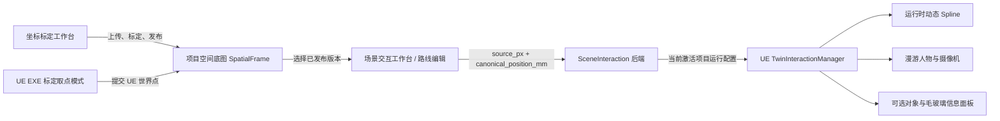
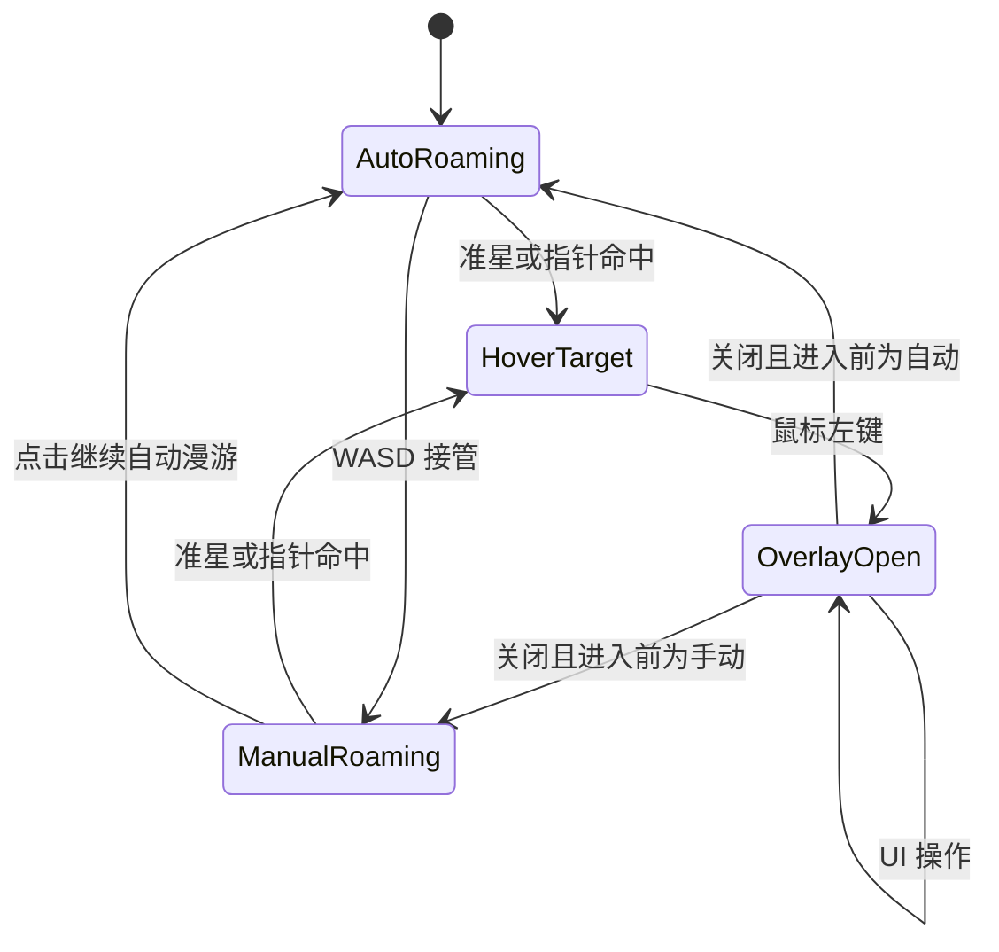

# OntoTwin 4.0.1 配置驱动人物漫游闭环（PRD）

> 状态：草案，待产品评审后实施  
> 主线：OntoTwin Nexus  
> 版本：4.0.1  
> 日期：2026-07-15  
> 基线：OntoTwin 4.0 场景交互层与人物漫游技术垂直链路

---

## 1. 文档目的

OntoTwin 4.0 已在 UE 编辑器测试环境中跑通人物生成、近身跟随/上帝视角切换、WASD 接管、默认路线跟随和基础对象命中，但尚未形成可交付给业务配置人员使用的完整产品闭环。

4.0.1 不推翻 4.0 的场景交互层，而是修正以下三项阻碍客户端验收的问题：

1. 将“图片标定结果”持久化并继承到人物漫游路线编辑中，使路线能够在 OntoTwin Web 工作台内配置，并由 UE 客户端动态执行。
2. 调整近身跟随摄像机，使其位于人物头顶斜后上方，并开放有限、可校验的参数配置。
3. 将弹窗交互改为方案 A：近身跟随模式使用屏幕中心准星单击，上帝视角使用鼠标指针单击；打开面板时自动暂停路线，关闭后按进入前状态恢复。

本 PRD 覆盖并替换 4.0 中与图片路线、摄像机默认值、对象选择、弹窗输入和客户端验收有关的设计。4.0 已确定的人物资产、同骨架换肤、场景交互后端模块、激活项目规则和 UE 项目绑定关系继续保留。

---

## 2. 产品角色与交付边界

### 2.1 主要角色

**OntoTwin 配置编辑人员**是本功能的主要使用者，其职责包括：

- 在 Web 中上传并标定场景底图。
- 在已发布的底图上配置人物默认路线。
- 配置人物、皮肤、出生规则和摄像机参数。
- 启动已打包 UE 客户端并验证效果。
- 在运行客户端中接管人物、点击场景对象并查看信息面板。

该角色不是 UE 项目集成人员，不应被要求日常打开 UE 编辑器、放置 Actor、修改蓝图或重新编辑样条线。

### 2.2 交付形态

正式交付由两部分组成：

- OntoTwin 配置编辑器：Flask 后端与 Web 多页面工作台。
- 已打包 UE EXE：读取当前激活项目及其场景交互配置，执行人物、路线和面板交互。

UE 编辑器仍用于交付前的场景制作、插件集成、地图构建和打包，但不进入业务配置人员的日常操作流程。

### 2.3 硬性边界

- 后端启动且 UE EXE 已配置服务地址时，即使 Web 页面未打开，UE 运行内容也必须正常工作。
- 日常新增或修改路线不得依赖 UE 编辑器。
- 生产路线不得依赖关卡中手工预放的 `ATwinRoamingRoute`。
- 已打包 Development EXE 是本版本的主要验收载体，PIE 仅作为开发调试手段。
- OntoTwin 只保存可配置事实和项目绑定；UE 世界坐标继续由运行时投影产生。

---

## 3. 版本目标与非目标

### 3.1 版本目标

4.0.1 完成以下产品闭环：

1. 标定图片可发布、持久保存并在浏览器重开后继续使用。
2. 人物漫游工作台可选中已发布底图并编辑多点路线。
3. 路线点同时保留图片像素位置和规范空间位置；图片确定 XY，楼层与 UE 地面检测共同确定 Z。
4. UE EXE 无需预放路线 Actor，即可根据后端配置生成并执行默认路线。
5. 近身跟随摄像机默认位于人物头顶斜后上方。
6. 用户无需记忆 `E`、`Tab`、`R` 组合键即可完成对象查看、路线暂停和恢复。
7. 人物自动漫游期间可以直接点击可交互对象，面板关闭后自动恢复原有漫游状态。
8. 标定发生变化时，受影响路线被显式标记为“需要复核”，不得静默漂移。

### 3.2 非目标

以下能力不进入 4.0.1：

- NavMesh 动态绕障与路径重新规划。
- 跨楼层路线和电梯联动。
- 路线点讲解、告警或复杂业务动作编排。
- 不同 Skeleton 之间的动画重定向。
- 手柄、移动端和 VR 输入适配。
- 任意网页嵌入和带认证的视频网页播放。
- 从 UE 自动生成正射俯视图。
- 多人在线协同编辑路线。
- 对人物做实时业务定位或将普通观察者强制建模为 OntoTwin 实例。

---

## 4. 4.0 当前问题复盘

### 4.1 图片标定没有形成可继承的数据资产

当前“图片标定”中的原图主要停留在浏览器本地草稿，原图、图像身份、标定锚点和发布版本没有形成完整的项目级空间底图资产。结果是：

- 人物漫游页无法可靠重载用户当时标定的同一张图片。
- 后端现有 `frame_image` 不能区分多张图片及其版本。
- Web 路线点无法证明与 UE 中的世界点使用了同一套标定关系。
- 用户只能回到 UE 编辑器手工放置路线 Actor，违背交付角色边界。

### 4.2 近身摄像机位置过低

当前近身摄像机的弹簧臂长度约为 120 cm，相对胶囊体中心上移约 35 cm。人物胶囊体中心通常位于地面上方约 88 cm，因此相机中心高度约为 123 cm，容易落在人物肩部或背部附近，遮挡视野，也不符合“头顶斜后上方”的预期。

### 4.3 弹窗交互依赖过多按键和具体 Actor 类型

当前操作需要理解 `R`、`Tab`、`E` 的状态关系，且命中逻辑依赖将对象直接转换为具体的 `ATwinInstance`。这会带来两个问题：

- 自动漫游、手动接管、鼠标输入和 UI 输入的状态切换不透明。
- 看板可能由 Widget、组件、代理碰撞体或父 Actor 承载，直接转换具体 Actor 容易使命中失败。

---

## 5. 目标架构



4.0.1 继续遵守统一数据流：

```text
OntoTwin Web 配置
    ↓
/api/v2/scene-interactions 与空间底图 API
    ↓
当前激活项目
    ↓
UE TwinInteractionManager
    ↓
动态路线 / 人物 / 摄像机 / 信息面板
```

其中：

- `ProjectStore` 保存项目级配置和资产元数据。
- 图片二进制保存为项目资产文件，不以内嵌 Base64 形式塞入项目 JSON 或 PostgreSQL 业务字段。
- `scene_interactions` 保存人物、路线和默认路线引用。
- UE 只消费精简的运行时投影，不直接理解 Web 编辑草稿。

---

## 6. 功能一：可继承的图片标定与路线编辑

### 6.1 核心设计

“图片标定”不再只是一段临时转换过程，而是产生可复用、可版本化的 **空间底图 SpatialFrame**。

空间底图由以下内容共同构成：

- 原始图片资产。
- 图片宽高、格式、哈希等身份信息。
- 所属项目、楼层、绑定的 UE 项目和 UE Level。
- 图片像素点与 UE 世界点之间的锚点对。
- 像素坐标到规范坐标的变换结果。
- 标定误差、发布状态、修订号和指纹。

人物路线引用一个已发布的空间底图版本。路线编辑器必须显示该版本对应的原始图片，不能用文件名相同但内容不同的图片替代。

### 6.2 图片资产存储

推荐采用“项目资产文件 + ProjectStore 元数据”的方式：

```text
backend/data/project_assets/{project_id}/spatial_frames/{asset_id}.{ext}
```

原则：

- 资产使用不可猜测的 `asset_id`，并记录 SHA-256 哈希。
- 支持 PNG、JPEG、WebP；单文件初始上限建议为 20 MB。
- 图片文件路径不直接暴露给前端，前端通过受控 API 获取。
- 删除被路线引用的底图前必须二次确认，并明确列出受影响路线。
- Docker 部署必须将项目资产目录纳入持久卷。
- 项目导出不能只导出 JSON 元数据；应输出包含 manifest 与资产文件的项目包。

> 该方案会新增项目资产目录并扩展 ProjectStore 元数据。正式编码前需确认该存储方案，并同步实现 JSON 与 PostgreSQL 两种后端。

### 6.3 SpatialFrame 数据契约

复用并扩展项目现有 `frames`，不再创建含义重复的顶层结构。

建议契约：

```json
{
  "id": "frame.floor1.overview",
  "name": "一层漫游底图",
  "kind": "image",
  "status": "published",
  "floor_id": "floor-1",
  "bound_ue_project_id": "test0316",
  "ue_level": "/Game/Maps/Main",
  "image": {
    "asset_id": "asset_01J...",
    "url": "/api/v2/spatial-frames/frame.floor1.overview/image",
    "sha256": "...",
    "width_px": 4096,
    "height_px": 3072,
    "mime_type": "image/png"
  },
  "anchors": [
    {
      "id": "anchor-1",
      "source_px": [412.0, 622.0],
      "ue_world_cm": [1020.0, -338.0, 0.0]
    }
  ],
  "floor_reference": {
    "canonical_z_base_mm": 0.0,
    "ue_ground_z_cm": 0.0,
    "captured_from_anchor_id": "anchor-1"
  },
  "transform": {
    "type": "affine_2d",
    "source": "image_px",
    "target": "canonical_mm",
    "matrix": [[0, 0, 0], [0, 0, 0]],
    "mean_residual_mm": 0,
    "max_residual_mm": 0
  },
  "calibration_revision": 1,
  "calibration_fingerprint": "sha256:...",
  "created_at": "2026-07-15T00:00:00Z",
  "updated_at": "2026-07-15T00:00:00Z"
}
```

说明：

- `ue_world_cm` 只属于标定锚点证据，不直接复制到路线点中。
- 图片锚点的 X/Y 参与二维仿射拟合；其 Z 不参与 XY 矩阵计算。
- `floor_reference` 保存该底图所属楼层在 UE Level 中的地面高度基准。它属于楼层/场景绑定，不属于某一个路线点。
- 路线的事实位置仍使用 `canonical_position_mm`。
- `calibration_fingerprint` 由图片身份、锚点、变换方式和关键绑定共同计算。
- 已发布版本不可原地静默覆盖；重新标定产生新 revision。

### 6.4 标定工作流

#### 6.4.1 Web 端

1. 用户在“坐标标定 > 图片标定”上传底图。
2. 后端立即保存图片为项目草稿资产，不再只依赖浏览器临时缓存。
3. 用户选择对应的 UE 项目、Level 和楼层。
4. 用户在图片上依次点击标定锚点。
5. 用户从 UE EXE 的标定取点会话中选择对应世界点，形成点对。
6. 用户将其中一个落在可行走地面上的 UE 点指定为“楼层地面基准点”。
7. 系统使用锚点 X/Y 计算二维仿射变换，并独立记录楼层 Z 基准、残差和可用范围。
8. 用户预览后显式点击“发布为空间底图”。
9. 发布完成后，用户可通过快捷入口进入“场景交互 > 漫游路线”。

#### 6.4.2 UE EXE 标定取点模式

由于业务配置人员不打开 UE 编辑器，4.0.1 在已打包 Development EXE 中提供受控的“标定取点模式”：

- Web 创建一次标定会话并显示会话状态。
- UE EXE 获取当前项目的待处理会话。
- 用户在上帝视角点击场景地面或明确地标。
- 客户端提交点击位置的 UE 世界坐标、Level 和锚点编号。
- 至少指定一个实际可行走地面点作为楼层 Z 基准；该点同时可以作为普通 XY 锚点。
- Web 将 UE 点与图片像素点配对。
- 取点模式只采集坐标，不移动或修改场景 Actor。
- 完成或取消会话后自动回到正常漫游输入。

第一版至少需要 3 个不共线锚点，建议使用 4 个或更多锚点以便计算残差。建议初始发布门槛：

- 平均残差不大于 200 mm。
- 最大残差不大于 500 mm。
- 三点近似共线、图片或 UE Level 不一致时禁止发布。

该门槛作为 4.0.1 默认值写入校验器，后续根据真实场景尺寸再调整。

### 6.5 路线数据契约

路线保存在 `scene_interactions.routes` 中：

```json
{
  "id": "route.floor1.default",
  "name": "一层默认参观路线",
  "enabled": true,
  "frame_id": "frame.floor1.overview",
  "calibration_revision": 1,
  "calibration_fingerprint": "sha256:...",
  "floor_id": "floor-1",
  "z_policy": "project_to_walkable_ground",
  "loop": true,
  "speed_cm_s": 150,
  "review_state": "ready",
  "waypoints": [
    {
      "id": "wp-1",
      "order": 1,
      "source_px": [820.5, 1440.0],
      "canonical_position_mm": [12500.0, 7600.0, 0.0]
    },
    {
      "id": "wp-2",
      "order": 2,
      "source_px": [1160.0, 1440.0],
      "canonical_position_mm": [15100.0, 7600.0, 0.0]
    }
  ],
  "revision": 3,
  "updated_at": "2026-07-15T00:00:00Z"
}
```

数据原则：

- `source_px` 用于图片编辑、回显和追溯。
- `canonical_position_mm` 是路线事实来源。
- UE 世界坐标不写入路线事实数据，由运行时根据项目绑定和坐标框架投影。
- `canonical_position_mm.z` 在 4.0.1 中由所选楼层的 `z_base_mm` 自动填写并只读，不允许用户在二维图片上逐点猜高度。
- 路线至少包含 2 个点；循环路线建议至少 3 个点。
- 4.0.1 只实现路径点、顺序、速度和循环；停留、讲解、动作保留为后续扩展，不在本次 UI 中暴露空配置。
- `interaction_revision` 在人物或路线保存后递增，用于通知 UE 刷新。

### 6.6 路径 Z 轴判定

#### 6.6.1 坐标语义

UE 使用 Z-up 坐标系，Z 轴正方向为竖直向上。二维图片本身只能确定平面 X/Y，不能从一个像素点可靠推导地面高度。因此 4.0.1 不把图片像素变换扩展为伪三维矩阵，而采用“楼层基准 + UE 运行时贴地”的规则。

三个高度概念必须分开：

| 概念 | 示例 | 含义 |
|---|---:|---|
| `canonical_z_base_mm` | 0 mm / 4500 mm | OntoTwin 中该楼层相对建筑基准的规范高度 |
| `ue_ground_z_cm` | 20 cm / 470 cm | 该楼层在绑定 UE Level 中的地面高度提示 |
| Character Actor Z | 地面 Z + 88 cm | UE 人物 Actor 位于胶囊体中心，不是脚底 |

`canonical_z_base_mm` 与 `ue_ground_z_cm` 不强制数值相等，因为 UE 场景原点可能与建筑规范原点不同。二者的对应关系属于项目/楼层绑定。

#### 6.6.2 编辑阶段

1. 用户为底图选择 `floor_id`。
2. 系统从 `spatial_profile.floor_table` 读取该楼层的 `z_base_mm`。
3. 用户在 UE EXE 标定取点模式中指定一个“楼层地面基准点”，记录其 `ue_ground_z_cm`。
4. Web 路线点只编辑 X/Y；保存时为每个点自动带入该楼层的 `canonical_z_base_mm`。
5. 路线级 `z_policy` 固定为 `project_to_walkable_ground`，不在 4.0.1 开放逐点 Z 编辑。

建议扩展楼层表：

```json
{
  "floor": 1,
  "floor_id": "floor-1",
  "z_base_mm": 0.0,
  "ue_ground_z_cm": 20.0,
  "ue_level": "/Game/Maps/Main",
  "map_codes": []
}
```

若旧项目没有 `ue_ground_z_cm`，可临时使用 `z_base_mm × scale_to_cm` 作为提示值，但空间底图正式发布前必须在 EXE 中完成一次地面基准确认。

#### 6.6.3 UE 运行时阶段

后端只下发每个点的 UE X/Y 与楼层地面 Z 提示。UE 对每个路线点执行：

```text
Expected = [RouteX, RouteY, ue_ground_z_cm]
TraceStart = Expected + [0, 0, GroundTraceUpCm]
TraceEnd   = Expected - [0, 0, GroundTraceDownCm]
    ↓ 只检测可行走地面通道
命中：ResolvedGroundZ = Hit.ImpactPoint.Z
未命中：路线无效，不使用猜测高度启动人物
```

初始建议搜索范围：向上 150 cm、向下 300 cm。具体检测通道、范围、最大坡度与台阶高度是 UE 项目级集成参数，不开放给日常配置人员。

运行时规则：

- 动态 Spline 的点位 Z 使用 `ResolvedGroundZ`，其语义是脚下地表高度。
- 人物生成 Z 使用 `ResolvedGroundZ + CapsuleHalfHeight + 2 cm` 安全间隙。
- 自动移动期间只由路线控制水平移动和朝向，垂直贴地交给 `CharacterMovement`，禁止每帧同时强写人物 Z，避免上下抖动。
- 地面射线应使用专用可行走地面通道，忽略人物、路线 Actor、看板代理和普通可移动物体，防止射线落到箱子或设备顶面。
- 任一点找不到有效地面、命中错误 Level 或相邻点地面高差超过角色能力时，路线进入 `invalid`，客户端报告具体点位。

4.0.1 只支持同一楼层的地面、缓坡和 UE CharacterMovement 可跨越的小台阶。楼梯、跨层平台、电梯和需要逐点高度的高架路线不在本版本范围内；这类路线未来需增加三维路径或 NavMesh 语义，不能仅靠二维图片猜 Z。

### 6.7 标定变更与路线复核

当空间底图的图片、锚点、变换矩阵、UE 项目绑定、UE Level 或楼层发生变化时：

1. 发布新的 `calibration_revision` 和 `calibration_fingerprint`。
2. 所有引用旧指纹的路线进入 `needs_review`。
3. Web 在路线列表和编辑画布中显示明确提示。
4. 未复核路线不得被设置为新的默认生产路线。
5. UE 对 `needs_review` 路线默认拒绝执行，并回退到有效出生点；不得自动使用新矩阵移动旧路线。
6. 用户打开路线、核对各点并显式保存后，路线更新为新指纹和 `ready`。

### 6.8 Web 路线编辑器

路线编辑位于独立的“场景交互 > 漫游路线”侧边菜单，不将路线业务继续塞入坐标标定工作台。

页面能力：

- 选择已发布且与当前项目绑定一致的空间底图。
- 显示原始图片、标定版本、误差和发布状态。
- 单击加点、拖动点、删除点、调整顺序。
- 清晰区分起点、途经点和终点。
- 配置路线名称、是否循环和移动速度。
- 显示当前楼层规范高度和 UE 地面基准；两者只读，用户不能在图片画布逐点输入 Z。
- 在图片上预览连线和方向。
- 显式保存、未保存状态、离开确认、删除确认和 Toast 反馈。
- 标定已变化时显示“需要复核”，不得仅用一个弱提示带过。

Web 页面继续使用 `ontotwin-ui` 的黑白灰工具型界面；不使用 UE UMG 的毛玻璃视觉。

### 6.9 UE 运行时路线

后端向 UE 输出精简运行配置：

```json
{
  "route_id": "route.floor1.default",
  "route_revision": 3,
  "loop": true,
  "speed_cm_s": 150,
  "z_policy": "project_to_walkable_ground",
  "floor_ground_z_hint_cm": 20.0,
  "waypoints_ue_cm": [
    [1020.0, -338.0, 0.0],
    [1280.0, -338.0, 0.0]
  ]
}
```

UE 侧执行规则：

- `TwinInteractionManager` 收到新 revision 后校验并刷新路线。
- 运行时创建临时 `ATwinRoamingRoute` 或等价动态路线对象，将点写入 `USplineComponent`。
- 每个点先在楼层 Z 提示附近向下检测可行走地面，再使用命中的地表 Z 构建 Spline。
- 动态对象不保存回 UE Level。
- 自动漫游启用时，人物默认从路线第一个有效点出生，避免先寻找远处起点造成碰撞或抖动。
- 未配置有效路线时，回退到 `ATwinGodViewAnchor` 或项目默认出生锚点。
- 继续使用地面贴合和 CharacterMovement；Spline 负责展示计划路线，不承诺主动绕障。
- 被障碍物阻挡时，客户端记录阻挡位置、命中对象和路线进度，不能无限抖动。

关卡中手工放置的 `ATwinRoamingRoute` 仅保留为开发/离线测试回退，不作为生产配置和验收依赖。

---

## 7. 功能二：近身跟随摄像机调整

### 7.1 模式命名

原“第一人称”实际仍能看到人物，不属于严格的第一人称视角。4.0.1 在用户界面中统一改名为：

- **近身跟随**：人物头顶斜后上方，跟随人物移动和转向。
- **上帝视角**：从较高位置观察并控制场景。

底层枚举可继续兼容旧名称，但 API 和界面应返回新的显示文案。

### 7.2 推荐默认值

近身跟随摄像机采用以下默认值：

| 参数 | 4.0 当前值 | 4.0.1 推荐值 | 说明 |
|---|---:|---:|---|
| 弹簧臂后向距离 | 120 cm | 220 cm | 避免人物占满画面 |
| 相对胶囊体中心高度 | 35 cm | 110 cm | 相机约位于地面上方 198 cm |
| 初始俯角 | 未显式配置 | -10° | 向下观察人物前方区域 |
| 摄像机碰撞 | 开启 | 保持开启 | 靠墙时自动收臂 |
| 轻微跟随延迟 | 已有/可选 | 保持轻微 | 降低突兀抖动 |

### 7.3 Web 配置范围

人物漫游配置中提供“近身跟随摄像机”折叠区：

- 后向距离：160–350 cm，默认 220 cm。
- 相对高度：70–160 cm，默认 110 cm。
- 初始俯角：0° 至 -25°，默认 -10°。
- “应用推荐预设”按钮。

旧项目迁移时不静默覆盖用户已自定义的距离和高度。若检测到仍为 4.0 的默认组合 `120/35`，Web 显示一次“可应用 4.0.1 推荐预设”的提示，由用户显式保存；本次测试项目实施时应用推荐预设。

---

## 8. 功能三：方案 A 弹窗交互

### 8.1 用户操作

#### 近身跟随模式

- 屏幕中心常驻低干扰准星。
- 准星经过可交互对象时，对象高亮并显示“点击查看”。
- 单击鼠标左键打开对象信息面板。
- 鼠标移动继续用于观察方向，不要求先按 `Tab` 释放鼠标。

#### 上帝视角

- 保持可见鼠标指针。
- 鼠标经过可交互对象时高亮。
- 单击鼠标左键打开对象信息面板。

#### 面板打开后

- 自动切换到 UI 输入，显示鼠标指针。
- 自动暂停当前默认路线，暂停原因记录为 `paused_by_overlay`。
- WASD 和视角旋转不再穿透到人物。
- 点击关闭按钮或按 `Esc` 关闭面板。
- 若打开前处于自动漫游，关闭后从原路线进度自动恢复。
- 若打开前已由用户手动接管，关闭后保持手动状态，不擅自切回自动漫游。

### 8.2 取消复杂按键主流程

- `E` 不再是打开面板的必需操作。
- `Tab` 不再是切换鼠标/场景输入的必需操作。
- `R` 不再是恢复默认路线的必需操作。
- HUD 提供明确的“继续自动漫游”按钮，用于用户手动接管后主动恢复路线。
- F7 可继续作为开发快捷键，但已打包客户端必须提供可见的“进入漫游/切换视角”入口，不能把快捷键作为唯一入口。

### 8.3 交互状态机



### 8.4 通用可交互目标

不再要求被点击对象必须直接是 `ATwinInstance`。UE 插件新增通用选择目标能力，例如：

```text
UTwinInteractionTargetComponent
  - bound_instance_id
  - interaction_kind
  - overlay_id / overlay_binding
  - enabled
  - highlight_policy
```

命中解析顺序：

1. 命中的 Primitive/Widget 组件上是否存在交互目标组件或接口。
2. 命中组件所属 Actor 是否提供交互目标。
3. 父级/附着 Actor 是否提供交互目标。
4. 是否可通过 SceneManager 解析到 `bound_instance_id`。
5. 无有效绑定时只取消高亮，不打开空面板。

可交互代理碰撞体使用 `QueryOnly` 并响应 `Visibility` 查询，避免为了点击而参与物理阻挡。

### 8.5 UMG 信息面板视觉

UE 客户端不套用 OntoTwin Web 的黑白灰工具风格。UMG 信息叠加层按 `lingjing-ui-core` 的“UE5 信息叠加层组件及模板”执行：

- 场景类型：`ue5_overlay`。
- 布局：Mode 2，HUD + 单侧详情面板。
- 信息密度：Level 1，必要时可到 Level 2。
- 保留 `root > viewport > safe-area` 的稳定层级思想。
- 使用单个半透明毛玻璃详情面板，默认放在右侧并保护中央三维视野。
- 可保留紧凑顶部 HUD、世界标记和单个详情面板。
- 不使用 Mode 5 底部工作台，也不做双侧驾驶舱式堆叠。
- 面板必须包含关闭、加载、空数据、错误四种状态。
- 毛玻璃效果不可牺牲文字对比度、点击区域和低性能设备可用性。

原生 UMG 实现应复用上述布局和 token 语义；若未来改成 Pixel Streaming Web 叠加层，再直接使用该 UI 资源中的模板和审计流程。

### 8.6 与 3.7 信息叠加层的关系

4.0.1 不重新定义 3.7 已有的信息字段、内容绑定、视频地址或告警触发规则，也不替换正在开发的信息面板业务内容。本版本只补齐三项运行交互能力：

- 如何从人物漫游状态选中一个支持 `I3D_Overlay` 的对象。
- 如何在面板打开和关闭时管理鼠标、键盘与默认路线状态。
- 如何用统一的毛玻璃单侧容器承载已有面板内容。

因此，3.7 负责“显示什么”，4.0.1 场景交互层负责“如何选中、打开、暂停和恢复”，两者通过实例绑定与 `I3D_Overlay` 契约衔接。

---

## 9. 前端信息架构

场景交互工作台继续使用独立侧边菜单，不使用顶部页签切换：

```text
场景交互
├─ 人物漫游
│  ├─ 人物与皮肤
│  ├─ 出生与默认路线
│  └─ 近身跟随摄像机
├─ 漫游路线
│  ├─ 空间底图选择
│  ├─ 路线列表
│  └─ 路线画布与属性
└─ 信息面板
   └─ 本版本只显示既有能力入口/状态
```

“坐标标定”在空间底图发布完成后提供“去配置漫游路线”的快捷入口，但路线编辑器本体仍属于场景交互工作台。

所有 Web 新页面和修改继续遵循：

- 极简黑白灰。
- 显式保存和清晰的未保存状态。
- 可继续编辑，不用提交后锁死。
- Toast、模态确认、可操作错误提示。
- 禁止原生 `alert` / `confirm`。

---

## 10. 后端模块与 API

### 10.1 模块边界

场景交互能力继续放在独立模块中，`backend/app.py` 只负责注册路由。

建议补充：

```text
backend/
├─ scene_interaction/
│  ├─ api.py
│  ├─ service.py
│  ├─ validators.py
│  └─ runtime_projection.py
└─ spatial_assets/
   ├─ api.py
   ├─ service.py
   ├─ storage.py
   └─ validators.py
```

`spatial_assets` 负责图片资产、空间底图发布和标定会话；`scene_interaction` 负责人物、路线及 UE 运行时投影。两者都只读取当前激活项目。

### 10.2 建议 API

#### 空间底图与标定

```text
POST   /api/v2/spatial-frames/assets
GET    /api/v2/spatial-frames
GET    /api/v2/spatial-frames/{frame_id}
GET    /api/v2/spatial-frames/{frame_id}/image
PUT    /api/v2/spatial-frames/{frame_id}/draft
POST   /api/v2/spatial-frames/{frame_id}/publish

POST   /api/v2/spatial-calibration-sessions
GET    /api/v2/spatial-calibration-sessions/{session_id}
POST   /api/v2/spatial-calibration-sessions/{session_id}/ue-points
POST   /api/v2/spatial-calibration-sessions/{session_id}/complete
DELETE /api/v2/spatial-calibration-sessions/{session_id}
```

#### 路线

```text
GET    /api/v2/scene-interactions/routes
POST   /api/v2/scene-interactions/routes
GET    /api/v2/scene-interactions/routes/{route_id}
PUT    /api/v2/scene-interactions/routes/{route_id}
DELETE /api/v2/scene-interactions/routes/{route_id}
POST   /api/v2/scene-interactions/routes/{route_id}/review
```

现有 UE 运行时配置接口继续输出人物、皮肤、默认路线和摄像机参数，不要求 UE 分别拼接多个编辑 API。

### 10.3 通用校验

- 所有对象必须属于当前激活项目。
- `frame_id` 必须存在且为 `published`。
- 路线引用的标定指纹必须与空间底图一致。
- 路线至少 2 点，坐标必须为有限数值并落在图片边界内。
- 路线楼层必须存在 `z_base_mm`；正式发布的空间底图必须具有经 EXE 确认的 `ue_ground_z_cm`。
- UE 项目、Level 和楼层绑定必须一致。
- 保存使用 `expected_revision` 防止旧页面覆盖新内容。
- 媒体 URL、文件类型、尺寸和图片解码结果必须校验。
- 客户端运行投影只返回必要字段，不返回原始图片二进制和 Web 草稿。

---

## 11. 存储与版本策略

### 11.1 Schema 版本

4.0 当前项目结构版本为 3。4.0.1 因扩展 `frames`、引入项目图片资产元数据和持久化路线，建议升级为：

```text
schema_version = 4
```

迁移原则：

- 低版本项目以兼容方式读入，在内存补齐默认结构。
- 只有用户正常保存后才落为版本 4。
- 高于当前程序支持版本的数据拒绝写回。
- JSON 与 PostgreSQL 两种存储后端必须同步支持新字段。
- 项目资产文件不直接写入数据库，但其元数据和引用必须随项目迁移。

### 11.2 Revision

- `schema_version`：只在数据结构变化时增加。
- `interaction_revision`：人物、摄像机、默认路线或路线内容变化时增加。
- `calibration_revision`：某一空间底图重新发布标定时增加。
- `route.revision`：某一路线内容变化时增加。

UE 使用 `interaction_revision` 判断是否拉取新配置，再按内部 revision 判断需要刷新人物、路线还是摄像机。

### 11.3 兼容 4.0 测试配置

- 现有 `route.test.default` 与关卡预放路线可作为开发回退继续识别。
- 生产配置保存新的 Web 路线后，`default_route_id` 优先指向项目路线。
- 运行时不能找到项目路线时记录明确错误，再根据环境策略选择出生锚点或开发回退路线。
- 不把旧预放路线自动转换成项目路线，避免丢失坐标来源和标定证据。

---

## 12. 客户端运行流程

### 12.1 冷启动

1. 启动 OntoTwin 后端。
2. 启动已打包 UE EXE，Web 页面可以关闭。
3. UE 根据后端地址与 UE 项目绑定解析当前激活项目。
4. 获取场景交互运行配置。
5. 校验人物资产、皮肤、摄像机和默认路线。
6. 运行时创建路线并在首个有效点生成漫游人物。
7. HUD 显示连接状态，并提供“进入漫游”可见入口。

### 12.2 自动漫游与接管

- 有有效默认路线时，进入场景后自动执行。
- 用户按 WASD 时切换为手动接管。
- 手动接管后 HUD 显示“继续自动漫游”。
- 用户点击该按钮时，人物平滑回到路线的合理接入点并继续。
- 面板导致的暂停与用户接管分开记录，关闭面板不会误改用户选择。

### 12.3 运行错误反馈

客户端至少记录并可显示：

- 后端连接失败。
- 当前激活项目与 UE 项目不匹配。
- 默认路线不存在、待复核或坐标无效。
- 人物或皮肤资产未 Cook。
- 路线被碰撞体阻挡。
- 可交互目标没有有效实例或面板绑定。

---

## 13. 状态定义

### 13.1 空间底图

| 状态 | 含义 |
|---|---|
| `draft` | 图片已保存但尚未完成标定或发布 |
| `published` | 可供路线引用的稳定版本 |
| `invalid` | 资产缺失、绑定失效或标定校验失败 |
| `archived` | 不再新建引用，但保留历史路线追溯 |

### 13.2 路线

| 状态 | 含义 |
|---|---|
| `draft` | 尚未满足运行条件或尚未发布保存 |
| `ready` | 标定一致且可下发 UE |
| `needs_review` | 底图标定已变化，等待人工复核 |
| `invalid` | 点数、坐标、绑定或引用不合法 |

### 13.3 漫游运行态

| 状态 | 含义 |
|---|---|
| `auto_roaming` | 正在按默认路线自动移动 |
| `manual_roaming` | 用户已通过 WASD 接管 |
| `paused_by_overlay` | 因信息面板打开而临时暂停 |
| `blocked` | 碰撞阻挡且无法继续前进 |
| `no_valid_route` | 没有可执行默认路线 |

---

## 14. 验收标准

### 14.1 图片标定与路线

- [ ] 图片上传后保存到后端项目资产中，关闭浏览器或清除本地草稿后仍可重载。
- [ ] 已发布空间底图具有唯一 ID、图片哈希、尺寸、绑定、标定 revision 和指纹。
- [ ] 配置人员无需打开 UE 编辑器，即可通过 UE EXE 采集至少 3 个标定世界点。
- [ ] 路线编辑器加载的图片与标定发布时图片哈希完全一致。
- [ ] 用户可在图片上新增、拖动、删除、排序并保存至少 2 个路线点。
- [ ] 每个路线点同时保存 `source_px` 和 `canonical_position_mm`，不保存固化 UE 坐标。
- [ ] 图片打点只编辑 X/Y，路线点 Z 自动采用所选楼层的 `z_base_mm`。
- [ ] 空间底图发布前必须通过 EXE 确认楼层 `ue_ground_z_cm`，不能默认假定 UE 地面为 Z=0。
- [ ] UE 在 Z 基准附近对每个点执行可行走地面检测，Spline 使用命中地表 Z。
- [ ] 人物 Actor Z 为地表 Z 加胶囊半高和安全间隙，自动移动时不再每帧与 CharacterMovement 争抢 Z。
- [ ] 任一路线点找不到地面或高度跳变不可通行时，路线拒绝执行并指出具体点位。
- [ ] 标定变更后，旧路线进入 `needs_review`，UE 不静默执行漂移后的路线。
- [ ] UE EXE 在关卡无预放 `ATwinRoamingRoute` 时，仍能动态生成并执行路线。
- [ ] 自动路线人物从首个有效路线点生成，不出现寻找起点时上下抖动。
- [ ] 路线受到不可通过障碍物阻挡时停止抖动，并输出可定位的错误信息。

### 14.2 摄像机

- [ ] 近身跟随默认相机位于人物头顶斜后上方，人物不占满画面。
- [ ] 默认参数为后向 220 cm、相对高度 110 cm、俯角 -10°。
- [ ] 靠近墙体时 SpringArm 碰撞收缩有效，不穿墙。
- [ ] Web 可在受限范围内修改三项参数，非法值不能保存。
- [ ] 旧项目已自定义参数不被静默覆盖。

### 14.3 弹窗交互

- [ ] 近身跟随模式中，准星命中目标后单击左键即可打开面板。
- [ ] 上帝视角中，鼠标指针命中目标后单击左键即可打开面板。
- [ ] 打开信息面板无需按 `E`、`Tab` 或 `R`。
- [ ] 看板使用组件或代理碰撞体时仍可解析到绑定实例。
- [ ] 面板打开时自动切到 UI 输入并暂停自动路线。
- [ ] 面板关闭后，进入前为自动漫游则自动恢复；进入前为手动则保持手动。
- [ ] 面板为单侧低干扰毛玻璃 UMG，不遮挡中央主要三维视野。
- [ ] 面板具备关闭、加载、空数据和错误状态。

### 14.4 客户端交付

- [ ] 已打包 Development EXE 是完整验收对象，而非只在 PIE 验收。
- [ ] 后端运行、Web 关闭时，EXE 仍可加载当前激活项目的人物和路线配置。
- [ ] EXE 提供可见的进入漫游、切换视角和继续自动漫游入口，F7/R 不作为唯一入口。
- [ ] 人物、皮肤、交互插件类和 UMG 资产全部正确 Cook。
- [ ] 配置错误通过 Web 或客户端给出可操作信息，不要求配置人员查 UE 蓝图。

---

## 15. 测试场景

### 15.1 正向场景

1. 上传一层平面图并创建 4 对锚点。
2. 发布空间底图，关闭并重新打开浏览器。
3. 在场景交互工作台重载同一底图，绘制 5 点循环路线。
4. 保存为默认路线并关闭 Web。
5. 启动 Development EXE，确认人物从首点开始自动漫游。
6. WASD 接管后点击“继续自动漫游”。
7. 自动漫游中单击看板，确认路线暂停、面板打开；关闭后从原进度继续。
8. 切换上帝视角并使用指针点击另一对象。

### 15.2 负向场景

- 只有 2 个标定点时尝试发布。
- 3 个标定点近似共线。
- 图片内容替换但文件名不变。
- 修改标定后直接启动 UE，不复核旧路线。
- 路线只有 1 点或点超出图片范围。
- 楼层没有地面基准，或路线点附近无法命中可行走地面。
- 同一张二维底图的路线试图跨楼层、楼梯或高架平台。
- EXE 绑定的 UE 项目或 Level 与空间底图不一致。
- 默认人物或皮肤资产未 Cook。
- 点击仅有 Widget/组件代理、不是 `ATwinInstance` 的看板。
- 面板打开前分别处于自动和手动状态，验证关闭后的不同恢复策略。
- 路线中间存在不可通过碰撞体，验证停止与错误上报。

---

## 16. 实施阶段

### 阶段 0：评审与存储确认

- 确认本 PRD。
- 确认项目资产目录与项目导出包方案。
- 确认 schema version 4 的 JSON/PG 同步变更。

### 阶段 1：空间底图持久化

- 新增项目图片资产存储模块。
- 扩展 `frames` 契约、迁移与 API。
- 修改图片标定草稿和发布流程。
- 验证浏览器重开与 Docker 持久化。

### 阶段 2：EXE 标定取点闭环

- 新增标定会话 API。
- UE Development EXE 增加受控取点模式。
- 完成点对、误差、发布和指纹流程。

### 阶段 3：Web 路线编辑与运行投影

- 增加场景交互侧边菜单中的路线页面。
- 复用图片坐标画布能力。
- 增加路线 CRUD、校验、复核和 revision。
- 输出 UE 精简路线坐标。

### 阶段 4：UE 动态路线

- 运行时生成 Spline 路线。
- 默认从首点生成、接管与恢复。
- 阻挡检测和运行日志。
- 保留预放路线为开发回退。

### 阶段 5：摄像机调整

- 应用推荐默认值和新俯角字段。
- Web 参数配置与旧配置兼容提示。
- 在不同人物高度、室内墙边和上帝视角切换中验证。

### 阶段 6：方案 A 弹窗交互

- 引入通用交互目标组件/接口。
- 实现准星射线与指针射线。
- 实现面板暂停/恢复状态机。
- 按 UE5 毛玻璃单侧详情模板实现 UMG。
- 增加可见的漫游入口与恢复按钮。

### 阶段 7：打包验收

- Development EXE Cook 与冷启动测试。
- Web 关闭场景验证。
- 正向、负向与回归测试。
- 形成配置人员操作说明和已知限制。

推荐按“空间底图垂直链路 → 路线垂直链路 → 摄像机 → 弹窗 → 打包”的顺序实施，每个阶段单独确认后再进入下一阶段。

---

## 17. 风险与缓解

| 风险 | 影响 | 缓解措施 |
|---|---|---|
| 图片与 UE Level 实际不一致 | 路线整体漂移 | 图片哈希、Level 绑定、发布指纹与显式复核 |
| 将二维图片的 Z 固定为 0 | 人物悬空、埋地或探地命中错误楼层 | 楼层 Z 基准 + 有界可行走地面检测，不开放逐点猜高度 |
| 标定点质量低 | 局部偏差大 | 至少 3 个不共线点、建议 4 点、残差门槛 |
| 大图使项目 JSON 或数据库膨胀 | 加载慢、备份困难 | 二进制文件与元数据分离，不存 Base64 |
| 项目导出遗漏资产 | 换机器后底图丢失 | 项目包包含 manifest 和 project_assets |
| Spline 穿过障碍物 | 自动路线卡住 | 4.0.1 明确不承诺绕障，增加阻挡停止与日志 |
| 鼠标点击与视角控制冲突 | 无法稳定打开面板 | 近身模式固定中心射线；上帝视角指针射线；面板打开后切 UI 输入 |
| 毛玻璃性能或可读性不足 | 低端设备体验差 | 控制模糊范围、提供降级透明背景、保证文字对比度 |
| 旧配置被新默认值覆盖 | 已有项目视角变化 | 不静默迁移自定义值，显式应用推荐预设 |

---

## 18. 待评审确认项

本 PRD 采用以下推荐默认方案，实施前由产品评审一次性确认：

1. 项目图片使用 `project_assets` 文件目录保存，ProjectStore 只保存元数据和引用。
2. 项目导入导出升级为包含 JSON manifest 与图片资产的项目包，而不是仅导出单个 JSON。
3. 标定发布默认门槛为平均误差 200 mm、最大误差 500 mm。
4. 4.0.1 路线 Z 采用“楼层规范高度 + EXE 地面基准 + UE 运行时贴地”，不开放图片逐点高度编辑。
5. 自动路线启用时，人物从首个有效路线点出生；无有效路线时才使用默认出生锚点。
6. UMG 信息面板默认位于右侧，采用 Mode 2 单侧毛玻璃详情面板。
7. 现有 `ATwinRoamingRoute` 仅作为开发回退，不进入业务配置和生产验收流程。

---

## 19. 版本完成定义

只有在一名不打开 UE 编辑器的 OntoTwin 配置人员能够独立完成以下操作时，4.0.1 才算完成：

1. 上传并发布场景底图。
2. 通过已打包 EXE 与图片完成标定点对齐。
3. 在 Web 中绘制并保存默认漫游路线。
4. 关闭 Web，单独启动后端和 UE EXE。
5. 看到人物以正确高度视角沿路线自动漫游。
6. 用 WASD 接管，再通过可见按钮恢复自动路线。
7. 在自动漫游中用一次鼠标单击打开看板，关闭后自动继续。

PIE 中“能够跑通”不再等价于版本验收通过。

---

## 20. 简短技术说明

图片上的点和 UE 世界里的点属于两套坐标系。至少三个不共线的对应点可以求出一个二维仿射变换，它能表达平移、旋转、缩放和一定程度的倾斜，但它只能可靠解决 X/Y。Z 必须来自所选楼层的高度基准，再由 UE 向地面做射线检测取得真实地表。人物 Actor 的位置在胶囊体中心，所以最终高度还要加胶囊半高。把这三层分开，才能避免人物悬空、埋地或因路线和 CharacterMovement 同时修改 Z 而上下抖动。
