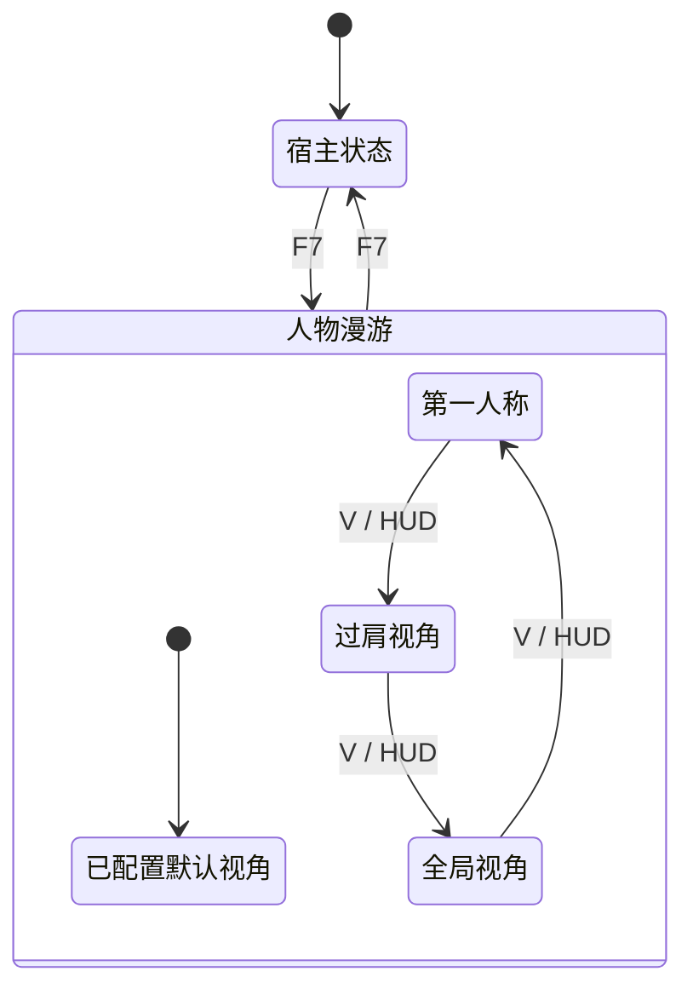

# OntoTwin 4.0.2 三视角统一与第一人称漫游（PRD）

> 状态：已确认，进入开发  
> 主线：OntoTwin Nexus  
> 版本：4.0.2  
> 日期：2026-07-22  
> 基线：OntoTwin 4.0.1 配置驱动人物漫游闭环

---

## 1. 背景

4.0.1 已经跑通配置驱动的人物生成、默认路线、手动接管、皮肤、对象点选和两种摄像机。现有视角命名与实际体验不一致：

- “近身视角（第一人称）”实际上能看到人物，属于过肩视角。
- “上帝视角”和宿主原有“全局视角”在产品体验上重复。
- 系统缺少真正看不到自身模型、按摄像机朝向移动的第一人称视角。
- 视角切换和路线转向可能造成画面突变，容易引起眩晕。

4.0.2 在不改变项目存储大结构、不接管宿主项目原有 Pawn 的前提下，将漫游态统一为三种视角，并补齐第一人称控制与平滑切换。

---

## 2. 目标与非目标

### 2.1 目标

1. 将当前“近身视角”正式更名为“过肩视角”。
2. 将漫游态的“上帝视角”统一命名为“全局视角”。
3. 新增真正的第一人称视角：本机不显示人物网格，从眼部高度观察。
4. 漫游态提供第一人称、过肩、全局三个显式入口，并支持 `V` 顺序切换。
5. 第一人称支持标准 FPS 输入、自动路线自由观察和中心准星点选。
6. 三种视角切换平滑，切换期间不打断自动路线。
7. 保留 `F7` 作为“进入/退出人物漫游”的全局开关，退出后恢复宿主原 Pawn。
8. Web 工作台可配置默认视角和第一人称参数，旧项目无须迁移。

### 2.2 非目标

- 不移除或替换宿主项目自己的 Pawn、输入体系与相机逻辑。
- 不把 Runtime Editor 合并进人物漫游状态机。
- 不修改 ProjectStore 顶层结构或提升 `schema_version`。
- 不在本版本提供相机轨道编辑、电影镜头或多人网络视角同步。
- 不提供移动端、手柄或 VR 输入适配。
- 不改变路线坐标、落地检测、人物资产或皮肤契约。

---

## 3. 产品术语与稳定标识

| 产品名称 | 稳定标识 | 含义 |
|---|---|---|
| 第一人称 | `first_person` | 从人物眼部位置观察，本机不显示人物网格 |
| 过肩视角 | `near_follow` | 当前近身跟随视角，可看到人物背部 |
| 全局视角 | `god` | 当前自由飞行上帝视角，产品层统一称为全局视角 |

`near_follow` 与 `god` 保留原标识，避免破坏已保存配置和 UE 运行契约。4.0.2 只新增 `first_person`。

宿主项目原 Pawn 仍然存在，但它是“漫游外宿主状态”，不作为第四种产品视角展示。

---

## 4. 用户与核心用例

主要用户仍是操作 OntoTwin Web 后台的配置编辑人员，而不是 UE 项目集成人员。

核心用例：

1. 编辑人员在 Web 中选择默认视角并调整有限的摄像机参数。
2. 终端用户按 `F7` 进入人物漫游，系统使用已保存的默认视角。
3. 用户通过 HUD 按钮或 `V` 在三种漫游视角间切换。
4. 自动路线运行时，用户可以切换视角或自由观察，路线继续运行。
5. 用户按 WASD 后接管人物；第一人称按摄像机方向移动，过肩视角沿用现有接管规则。
6. 第一人称和过肩视角使用中心准星加左键点选看板；全局视角使用鼠标指针左键点选。
7. 用户再次按 `F7` 退出漫游，恢复进入前的宿主 Pawn、输入和相机。

---

## 5. 状态模型



切换顺序固定为：

```text
first_person → near_follow → god → first_person
```

兼容当前使用习惯：从过肩视角按一次 `V` 仍进入全局视角。

---

## 6. 三视角行为矩阵

| 行为 | 第一人称 | 过肩视角 | 全局视角 |
|---|---|---|---|
| 人物是否存在 | 是 | 是 | 是 |
| 本机是否显示人物 | 否，尽量保留阴影 | 是 | 是 |
| 自动路线 | 继续 | 继续 | 继续 |
| WASD | 接管；前后按相机水平朝向，左右平移 | 接管；沿用现有视角相对移动 | 移动全局相机，不接管人物 |
| 鼠标观察 | 自由偏航/俯仰，身体偏航跟随相机 | 自由观察 | 按住右键观察 |
| 对象点选 | 中心准星 + 左键 | 中心准星 + 左键 | 可见指针 + 左键 |
| 跳跃/下蹲 | 沿用人物能力 | 沿用人物能力 | 不适用 |
| 切回后的地点 | 当前人物位置 | 当前人物位置 | 全局相机位置独立；人物仍沿路线移动 |

### 6.1 第一人称可见性

- 只对本地玩家隐藏人物可见网格，不销毁人物 Actor。
- 胶囊体、碰撞、路线跟随、换肤和动画继续运行。
- 条件允许时开启隐藏模型投影，使地面仍能看到人物阴影。
- 切换到过肩或全局视角前恢复人物网格可见性。

### 6.2 第一人称自动路线观察

- 自动路线决定人物位置和主体朝向。
- 鼠标产生的偏航、俯仰观察偏移在路线转向时保留，不自动回正。
- 用户按下 WASD 后沿用现有规则暂停自动路线并进入手动接管。

---

## 7. 输入与交互

| 输入 | 漫游外 | 第一人称 | 过肩视角 | 全局视角 |
|---|---|---|---|---|
| `F7` | 进入漫游 | 退出并恢复宿主 | 退出并恢复宿主 | 退出并恢复宿主 |
| `V` | 无 | 切到过肩 | 切到全局 | 切到第一人称 |
| WASD | 宿主自行处理 | 人物移动/接管 | 人物移动/接管 | 相机平移 |
| 鼠标移动 | 宿主自行处理 | 自由观察 | 自由观察 | 右键按住时观察 |
| 左键 | 宿主自行处理 | 中心射线点选 | 中心射线点选 | 指针射线点选 |

`E`、`Tab`、`R` 不作为主交互路径。已有兼容输入可以保留，但 HUD 文案与验收不再要求用户记忆这些按键。

---

## 8. 相机切换与防眩晕

### 8.1 第一人称与过肩视角

- 切换时长：约 `0.35 s`。
- 平滑插值：相机位置、弹簧臂距离、高度和 FOV。
- 使用缓入缓出曲线，避免线性启动和突然停止。

### 8.2 人物视角与全局视角

- 切换时长：约 `0.50 s`。
- 使用 UE ViewTarget Blend 在人物相机与全局相机之间过渡。
- 过渡完成后再完成 Pawn possession 切换，避免中途跳帧。

### 8.3 切换期间规则

- 自动路线继续运行，不暂停、不重启、不改变当前位置。
- 暂时忽略移动、点选和再次切换输入，避免状态重入。
- `F7` 始终保留安全退出能力；退出时清理未完成的切换。

---

## 9. Web 配置设计

“人物漫游”页签沿用现有配置卡片，不新增前端路由。

### 9.1 文案修正

- “近身视角（第一人称）”改为“过肩视角”。
- “上帝视角（第三人称）”改为“全局视角”。
- “近身距离/高度/观察灵敏度”改为“过肩距离/高度/观察灵敏度”。

### 9.2 默认视角

下拉选项为：

1. 过肩视角 `near_follow`
2. 第一人称 `first_person`
3. 全局视角 `god`

新建空配置默认 `near_follow`。旧项目已经保存的 `near_follow` 或 `god` 原样生效。

### 9.3 第一人称参数

| 字段 | 标识 | 默认值 | 合法范围 |
|---|---|---:|---:|
| 视点高度（cm） | `eye_height_cm` | 165 | 120–210 |
| 视野角（°） | `fov_deg` | 85 | 60–110 |
| 观察灵敏度 | `look_sensitivity` | 1.0 | 0.1–5.0 |

字段随现有显式保存、脏状态、Toast 和后端校验流程工作，不使用原生 `alert/confirm`。

---

## 10. 后端契约

场景交互配置中的 `camera` 扩展如下：

```json
{
  "camera": {
    "default_mode": "near_follow",
    "first_person": {
      "eye_height_cm": 165,
      "fov_deg": 85,
      "look_sensitivity": 1.0
    },
    "near_follow": {
      "distance_cm": 120,
      "height_cm": 35,
      "look_sensitivity": 1.0
    },
    "god": {
      "camera_id": "default",
      "move_speed_cm_s": 1800,
      "look_sensitivity": 1.0
    }
  }
}
```

兼容规则：

- 缺少 `first_person` 时由读取与校验层补默认值。
- `default_mode` 新增接受 `first_person`。
- 不新增 ProjectStore 顶层字段，不提升 `schema_version`。
- 保存人物配置仍递增 `interaction_revision`。
- 运行时投影输出三种相机配置，UE 不读取 Web 草稿态。

---

## 11. UE 实现设计

### 11.1 类型与配置

- `ETwinRoamingCameraMode` 新增 `FirstPerson`。
- 新增 `FTwinFirstPersonCameraSettings`。
- `FTwinRoamingRuntimeConfig` 增加第一人称设置。
- `TwinInteractionManager` 解析 `camera.first_person` 和三种 `default_mode`。

### 11.2 人物相机

- 继续复用人物上的摄像机与弹簧臂，不新增第二个可争用的 PlayerCameraManager。
- `TwinRoamingCharacter` 负责第一人称/过肩相机参数插值、FOV 和本机网格可见性。
- 第一人称启用控制器偏航驱动身体；过肩视角恢复现有移动朝向策略。
- 当前路线预瞄、人物转向和平滑摄像机能力继续保留。

### 11.3 视角状态机

- `TwinCameraModeComponent` 统一管理三视角、过渡状态、全局 Pawn 和 possession。
- `TwinInteractionManager` 在过渡期间过滤普通输入，并对 HUD、点选和运行状态输出使用统一模式。
- `F7` 退出时取消定时器、销毁全局 Pawn、恢复人物网格并交还宿主 Pawn。

### 11.4 HUD

- 沿用 UE5 单 HUD 叠加层，不引入网页 UI。
- 在现有毛玻璃半透明状态条中加入三个紧凑视角按钮：第一人称、过肩、全局。
- 当前视角有明确选中态，但保持低遮挡、低色彩干扰。
- HUD 同时提示 `F7` 退出、`V` 切换和当前视角对应的点选方式。

---

## 12. 兼容性与迁移

1. 旧配置无 `first_person`：运行时自动补默认值。
2. 旧 `near_follow`：行为保持，仅产品文案改为“过肩视角”。
3. 旧 `god`：行为保持，仅产品文案改为“全局视角”。
4. 宿主 Pawn：不替换、不改类、不接管其长期输入；只在 `F7` 漫游期间临时保存和恢复。
5. Runtime Editor：继续与人物漫游互斥，不在 4.0.2 重构其生命周期。
6. UE 项目迁移：功能代码随 OntoTwinSync 插件迁移；项目级人物资产和皮肤仍按现有资源目录迁移方案处理。

---

## 13. 验收标准

### 13.1 Web 与后端

- 默认视角下拉显示“过肩视角、第一人称、全局视角”。
- 可保存第一人称视点高度、FOV 和观察灵敏度。
- 合法边界值可以保存，越界值被明确拒绝。
- 旧项目打开、保存和运行不报错，且无需手工迁移。

### 13.2 UE 基础流程

- `F7` 能稳定进入和退出漫游，退出后恢复宿主原 Pawn。
- HUD 可直接选择三种视角，`V` 按既定顺序循环。
- 第一人称看不到自身模型，过肩和全局视角能看到人物。
- 第一人称 WASD 按摄像机水平方向移动，鼠标可完整左右与上下观察。
- 第一人称和过肩可用中心准星左键打开实例面板；全局可用指针左键打开。

### 13.3 路线与切换

- 自动路线中切换三种视角，人物不停止、不重置、不瞬移。
- 第一人称自由观察不会被路线转弯强制回正。
- 第一/过肩切换约 0.35 秒平滑完成，人物/全局切换约 0.5 秒平滑完成。
- 切换期间重复按键、移动或点选不会造成多次 possession、卡死或弹窗误触。
- 全局视角观察期间人物继续沿路线移动，切回后回到人物当前地点。

### 13.4 回归

- 换肤、默认路线、手动接管、路线恢复、出生规则和看板弹窗保持可用。
- 现有路线转向预瞄与行走动画保持可用。
- ZHHZ 宿主项目 `Development Editor` 编译通过。

---

## 14. 已确认结论

- 本版本采用产品层合并，不重写宿主 Pawn 架构。
- 漫游内只有第一人称、过肩视角、全局视角三个产品入口。
- 默认视角继续可配置；新建配置默认过肩视角。
- 第一人称严格隐藏本机人物模型，使用标准 FPS 控制。
- 自动路线中允许自由观察且不自动回正。
- 看板交互采用第一/过肩中心射线、全局指针射线。
- 路线在任何视角切换和切换动画中持续执行。
- 本轮没有遗留产品决策问题。
