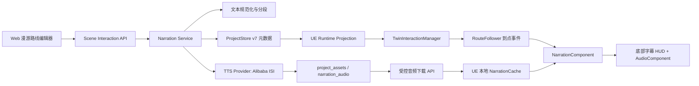
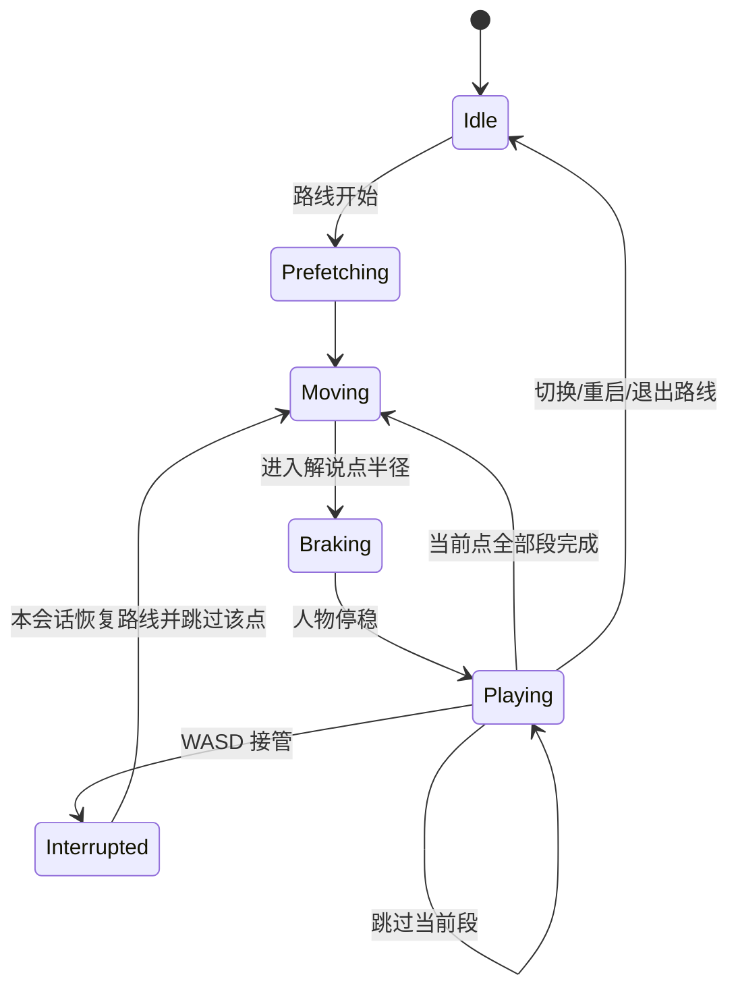

# OntoTwin 4.0.3 漫游点位解说与语音字幕（PRD）

> 状态：MVP 已实现并通过自动化/编译验证，待 ZHHZ PIE 与真实 TTS 人工验收  
> 主线：OntoTwin Nexus  
> 版本：4.0.3  
> 日期：2026-08-13  
> 基线：4.0.1 配置驱动人物漫游闭环、4.0.2 三视角统一与第一人称漫游  
> 变更性质：扩展既有路线点、Scene Interaction 后端和 UE 运行时；不新增前端路由

---

## 1. 文档目的

4.0.3 为已经标定并发布的漫游路线增加“点位解说”能力。配置编辑人员可在现有路线点输入解说词，并选择字幕、语音或字幕加语音。人物自动漫游到该点后停下，完成解说，再继续路线。

本文固定以下可审计边界：

- 解说绑定既有路线点，不创建第二套空间点位。
- Web 负责内容配置、显式生成与状态反馈。
- 后端负责文本规范化、分段、TTS、资产缓存、校验和运行投影。
- UE 只消费已发布配置和项目音频资产，不持有云厂商密钥，也不在运行时调用云 TTS。
- 无网或音频异常时，路线仍可通过字幕完成解说。

---

## 2. 当前事实与差距

### 2.1 已实现基线

当前路线事实保存在 `scene_interactions.routes[]`，每个点已有：

```json
{
  "id": "wp-1",
  "order": 1,
  "source_px": [454.3, 355.9],
  "canonical_position_mm": [1200.0, 4300.0, 0.0]
}
```

现有能力已经包含：

- 已发布空间底图、图片像素坐标和规范坐标转换。
- 路线保存、复核、默认路线、循环和速度配置。
- 后端把规范坐标投影为 UE 世界坐标。
- UE 动态创建路线并使用 CharacterMovement 沿路线移动。
- WASD 人工接管、重载人物、路线切换与三视角。
- UE Screen Space 信息叠加层和共享玻璃主题基础。

### 2.2 当前缺口

- Web 路线点没有解说编辑区。
- 路线运行投影只包含 `waypoints_ue_cm` 坐标数组，点位稳定 ID 在 UE 丢失。
- `UTwinRouteFollowerComponent` 没有“到达某个路线点”的事件和等待状态。
- 项目资产目录当前只正式管理空间底图，没有解说音频类型。
- 后端没有 TTS Provider、文本分段、音频生成或审计记录。
- UE 没有独立字幕 HUD、音频预取、字幕降级和背景声压低机制。

---

## 3. 目标与非目标

### 3.1 目标

1. 在现有路线点编辑解说词和输出模式。
2. 人物进入点位触发半径后平滑停下，完成解说后自动继续。
3. 支持字幕、语音、字幕加语音三种点位模式。
4. 支持中文长文本自动分页，并允许编辑人员调整分页断点。
5. 后端通过阿里云智能语音交互生成并缓存 WAV 音频。
6. UE EXE 无网时仍能播放已缓存音频；音频不可用时自动降级字幕。
7. WASD 接管、跳过、路线切换、重启和退出都有确定的解说生命周期。
8. 项目导入导出包含解说音频和完整审计元数据。
9. 旧路线和旧 UE 客户端保持兼容。

### 3.2 非目标

- 不提供实时云端朗读或边走边流式生成。
- 不提供录音上传、真人配音、声音克隆或 SSML 编辑器。
- 不提供逐字卡拉 OK、高亮跟读或字幕时间轴手工编排。
- 不提供多语言；4.0.3 正式支持普通话中文，契约预留 `language`。
- 不提供独立解说点、范围触发区或与路线无关的自动讲解。
- 不建立异步任务队列、消息中间件或新的前端构建链。
- 不让编辑人员在 Web 中填写云密钥。
- 不把字幕做成模型旁的 World Space 面板。

---

## 4. 用户与核心用例

主要用户是 OntoTwin Web 后台的配置编辑人员，不要求进入 UE 编辑器。

### 4.1 配置用例

1. 编辑人员打开“漫游路线”，选择一条已保存路线。
2. 选择某个路线点，在右侧配置解说词和输出模式。
3. 系统自动分页，编辑人员可插入或删除分页断点。
4. 编辑人员保存路线；保存不自动产生云调用。
5. 编辑人员点击“生成/更新语音”，查看逐点状态。
6. 即使部分语音失败，路线仍可保存和运行，并明确显示降级状态。

### 4.2 运行用例

1. 人物沿默认路线移动。
2. 进入解说点触发半径后减速并停稳。
3. 底部字幕 HUD 显示当前分页，语音按相同分段播放。
4. 当前点解说完成后，人物自动继续路线。
5. 用户可跳过当前段；按 WASD 则立即停止整个当前点解说并接管人物。

---

## 5. 稳定术语与标识

| 产品术语 | 稳定标识 | 含义 |
|---|---|---|
| 点位解说 | `waypoint.narration` | 附着于既有路线点的解说事实 |
| 字幕 | `subtitle` | 只显示字幕 |
| 语音 | `voice` | 优先语音；不可用时必须显示字幕降级 |
| 字幕 + 语音 | `subtitle_voice` | 同时显示字幕并播放语音 |
| 解说段 | `segment` | 后端由完整文本与分页断点生成的运行单元 |
| 语音配置 | `voice_profile` | Provider、音色、语速、音调、音量 |
| 音频资产 | `narration_asset` | 项目级、内容寻址、可下载的 WAV 文件 |
| 解说会话 | `narration_session` | 一次进入、重启或切换路线形成的运行会话 |

路线点 `id` 是解说绑定和运行事件的稳定标识；点位排序变化不改变 `id`。

---

## 6. 已确认决策台账

| ID | 已确认结论 |
|---|---|
| D-001 | 解说绑定现有路线点，不建立独立解说点。 |
| D-002 | 到点后人物停下，解说结束后自动继续。 |
| D-003 | 每点可选字幕、语音、字幕加语音。 |
| D-004 | 后端生成并缓存音频，UE 不运行云 TTS。 |
| D-005 | 语音点按音频结束判定完成；字幕点按阅读时长判定。 |
| D-006 | 字幕阅读时长自动计算，并允许点位级人工覆盖。 |
| D-007 | WASD 立即停止当前字幕和语音并进入人工接管。 |
| D-008 | 接管后返回路线时，本会话不重播已中断点；重启路线会重置。 |
| D-009 | 循环路线每一圈都重新播放解说。 |
| D-010 | 项目提供默认语音；路线可覆盖音色、语速、音调和音量。 |
| D-011 | 点位不单独选音色，统一继承路线有效语音配置。 |
| D-012 | 云 TTS 只在编辑生成阶段需要网络，客户端运行不依赖云服务。 |
| D-013 | 没有生成完音频也允许保存和运行，运行时降级字幕。 |
| D-014 | `voice` 点音频异常时强制显示字幕并记录 `audio_fallback_to_subtitle`。 |
| D-015 | 字幕使用独立的屏幕底部居中 Narration HUD。 |
| D-016 | 用户只维护一份完整解说词；字幕和 TTS 不允许使用两份不同文本。 |
| D-017 | 后端按标点自动分页，编辑人员可调整分页断点。 |
| D-018 | 到达由触发半径判断；路线有默认值，点位可覆盖。 |
| D-019 | 字幕 HUD 显示进度和“跳过当前段”，不提供上一段、下一段或暂停。 |
| D-020 | 解说时压低背景音乐/环境声，不压低高优先级告警和安全提示。 |
| D-021 | TTS 使用通用 Provider 接口，4.0.3 首个实现为阿里云智能语音交互。 |
| D-022 | Provider 和密钥属于部署配置，不是普通项目字段。 |
| D-023 | 文本、分页或有效语音配置变化后，旧音频立即失效。 |
| D-024 | 路线保存与语音生成分离，云调用必须由“生成/更新语音”显式触发。 |
| D-025 | 音频是项目资产；项目数据只保存稳定 ID、摘要和元数据。 |
| D-026 | UE 使用滑动预取：当前点及后续点后台下载并缓存。 |
| D-027 | 切换路线、重启路线或退出漫游立即停止解说并清理状态。 |
| D-028 | 4.0.3 正式支持中文普通话，预留语言字段。 |
| D-029 | 审计记录摘要、分段版本、语音参数、Provider、时间、结果、音频摘要和操作者；不保存密钥或完整 Provider 响应。 |
| D-030 | 开发使用阿里云免费试用；正式部署使用商用账号，不以免费额度作为产品前提。 |

---

## 7. 总体架构



后端模块继续保持 `app.py` 只注册路由。建议新增：

```text
backend/scene_interaction/
├─ narration.py              # 契约、分段、时长和摘要
├─ narration_assets.py       # WAV 校验、内容寻址存储和下载解析
├─ narration_service.py      # 显式生成、失效、审计和批处理
└─ tts/
   ├─ base.py                # Provider 接口
   └─ alibaba.py             # Token 与短文本 TTS
```

---

## 8. Web 产品设计

### 8.1 页面位置

不新增路由或顶部页签。继续使用：

```text
/interaction?feature=routes
```

解说是“路线点属性”，位于现有路线编辑器右侧“路线点”区域中。

### 8.2 点位列表

每个点位行增加小面积状态点和短标签：

| 状态 | UI 文案 |
|---|---|
| 无解说 | 无解说 |
| 字幕可用 | 字幕 |
| 待生成 | 待生成 |
| 生成中 | 生成中 |
| 语音可用 | 语音可用 |
| 部分失败 | 部分失败 |
| 失效 | 需更新 |

状态只使用 6px 语义点和文字，不铺设大色块。

### 8.3 点位解说编辑区

选中路线点后显示：

1. “启用点位解说”开关。
2. 输出方式：字幕 / 语音 / 字幕 + 语音。
3. 完整解说词文本框，显示字符数。
4. 自动分页预览，每页显示序号、文本和预计时长。
5. 在页间“插入分页”或“合并上一页”。
6. “使用路线默认触发距离”或填写点位覆盖值。
7. 字幕模式下“自动阅读时长”或填写点位总时长。
8. 当前语音状态、生成时间和失败原因摘要。

编辑人员永远只维护一份完整文本。分页操作改变 `manual_break_offsets`，不复制文本。

### 8.4 路线语音设置

路线属性增加折叠区“解说语音”：

- 使用项目默认语音。
- 覆盖音色。
- 覆盖语速。
- 覆盖语调。
- 覆盖音量。
- 默认触发距离，默认 `100 cm`，范围 `30–500 cm`。

不展示 Provider 密钥、Access Token 或 AppKey。

### 8.5 显式保存与生成

- “保存路线”只保存文本和配置，不调用阿里云。
- “生成/更新语音”只处理当前路线中 `pending`、`stale` 或 `failed` 的语音段。
- 按钮执行期间显示“正在生成 X/Y”，禁用重复提交。
- 生成结果使用 Toast 和点位就近状态展示。
- 部分失败不回滚已经成功的相同摘要资产。
- 离开存在未保存修改的页面沿用现有脏状态提示。

Web 继续遵循 OntoTwin 黑白灰工具风格，不把 UE 液态玻璃带入编辑器，不使用原生 `alert/confirm`。

---

## 9. 文本规范化、分页与时长

### 9.1 源文本

- 编码：UTF-8。
- 正式语言：`zh-CN`。
- 单点源文本上限：`4000` 个 Unicode 字符。
- 保存前执行 Unicode NFC、换行归一化和首尾空白清理。
- 保留正文内部有意义的换行；连续空白不影响摘要的规则必须固定版本。

### 9.2 分页算法

算法版本首版为 `zh-punct-v1`：

1. 先应用有效的人工分页断点。
2. 再按 `。！？；` 等强标点优先切分。
3. 其次使用 `，、：` 等弱标点。
4. 单段目标 `20–60` 个中文字符。
5. TTS 硬上限为 `300` 字符；实现使用 `280` 字符安全上限。
6. 超长无标点文本按字符边界继续切分，不截断、不丢字。

人工断点保存为规范化源文本的字符偏移。文本编辑后，无效偏移由前端移除并由后端再次校验。

### 9.3 字幕时长

字幕-only 默认每段：

```text
duration_sec = clamp(可见字符数 / 4.0 + 0.8, 2.5, 12.0)
```

点位设置人工总时长后，按每段可见字符比例分配，单段仍不得低于 `1.0 s`。

语音或字幕加语音模式以实际 WAV 时长为准；字幕切页与音频段一一对应。

---

## 10. TTS Provider 与部署配置

### 10.1 Provider 接口

```python
class TTSProvider:
    provider_id: str

    def readiness(self) -> dict: ...
    def synthesize(self, text: str, voice_profile: dict) -> bytes: ...
```

Provider 返回 WAV 字节或结构化错误，不直接修改 ProjectStore。

### 10.2 阿里云首版

使用智能语音交互短文本 REST API：

- HTTPS POST。
- `16 kHz`、单声道、`WAV`。
- 每次请求不超过 300 字符；系统分段上限使用 280。
- 支持 `voice`、`speech_rate`、`pitch_rate`、`volume`。
- 正式环境通过 OpenAPI 获取并提前刷新 Token；Token 只存在后端内存。

官方接口与 Token 说明：

- [阿里云短文本语音合成 REST API](https://help.aliyun.com/zh/isi/developer-reference/restful-api-3)
- [通过 OpenAPI 获取 Token](https://help.aliyun.com/zh/isi/getting-started/use-http-or-https-to-obtain-an-access-token)
- [智能语音交互计费规则](https://help.aliyun.com/zh/isi/product-overview/pricing)

### 10.3 环境变量

```text
ONTOTWIN_TTS_PROVIDER=alibaba
ONTOTWIN_TTS_ALIBABA_APPKEY=...
ALIBABA_CLOUD_ACCESS_KEY_ID=...
ALIBABA_CLOUD_ACCESS_KEY_SECRET=...
ONTOTWIN_TTS_ALIBABA_REGION=cn-shanghai
```

可选测试变量 `ONTOTWIN_TTS_ALIBABA_TOKEN` 只允许开发环境临时使用。任何 API、项目 JSON、日志和审计记录都不得返回或保存 Secret/Token。

### 10.4 成本策略

- 保存不生成，只有显式按钮产生调用。
- 内容摘要相同则复用项目音频资产。
- 同一批次先去重再调用 Provider。
- Web 显示预计生成段数，但 4.0.3 不承诺云账单金额估算。
- 开发可使用三个月试用资格；正式交付按商用服务设计。

---

## 11. 项目音频资产

### 11.1 文件位置

```text
backend/data/project_assets/{project_id}/narration_audio/{asset_id}.wav
```

`asset_id` 使用内容寻址：

```text
narration_sha256前24位
```

写入采用临时文件加原子替换，解析路径必须通过 `realpath/commonpath` 防止越界。

### 11.2 WAV 验证

只接受后端 Provider 返回并通过验证的：

- RIFF/WAVE。
- PCM 16-bit。
- 单声道。
- 8000 或 16000 Hz；首版请求 16000 Hz。
- 单段最大 `10 MB`。
- 时长范围 `0.2–120 s`。

### 11.3 下载

```http
GET /api/v2/scene-interactions/narration-assets/{asset_id}
```

- UE 请求必须通过当前项目绑定校验。
- 响应提供 `ETag=sha256`、`Content-Length` 和条件下载。
- 不接受客户端传入磁盘路径。
- 不返回其他项目资产。

### 11.4 导入导出

项目包必须包含：

- Project JSON/数据库逻辑数据。
- `project_assets/{project_id}/narration_audio/`。
- manifest 中的 asset ID、SHA-256、大小和 MIME。

导入时逐文件校验摘要；缺失文件不阻止项目导入，但把相关段标记为 `missing` 并在运行时字幕降级。

---

## 12. ProjectStore v7 数据契约

### 12.1 版本迁移

`CURRENT_SCHEMA_VERSION` 从 6 升至 7。

v6 → v7 内存迁移：

- 为 `scene_interactions` 增加 `narration_defaults` 和 `narration_assets`。
- 不启用任何旧路线点解说。
- 不生成文本、断点、语音或审计记录。
- JSON 与 PostgreSQL 同步；PG 继续使用现有 `scene_interactions JSONB`，不新增表。
- 高于程序支持版本的数据继续拒绝写回。

### 12.2 项目默认语音

```json
{
  "narration_defaults": {
    "language": "zh-CN",
    "provider_id": "alibaba.isi.standard",
    "voice_id": "xiaoyun",
    "speech_rate": 0,
    "pitch_rate": 0,
    "volume": 50,
    "trigger_radius_cm": 100
  }
}
```

`provider_id` 可作为非密钥配置保存；Provider 凭证不得保存。

### 12.3 路线和点位

```json
{
  "id": "route.xxx",
  "narration_profile": {
    "inherit_project": true,
    "voice_id": null,
    "speech_rate": null,
    "pitch_rate": null,
    "volume": null,
    "trigger_radius_cm": 100
  },
  "waypoints": [
    {
      "id": "wp-1",
      "order": 1,
      "source_px": [454.3, 355.9],
      "canonical_position_mm": [1200.0, 4300.0, 0.0],
      "narration": {
        "enabled": true,
        "mode": "subtitle_voice",
        "language": "zh-CN",
        "text": "这里是总装区域。",
        "manual_break_offsets": [],
        "duration_mode": "auto",
        "duration_sec": null,
        "trigger_radius_cm": null,
        "content_digest": "sha256:...",
        "generation_state": "available",
        "segments": [
          {
            "segment_id": "seg-1",
            "order": 1,
            "text": "这里是总装区域。",
            "duration_sec": 3.2,
            "audio_asset_id": "narration_ab12...",
            "audio_sha256": "...",
            "audio_duration_sec": 3.18
          }
        ],
        "last_generation": {
          "provider_id": "alibaba.isi.standard",
          "requested_at": "2026-08-13T10:00:00Z",
          "completed_at": "2026-08-13T10:00:02Z",
          "result": "success",
          "operator": "local-editor"
        }
      }
    }
  ]
}
```

事实字段是 `text`、人工断点和配置；`content_digest`、`segments`、音频引用和生成记录属于可重建派生数据。

### 12.4 摘要与失效

摘要至少包含：

```text
normalized_text
manual_break_offsets
segmentation_algorithm_version
language
effective_provider_id
effective_voice_id
speech_rate
pitch_rate
volume
audio_format
sample_rate
```

以上任一值变化：

- 立即把旧段从当前点运行引用中移除。
- `generation_state` 设为 `pending`。
- 旧文件可暂留，直到项目资产垃圾回收；不能继续作为新文本语音播放。
- 路线仍可运行并显示新字幕。

### 12.5 Revision

- 保存路线文本或配置：路线 `revision + 1`，`interaction_revision + 1`。
- 一次生成批次完成：无论全成或部分失败，只提交一次路线 revision 和 interaction revision。
- 纯查询、预览和 Provider readiness 不增加 revision。
- 所有写操作继续使用 `expected_revision` 防止覆盖。

---

## 13. API 设计

### 13.1 复用路线 API

现有路线查询和保存扩展 `narration_profile` 与 `waypoints[].narration`：

```http
GET  /api/v2/scene-interactions/routes/{route_id}
PUT  /api/v2/scene-interactions/routes/{route_id}
POST /api/v2/scene-interactions/routes
```

客户端不能提交 `content_digest`、音频摘要和审计结果作为事实；后端重算并忽略/拒绝伪造派生字段。

### 13.2 Provider readiness

```http
GET /api/v2/scene-interactions/narration/provider-status
```

示例：

```json
{
  "provider_id": "alibaba.isi.standard",
  "configured": true,
  "ready": true,
  "message": "语音服务已配置"
}
```

不得返回凭证片段、账号 ID 或 Token 到期明文。

### 13.3 生成/更新语音

```http
POST /api/v2/scene-interactions/routes/{route_id}/narration/generate
```

请求：

```json
{
  "expected_revision": 12,
  "expected_project_id": "p_xxx",
  "waypoint_ids": []
}
```

空 `waypoint_ids` 表示处理整条路线中需要生成的点。4.0.3 使用同步批处理，不引入任务队列；后台按 Provider 并发限制顺序生成。

响应包含：总段数、复用数、成功数、失败数、逐点状态和新 revision。单段失败不泄露 Provider 完整响应，只返回稳定错误码和可操作说明。

### 13.4 音频资产下载

使用 §11.3 接口。浏览器不需要直接播放云 URL；UE 永远通过 OntoTwin 后端下载项目资产。

---

## 14. UE 运行投影

### 14.1 向后兼容

继续输出旧字段：

```json
"waypoints_ue_cm": [[100, 200, 0], [300, 400, 0]]
```

同时新增：

```json
"waypoints": [
  {
    "waypoint_id": "wp-1",
    "position_ue_cm": [100, 200, 0],
    "trigger_radius_cm": 100,
    "narration": {
      "mode": "subtitle_voice",
      "segments": [
        {
          "segment_id": "seg-1",
          "text": "这里是总装区域。",
          "duration_sec": 3.2,
          "audio_asset_id": "narration_ab12...",
          "audio_sha256": "...",
          "audio_duration_sec": 3.18
        }
      ]
    }
  }
]
```

运行投影不包含源图片坐标、人工断点、Provider 参数、审计和密钥。

### 14.2 降级投影

- 字幕模式：始终下发文本段。
- 语音模式：也必须下发文本段，以支持音频失败时字幕降级。
- 音频待生成/失败/缺失：不下发不可用 asset ID，附 `audio_state`。
- 旧点无解说：不下发 `narration` 或下发 `enabled=false`。

---

## 15. UE 运行时设计

### 15.1 类型与组件

建议新增：

```text
FTwinNarrationSegment
FTwinRouteWaypoint
ETwinNarrationState
UTwinNarrationComponent
UOntoTwinNarrationWidget
```

扩展：

- `FTwinRoamingRuntimeRoute` 保存带 ID 的点位数组，同时保留 `Points`。
- `UTwinRouteFollowerComponent` 发布点位到达事件并支持 `PausedForNarration`。
- `UTwinInteractionManagerComponent` 解析新投影、建立会话并统一清理。

### 15.2 状态机



人物尚未停稳时字幕和语音不开始。停稳阈值默认水平速度 `< 5 cm/s`，最多等待 `2 s`；超时后开始解说并记录警告，避免路线永久卡死。

### 15.3 到点判定

- 使用点位在 Spline 上的累计距离和角色世界位置共同判断。
- 进入触发半径后路线组件减速，不瞬间把速度置零。
- 每个点每个 loop 只触发一次。
- 起点有解说时，人物生成并稳定落地后触发。
- 人工接管期间不触发路过的解说点。

### 15.4 字幕 HUD

字幕 HUD 是 Screen Space、底部居中、与实例信息面板独立的单例组件：

- 画面底部安全区上方 `48–72` logical px。
- 最大宽度约视口 `60%`，正文最多三行；更长内容已由后端分页。
- 显示当前页文本、`当前段/总段` 进度和“跳过当前段”。
- 字幕内容不获取键盘焦点；只有跳过按钮可命中。
- 不阻塞 F7、V、WASD、摄像机观察或场景点选。
- 720p、1080p、2K、4K 和 100–200% DPI 只应用一次 viewport scale。

视觉复用现有 `UOntoTwinGlassTheme` 与共享 Screen renderer：

- High：共享 Slate Postbuffer；不得为字幕另建 Postbuffer。
- Balanced：`UBackgroundBlur` 加清晰文字层。
- Performance：静态可读表面。
- 仅允许 High → Balanced → Performance 降级。
- 文字、进度和按钮始终位于玻璃/折射层之上。
- 开合使用短淡入淡出；空闲无连续液态运动；ReduceMotion 只保留淡入淡出。

### 15.5 音频播放与缓存

- 后端提供 WAV，UE 使用 `UAudioComponent`/运行时 PCM SoundWave 播放，不占用信息面板 MediaPlayer。
- 缓存目录：`Saved/OntoTwin/NarrationCache/{project_id}/{sha256}.wav`。
- 缓存命中必须重新校验摘要和 WAV 头。
- 默认预取当前点和后续 `2` 个有语音的点；该值是插件运行配置，不是路线业务字段。
- 路线轮询更新时，当前已开始的段可播完；后续段使用新 revision。若文本事实已变化则立即停止旧段并刷新。

### 15.6 背景声压低

- 解说开始时使用短淡入把配置的背景音乐/环境 SoundClass 压低，推荐 `-8 dB`。
- 解说结束或中断后 `300–500 ms` 平滑恢复。
- 告警和安全提示 SoundClass 不加入压低列表。
- 宿主未配置背景 SoundClass 时不修改 Master 音量，只记录一次诊断信息。

---

## 16. 输入和生命周期规则

| 事件 | 结果 |
|---|---|
| 跳过当前段 | 停止当前音频并立即进入下一段；末段则继续路线 |
| WASD | 立即停止整点字幕与语音、恢复背景声、进入人工接管 |
| 返回路线 | 当前会话不重播已中断点，从安全汇入位置继续 |
| 重启路线 | 新建会话，清空已播放集合，从起点重新播放 |
| 路线循环 | 每圈重置点位播放集合，每圈重新播放 |
| 切换路线 | 停止解说、清理 HUD/音频/回调，创建新会话 |
| F7 退出 | 立即停止并销毁 Narration 状态，恢复宿主输入和声音 |
| V 切换视角 | 解说继续，不重新触发、不打断音频 |
| 打开实例面板 | 解说继续；字幕 HUD 与信息面板可同时存在 |

`Esc` 沿用现有输入优先级，不新增隐藏快捷键。

---

## 17. 失败与降级矩阵

| 故障 | Web 行为 | UE 行为 |
|---|---|---|
| Provider 未配置 | 禁用生成并给出部署说明 | 不受影响，使用已有资产或字幕 |
| 后端生成时无网 | 当前段 failed，可重试 | 使用旧的同摘要有效资产；否则字幕 |
| 文本已变、语音未更新 | 显示“需更新” | 播放新字幕，不播放旧语音 |
| 音频 404 | 状态可在下次查询显示 missing | 字幕降级并记录事件 |
| 摘要不匹配 | 标记资产损坏 | 删除本地缓存，重试一次，再字幕降级 |
| WAV 无法解析 | 标记 failed/corrupt | 不播放，字幕降级 |
| 字幕-only | 正常 | 按阅读时长显示后继续 |
| `voice` 无音频 | 允许保存 | 强制显示字幕，不静默停留 |
| UE 无后端连接但有缓存 | 不适用 | 播放缓存音频和运行投影缓存允许的内容 |
| UE 无后端连接且无缓存 | 不适用 | 字幕降级 |
| 路线更新发生在解说中 | 显示最新 revision | 当前事实变更则停止旧内容；否则当前段播完再切换 |

任何异常都不能让人物永久停在点位。单点解说等待总超时上限为派生总时长加 `5 s`；超时后记录并继续路线。

---

## 18. 审计、日志与隐私

### 18.1 持久审计

每次生成批次记录：

- 路线 ID、点位 ID、segment ID。
- 文本 SHA-256，不重复保存完整文本副本。
- 分段算法版本和人工断点摘要。
- 有效 voice profile。
- Provider ID。
- 请求、完成时间和结果码。
- 音频 asset ID、SHA-256、时长和大小。
- 操作者；单用户阶段使用稳定值 `local-editor`。

### 18.2 禁止记录

- AccessKey Secret、Token、完整 Authorization 参数。
- Provider 完整错误响应或带凭证 URL。
- 不必要的完整解说词日志。

### 18.3 UE 诊断事件

至少包含：

```text
narration_started
narration_segment_skipped
narration_interrupted_by_takeover
audio_cache_hit
audio_download_failed
audio_digest_mismatch
audio_fallback_to_subtitle
narration_completed
```

高频状态不得每帧写日志。

---

## 19. 性能与资源预算

- Web 单路线最多沿用 `200` 点；单点最多 `4000` 字符。
- TTS 同步批次按 Provider 限流顺序调用，试用环境最多使用 2 路，本实现默认串行。
- UE 同时只播放一个解说音频、只显示一个字幕 HUD。
- 预取窗口默认当前加后续 2 个语音点。
- UE 内存中只保留当前段和下一段解码 PCM；磁盘保留 WAV 缓存。
- 字幕 HUD 不创建 SceneCapture、私有全帧 RenderTarget 或独立 Postbuffer。
- 1080p/2K 下 Narration HUD 对 Slate/GPU 的增量需在目标硬件验收；Performance 模式必须可用。

---

## 20. 兼容与迁移

1. 旧项目 v6 在内存迁移为 v7，旧路线行为完全不变。
2. 旧路线点没有 `narration` 时视为未启用。
3. 新后端继续输出 `waypoints_ue_cm`，旧 UE 插件仍能漫游但忽略解说。
4. 新 UE 插件遇到旧运行投影时按普通路线运行。
5. 阿里云未配置不影响后端启动、路线保存、字幕编辑和 UE 纯字幕运行。
6. 项目复制到新机器后，只要项目包包含音频资产，UE 运行无需重新调用 TTS。
7. 宿主项目只需同步最终 OntoTwinSync 插件；不要求在 UE 编辑器逐点配置解说。

---

## 21. 验收标准

### 21.1 Web

- 选中路线点可编辑完整解说词和三种输出模式。
- 自动分页不丢字，人工分页可插入、删除并保存。
- 触发距离和字幕时长继承/覆盖关系清晰。
- 保存路线不产生 TTS 请求。
- “生成/更新语音”有加载态、逐点结果和可重试失败状态。
- 文本修改后旧语音立即显示为“需更新”。
- Provider 未配置时仍能保存字幕路线。
- 页面无原生 `alert/confirm`，保存可继续编辑。

### 21.2 后端与存储

- v6 项目可无损迁移到 v7，JSON 和 PostgreSQL 结果一致。
- 分段结果稳定、每段不超过 280 字符、摘要可重复计算。
- 相同摘要不重复生成或写入文件。
- WAV 校验、路径越界防护、项目隔离和摘要校验通过。
- Secret/Token 不进入 API、项目 JSON、日志或测试快照。
- 生成部分失败时成功段保留，revision 只提交一次。
- 运行投影同时保留旧坐标数组和新点位结构。

### 21.3 UE

- 人物到点平滑停下，完成解说后继续。
- 字幕、语音、字幕加语音三种模式分别可用。
- 纯语音点音频失败时自动显示字幕并继续。
- 字幕分页、音频段和进度一一对应。
- “跳过当前段”有效；WASD 立即停止整点解说并接管。
- V 切视角不中断解说；F7 退出彻底清理。
- 重启路线重播，人工接管后恢复不重播，循环每圈重播。
- 背景音乐/环境声降低且告警声不降低；未配置 SoundClass 时不误伤 Master。
- 720p、1080p、2K、4K 和多档 DPI 底部字幕位置正确、文字可读。
- High/Balanced/Performance 降级确定，文字不进入模糊或折射层。
- PIE、Standalone、打包 Development/Shipping 均完成基础闭环。

### 21.4 离线与迁移

- 后端断网但项目音频已生成时，UE 正常播放。
- 新客户端首次无音频且后端不可达时，字幕降级且路线不阻塞。
- 项目导出、换机导入后音频摘要一致并可播放。
- 旧 UE 客户端连接新后端仍能执行路线。

---

## 22. 测试矩阵

### 22.1 正向

- 2 点、6 点、200 点路线。
- 起点、中间点、终点分别配置解说。
- 中文标点、无标点长文本、人工分页和空白文本。
- 三种输出模式、路线语音覆盖和项目默认继承。
- 保存后显式生成、相同摘要复用、部分更新。
- 单圈、循环、重启、切换路线和三视角切换。

### 22.2 负向

- 401/403、限流、超时、Provider 返回 JSON 错误而非音频。
- Token 过期后刷新重试。
- 音频文件被删除、截断、替换、摘要不匹配。
- 文本在生成前后被另一 revision 修改。
- 生成期间切换激活项目。
- UE 下载一半断线、缓存残留临时文件、关卡卸载。
- 解说中连续按跳过、WASD、V、F7。

---

## 23. 实施阶段

### 阶段 A：契约、迁移与分段

- ProjectStore v7。
- 路线点 narration 规范化与校验。
- 稳定分段、摘要、时长与运行投影。
- 后端单元测试。

### 阶段 B：项目音频与阿里云 Provider

- WAV 存储、校验、下载和项目隔离。
- OpenAPI Token 管理和短文本 TTS。
- 显式生成、复用、失效、审计和错误码。
- Fake Provider 测试，不在自动测试调用真实云服务。

### 阶段 C：Web 路线点解说编辑

- 点位状态、文本、模式、分页、触发距离和时长。
- 路线语音配置。
- 保存与生成分离、加载态、Toast 和错误状态。

### 阶段 D：UE 路线事件和字幕

- 带 ID 点位解析。
- 到点减速、等待和会话状态机。
- Screen Narration HUD、进度与跳过。

### 阶段 E：UE 音频和完整生命周期

- 下载缓存、WAV 解码、AudioComponent 和预取。
- 音频失败字幕降级。
- WASD、路线切换、重启、循环和 F7 清理。
- 背景声压低扩展点。

---

## 24. 风险与处理

| 风险 | 处理 |
|---|---|
| 阿里云试用到期或商用欠费 | 生成失败不影响字幕路线；Provider 状态明确展示 |
| Token 约 24 小时过期 | 后端缓存到期时间并提前刷新；鉴权失败只重试一次 |
| 同步批次耗时较长 | 显式生成、默认串行、显示进度；不把生成放进保存流程 |
| Spline 平滑导致点位事件错过 | 使用累计距离和世界半径双条件，每圈触发集合去重 |
| WAV 动态解码占内存 | 16 kHz mono、滑动预取、只保留当前和下一段 PCM |
| 字幕与信息面板输入冲突 | 字幕装饰不命中，只有跳过按钮命中，不抢键盘焦点 |
| 新结构破坏旧 UE | 保留 `waypoints_ue_cm`，新字段增量解析 |
| 项目换机丢音频 | 导出 manifest 强制包含项目资产；导入校验并显式标记 missing |
| 文本与旧语音不一致 | 摘要包含完整文本、分页和语音参数，变化立即解除旧引用 |

---

## 25. 完成定义

4.0.3 只有在以下条件同时满足时才算完成：

1. Web 编辑人员无需进入 UE 编辑器即可完成点位解说配置和语音生成。
2. 字幕、语音和字幕加语音在自动路线中形成完整停靠—解说—继续闭环。
3. 人工接管、跳过、循环、切换、重启和退出行为符合本 PRD。
4. 无网、无密钥、音频损坏和 Provider 失败均有确定降级，不阻塞路线。
5. ProjectStore v7、JSON、PostgreSQL、项目资产和导入导出保持一致。
6. 新旧后端/UE 组合满足向后兼容约定。
7. 自动测试不依赖真实阿里云账号，真实 Provider 使用单独人工验收。
8. 最终宿主项目同步插件后可在打包 EXE 中验收。

---

## 26. 简短技术说明

TTS 生成和 TTS 播放是两件事：4.0.3 只在后台编辑阶段把文字生成 WAV，并把 WAV 当成项目资产。UE EXE 运行时只是下载或读取缓存文件，所以现场没有互联网仍能说话。唯一需要联网和产生云费用的动作，是编辑人员主动点击“生成/更新语音”。
