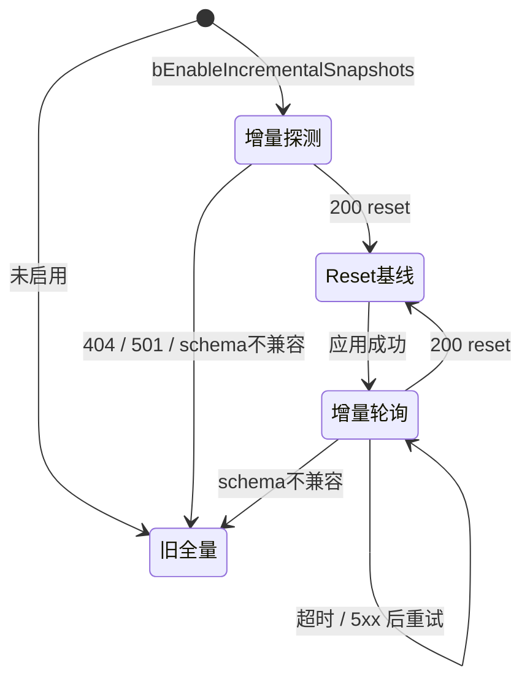

# OntoTwin 4.1 增量快照同步接口规范（API）

> 状态：已确认，进入开发  
> 协议版本：`snapshot_delta_v1`  
> 日期：2026-07-24  
> 适用范围：OntoTwin 后端与 `OntoTwinSync` UE 插件

---

## 1. 设计原则

1. 旧接口保持不变，新协议使用独立路由。
2. cursor 不透明，客户端只保存和回传。
3. 缺席表示不变，删除必须显式表达。
4. 首次连接和异常恢复使用 reset 全量基线。
5. 增量按接口对象分块，不做任意深度 JSON Merge Patch。
6. ProjectStore 持久化结构不增加 revision 字段。

---

## 2. 接口概览

### 2.1 兼容全量接口

```http
GET /api/v2/state/snapshots?scene=<scene_id>
```

响应继续是快照数组：

```json
[
  {
    "instanceId": "machine_01",
    "interfaces": {}
  }
]
```

该路由不得改成信封对象。

### 2.2 增量接口

```http
GET /api/v2/state/snapshot_changes?scene=<scene_id>&cursor=<opaque_cursor>
Accept: application/json
X-OntoTwin-UE-Project-Id: <project_id>
X-OntoTwin-UE-Project-Name: <project_name>
```

参数：

| 参数 | 必填 | 说明 |
|---|---|---|
| `scene` | 否 | 与旧接口一致；`zone` 作为兼容别名 |
| `cursor` | 否 | 上一次成功响应返回的不透明游标；首次请求不传 |

---

## 3. 通用响应信封

```json
{
  "schemaVersion": "snapshot_delta_v1",
  "mode": "delta",
  "streamId": "6e81e82f8b2a4efb",
  "revision": 42,
  "cursor": "6e81e82f8b2a4efb:42",
  "upserts": [],
  "deletedIds": [],
  "resetReason": null,
  "serverTime": 1784880000.125,
  "stats": {
    "instanceCount": 228,
    "upsertCount": 0,
    "deletedCount": 0
  }
}
```

字段：

| 字段 | 类型 | 说明 |
|---|---|---|
| `schemaVersion` | string | 固定为 `snapshot_delta_v1` |
| `mode` | string | `reset` 或 `delta` |
| `streamId` | string | 当前服务端同步流标识 |
| `revision` | integer | 当前流内单调递增版本 |
| `cursor` | string | 客户端下一轮原样回传 |
| `upserts` | array | 新实例完整快照或已有实例接口级增量 |
| `deletedIds` | string[] | 明确删除的实例 ID |
| `resetReason` | string/null | reset 原因 |
| `serverTime` | number | Unix 秒，仅诊断，不参与变化判断 |
| `stats` | object | 响应统计 |

客户端只有在完整验证并成功应用响应后才能替换本地 cursor。

---

## 4. Reset 响应

以下情况返回 `mode=reset`：

- 请求未携带 cursor；
- cursor 格式错误；
- streamId 不匹配；
- revision 超前；
- revision 已超出服务端历史保留范围；
- 服务重启；
- 激活项目改变；
- `scene`/`zone` 范围改变；
- 检测到 v1 无法安全表达的结构删除。

示例：

```json
{
  "schemaVersion": "snapshot_delta_v1",
  "mode": "reset",
  "streamId": "6e81e82f8b2a4efb",
  "revision": 1,
  "cursor": "6e81e82f8b2a4efb:1",
  "upserts": [
    {
      "instanceId": "machine_01",
      "displayName": "加工中心 01",
      "interfaces": {
        "I3D_Representable": {
          "asset_id": "/Game/Factory/SM_Machine.SM_Machine",
          "is_visible": true,
          "render_parts": []
        },
        "I3D_Spatial": {
          "translation_x": 100.0,
          "translation_y": 200.0,
          "translation_z": 0.0,
          "rotation_x": 0.0,
          "rotation_y": 0.0,
          "rotation_z": 90.0,
          "scale_x": 1.0,
          "scale_y": 1.0,
          "scale_z": 1.0
        }
      }
    }
  ],
  "deletedIds": [],
  "resetReason": "missing_cursor",
  "serverTime": 1784880000.125,
  "stats": {
    "instanceCount": 1,
    "upsertCount": 1,
    "deletedCount": 0
  }
}
```

Reset 应用规则：

1. 对全部 `upserts` 执行创建或完整更新。
2. 收集响应中的全部 `instanceId`。
3. 销毁本地存在但基线未包含的实例。
4. 清理旧范围的增量状态。
5. 成功后保存新 cursor。

---

## 5. Delta 响应

### 5.1 无变化

```json
{
  "schemaVersion": "snapshot_delta_v1",
  "mode": "delta",
  "streamId": "6e81e82f8b2a4efb",
  "revision": 42,
  "cursor": "6e81e82f8b2a4efb:42",
  "upserts": [],
  "deletedIds": [],
  "resetReason": null,
  "serverTime": 1784880000.625,
  "stats": {
    "instanceCount": 228,
    "upsertCount": 0,
    "deletedCount": 0
  }
}
```

### 5.2 空间变化

```json
{
  "schemaVersion": "snapshot_delta_v1",
  "mode": "delta",
  "streamId": "6e81e82f8b2a4efb",
  "revision": 43,
  "cursor": "6e81e82f8b2a4efb:43",
  "upserts": [
    {
      "instanceId": "machine_01",
      "interfaces": {
        "I3D_Spatial": {
          "translation_x": 125.0,
          "translation_y": 200.0,
          "translation_z": 0.0,
          "rotation_x": 0.0,
          "rotation_y": 0.0,
          "rotation_z": 90.0,
          "scale_x": 1.0,
          "scale_y": 1.0,
          "scale_z": 1.0
        }
      }
    }
  ],
  "deletedIds": [],
  "resetReason": null,
  "serverTime": 1784880001.125,
  "stats": {
    "instanceCount": 228,
    "upsertCount": 1,
    "deletedCount": 0
  }
}
```

### 5.3 删除

```json
{
  "schemaVersion": "snapshot_delta_v1",
  "mode": "delta",
  "streamId": "6e81e82f8b2a4efb",
  "revision": 44,
  "cursor": "6e81e82f8b2a4efb:44",
  "upserts": [],
  "deletedIds": ["machine_01"],
  "resetReason": null,
  "serverTime": 1784880001.625,
  "stats": {
    "instanceCount": 227,
    "upsertCount": 0,
    "deletedCount": 1
  }
}
```

Delta 应用规则：

1. 先按 `deletedIds` 删除实例。
2. 再按 `upserts` 创建或更新实例。
3. delta 未提到的实例保持不变。
4. 同一响应不得同时在 `deletedIds` 和 `upserts` 中出现相同 ID。
5. 成功后保存 cursor。

---

## 6. Upsert 语义

### 6.1 新实例

新实例必须发送与旧全量接口等价的完整快照，至少包含：

- `instanceId`；
- `displayName`；
- `interfaces`；
- 创建所需的 `I3D_Representable` 和 `I3D_Spatial`（若类型已注入）。

### 6.2 已存在实例

已存在实例采用接口级增量：

- 顶层字段出现：替换该字段。
- 顶层字段缺失：保持不变。
- `interfaces.I3D_*` 出现：该接口对象是完整接口值，按现有 `Apply*FromSnapshot` 应用。
- 某接口缺失：该接口保持不变。
- 不允许在接口对象内部依赖任意深度 merge patch。

示例中只有 `I3D_Spatial` 变化时，不得附带未变化的 `I3D_Representable.render_parts`。

### 6.3 忽略字段

以下字段不进入增量脏判断：

- 响应生成时刻 `timestamp`；
- 仅为兼容或诊断重复携带的 `raw_state`。

reset 和新实例完整快照仍可包含这些字段。

### 6.4 结构删除

`snapshot_delta_v1` 不定义通用深层删除。接口集合减少、必要顶层字段被移除等结构性变化应旋转 streamId，并返回 reset。

---

## 7. Cursor 与历史

### 7.1 格式

当前实现可使用：

```text
<streamId>:<revision>
```

该格式仍视为不透明协议字段，客户端不得拆分依赖。

### 7.2 历史保留

- 服务端至少保留最近 128 个非空变化批次。
- 多个变化可以共享同一 revision，表示一次扫描批次。
- cursor 早于可恢复窗口时返回 reset，而不是返回不完整 delta。

### 7.3 聚合

客户端 cursor 落后多个 revision 时，服务端可聚合为最终状态：

- 多次 upsert 合并为最后一次 upsert；
- upsert 后删除只保留删除；
- 删除后重建只保留完整重建快照。

---

## 8. 状态变化检测

服务端变化检测必须基于真实实例状态，不得对序列化后的整个响应直接比较，因为快照中的当前时间会导致永久脏状态。

至少覆盖：

- `raw_state` 更新；
- `last_seen` 导致的 online/offline 转换；
- 实例创建与删除；
- render config 和 Overlay revision 变化；
- 对象类型配置或注入接口变化；
- display name、层级和分类元数据变化；
- zone/scene 成员变化。

服务端可以在内存中缓存上次完整实例快照和轻量变化令牌，不得把同步 revision 写入 ProjectStore。

---

## 9. 错误与回退

| 状态 | 含义 | UE 行为 |
|---|---|---|
| 200 + reset | 正常恢复 | 完整对账并保存 cursor |
| 200 + delta | 正常增量 | 应用显式变化并保存 cursor |
| 400 | 请求参数错误 | 记录错误；兼容性错误可回退全量 |
| 403 | UE 项目绑定不匹配 | 阻断同步，不回退绕过绑定 |
| 404/501 | 新接口不存在/未实现 | 当前会话回退旧全量接口 |
| 5xx | 服务暂时失败 | 保留 cursor，按现有策略重试 |
| 网络失败 | 无响应 | 保留 cursor，按现有策略重试 |
| 未知 schemaVersion | 客户端不支持 | 当前会话回退旧全量接口并告警 |

403 绝不能通过回退旧接口绕过；旧接口仍执行同样的绑定校验。

---

## 10. UE 客户端状态机



客户端配置：

```text
bEnableIncrementalSnapshots = true
```

该配置允许项目显式关闭。即使默认开启，新客户端也必须能在旧后端上自动回退。

---

## 11. 验收断言

1. 旧 `/snapshots` 始终返回数组。
2. 首次 `/snapshot_changes` 返回 reset。
3. 无变化轮询的 `upserts=[]` 且 `deletedIds=[]`。
4. 单实例空间更新不携带 `render_parts`。
5. delta 缺少 Overlay 不会清除客户端 Overlay。
6. 删除只影响 `deletedIds` 指定的实例。
7. 无效、过期或旧进程 cursor 返回 reset。
8. 403 不触发绕过式回退。
9. 404/501 触发会话级旧接口回退。
10. response 应用失败时客户端不推进 cursor。

