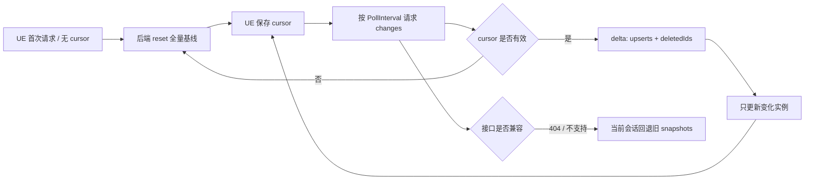

# OntoTwin 4.1 运行时同步与性能治理（PRD）

> 状态：已确认，进入开发  
> 主线：OntoTwin Nexus  
> 版本：4.1  
> 日期：2026-07-24  
> 基线：OntoTwin 3.7.1 正式宿主插件与现有 4.0.x 场景交互能力  
> 配套规范：《OntoTwin 4.1 增量快照同步接口规范（API）》

---

## 1. 背景

当前 UE `ATwinSceneManager` 默认每 0.5 秒请求一次：

```http
GET /api/v2/state/snapshots
```

后端每次重建并返回当前项目全部实例，UE 每次解析整个 JSON 数组，并对全部实例执行 `ApplySnapshot`。ZHHZ 当前基线为：

- 228 个孪生实例；
- 8068 个 `render_parts`；
- 紧凑全量 JSON 约 6.52 MB；
- 每秒轮询两次，理论响应流量约 13 MB/s；
- 只移除 `render_parts` 后约 0.37 MB，减少 94.3%；
- 只保留运行期动态数据后约 0.175 MB，减少 97.3%。

全量轮询造成周期性的网络传输、JSON 分配与解析、主线程状态应用和日志开销。MegaLights 解决局部灯光与阴影的 GPU 压力，但不处理这条 CPU/网络同步链路，因此两类优化必须并行治理。

---

## 2. 版本定位

4.1 是独立的“运行时同步与性能治理”主线，不归入 3.7 UI 信息面板，也不归入 4.0 人物漫游。

本版本首先交付增量快照协议与 UE 客户端支持，并为后续组件 Mobility、碰撞、阴影、分帧加载和 ISM/HISM 治理建立统一性能基线。

---

## 3. 目标与非目标

### 3.1 目标

1. 保留现有全量快照接口和所有旧客户端行为。
2. 新增带不透明游标的增量快照接口。
3. 首次连接、服务重启、项目切换和游标失效时自动恢复全量基线。
4. 正常轮询只返回发生有效变化的实例接口，不重复发送 `render_parts`。
5. 删除实例使用显式 `deletedIds`，不再通过“本轮缺席”推断。
6. UE 只对 `upserts` 中的实例调用状态应用逻辑。
7. F8 Runtime Editor、Overlay、模型热更换、复合模型、新增和删除保持功能一致。
8. 增量接口不可用或响应不兼容时，UE 当前会话自动回退旧全量接口。
9. 源插件先在 `digital_twin_aircraft` 实现和验证，再受控同步到 ZHHZ 正式宿主。

### 3.2 非目标

- 不修改 ProjectStore JSON 或 PostgreSQL 持久化结构。
- 不改变现有项目 `schema_version`。
- 不删除或改变 `/api/v2/state/snapshots` 的响应格式。
- 不改变 F8 的选择、拖动、旋转、吸附和保存交互。
- 不在本版本引入消息队列、外部缓存或新 Python 依赖。
- 不把 AGV WebSocket 状态流并入本协议。
- 不在本版本实施 Static/Movable 切换、ISM/HISM 或灯光自动裁剪。

---

## 4. 核心用户价值

1. 运行期间不再每 0.5 秒解析和应用数 MB 的重复数据。
2. 大型复合模型场景的周期性卡顿明显减少。
3. 弱网络或 Pixel Streaming 场景中的带宽占用降低。
4. 后端不再为没有变化的实例重复序列化大型 `render_parts`。
5. 网络闪断或服务重启后可以自动恢复，不要求用户重启 UE。

---

## 5. 总体架构



### 5.1 双接口策略

- 旧接口：`GET /api/v2/state/snapshots`，永久保持全量数组语义。
- 新接口：`GET /api/v2/state/snapshot_changes`，返回 `snapshot_delta_v1` 信封。
- 两个接口使用相同的 UE Project 绑定校验和 `scene`/`zone` 过滤规则。

### 5.2 游标策略

- cursor 是服务端生成的不透明字符串，客户端不得解析或自行递增。
- cursor 同时绑定服务进程代次、激活项目和场景过滤范围。
- 服务重启、项目切换、场景切换或历史过期时，服务返回 `mode=reset`。
- reset 响应本身包含完整当前基线和新 cursor。

### 5.3 变化粒度

- 新实例：发送完整快照。
- 已存在实例：按完整接口对象发送变化，例如完整 `I3D_Spatial` 或完整 `I3D_Overlay`。
- 未变化接口不出现，字段缺失表示“保持现状”。
- `raw_state` 和响应生成时间不参与变化判断。
- 接口被移除等结构性变化在 v1 中触发 reset，避免部分清理语义产生歧义。

---

## 6. 功能需求

### FR-1：全量兼容

旧 `/api/v2/state/snapshots` 的路由、请求参数、绑定校验和顶层 JSON 数组格式不得改变。现有插件和外部脚本无须升级即可继续工作。

### FR-2：首次基线

UE 开启增量模式且本地无 cursor 时，请求新接口。后端返回：

- `mode=reset`；
- 当前范围全部实例的完整快照；
- 当前 cursor；
- 空的 `deletedIds`。

UE 应以该响应对本地注册表执行完整对账，允许销毁基线中不存在的旧实例。

### FR-3：增量更新

cursor 有效时，后端只返回该 cursor 之后的最终有效变化：

- 同一实例多次更新只需要返回最新状态；
- 更新后又删除时只返回删除；
- 删除后以同 ID 重新创建时返回完整新实例；
- 无变化时返回空 `upserts` 和空 `deletedIds`，仍返回当前 cursor。

### FR-4：显式删除

只有 reset 全量对账或 `deletedIds` 才能触发实例销毁。delta 响应中未出现的实例必须保持不变。

### FR-5：结构变化

以下情况必须发送完整实例或触发 reset：

- 新增实例；
- `render_parts` 或 `assembly_signature` 改变；
- 资产路径或注入接口集合改变；
- 接口被移除；
- 项目或场景范围改变。

### FR-6：F8 Runtime Editor

- F8 选择、移动、旋转、取消和保存流程保持不变。
- writeback 成功后仍立即应用响应中的快照。
- 下一轮增量必须包含该写回的最终后端状态，重复应用应幂等。
- 较旧的游标响应不得造成持续性位置回滚。

### FR-7：Overlay

- delta 中没有 `I3D_Overlay` 表示 Overlay 未变化，不得清空。
- Overlay 配置改变时发送完整 `I3D_Overlay` 对象。
- Overlay 接口被移除时 v1 使用 reset 恢复一致状态。

### FR-8：在线状态

`online` 从 true 变 false 或从 false 变 true 均属于有效变化，即使没有新的业务属性写入。

### FR-9：自动回退

UE 增量模式遇到以下情况时，当前会话回退旧全量轮询：

- 新接口返回 404 或 501；
- `schemaVersion` 不受支持；
- 响应缺少 reset/delta 所需核心字段。

普通超时或 5xx 按现有失败重试处理，不立即永久回退。

### FR-10：可观测性

后端响应至少提供：

- 当前 revision；
- upsert 数量；
- delete 数量；
- 当前范围实例总数；
- reset 原因（如有）。

UE 日志至少记录：

- 首次 reset；
- 每次非空 delta 的 revision 和数量；
- cursor 失效恢复；
- 回退旧接口及原因。

空增量不得每 0.5 秒输出普通 Log。

---

## 7. 性能预算

以 ZHHZ 228 实例、8068 `render_parts` 为验收基线：

| 指标 | 当前基线 | 4.1 目标 |
|---|---:|---:|
| 常态单次响应 | 约 6.52 MB | 无变化时小于 2 KB |
| 全部实例仅动态字段响应 | 不适用 | 小于 0.40 MB |
| 常态带宽 | 约 13 MB/s | 降低至少 90% |
| 无变化实例 `ApplySnapshot` | 每轮约 228 次 | 0 次 |
| `render_parts` 常态重传 | 每轮 8068 项 | 0 项 |

首次 reset 仍允许发送完整基线。本版本不把首次模型加载耗时纳入“常态轮询”指标。

---

## 8. 兼容与安全边界

1. 新后端必须兼容旧 UE。
2. 新 UE 必须兼容旧后端，并能自动回退。
3. `scene`/`zone`、UE Project ID 和激活项目共同构成同步范围，cursor 不得跨范围复用。
4. delta 缺席不表示删除，也不表示清空字段。
5. 服务端生成的当前时间不得导致所有实例被判定为变化。
6. revision 只存在内存，不写入 ProjectStore，因此不引入数据迁移。
7. 后端重启后旧 cursor 必须触发 reset，不得猜测续接。

---

## 9. 发布与同步流程

1. 在 `D:\tmp\digital_twin_aircraft` 完成文档和代码。
2. 运行后端单元测试、API 测试和 Python 编译检查。
3. 编译源插件或至少完成目标 UnrealBuildTool 编译。
4. 使用源插件对兼容后端执行 reset、delta、删除、重连和 F8 回归。
5. 备份 ZHHZ 当前插件。
6. 增量同步到 `D:\ZHHZ\ZHHZ\Plugins\OntoTwinSync`。
7. 校验源插件与 ZHHZ 插件的受控文件哈希一致。
8. 重新编译并打包 ZHHZ；旧打包程序不受源码变化影响。

---

## 10. 验收场景

### 10.1 后端

- 无 cursor 返回 reset 全量。
- 有效 cursor 且无变化返回空 delta。
- 修改一个实例位置只返回该实例的 `I3D_Spatial`。
- 修改 Overlay 只返回该实例的 `I3D_Overlay`。
- 新实例返回完整快照。
- 删除实例只返回其 ID。
- 重启或错误 cursor 返回 reset。
- 历史过期返回 reset。
- 旧全量接口响应保持数组。

### 10.2 UE

- reset 后场景实例数量与后端一致。
- 空 delta 不调用任何实例更新。
- delta 缺少 Overlay 时现有面板不消失。
- 删除一个实例不会误删其他实例。
- F8 保存后位置保持且能同步给后续客户端。
- 新接口 404 时自动回退全量。
- 后端重启后自动 reset，无须重启 UE。
- 场景切换后不复用旧 cursor。

### 10.3 性能

- 记录同一场景在全量和增量模式下的响应大小。
- 使用 UE Insights 或 `stat game` 对比轮询帧尖峰。
- 使用 `stat unit`/GPU Profile 将同步收益与 MegaLights GPU 收益分开记录。

---

## 11. 完成定义

满足以下条件才可标记 4.1 第一阶段完成：

1. PRD 与 API 规范已落库。
2. 旧全量接口回归通过。
3. 新增、更新、删除、reset、游标过期和回退测试通过。
4. UE 源插件编译通过。
5. ZHHZ 插件同步完成且源码哈希一致。
6. ZHHZ Development 包完成至少一次真实窗口功能回归。
7. 性能结果达到第 7 节预算，或对未达到项给出可复现证据和后续计划。

