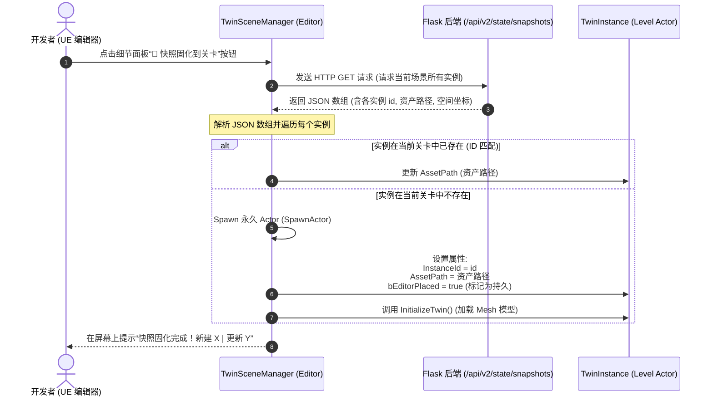

# UE 5「快照固化到关卡」功能与数据流向总结

本文档详细梳理了 **OntoTwin** 数字孪生系统中，在 Unreal Engine (UE) 编辑器中配置的**“快照固化到关卡”**（Snapshot to Level / 固化到快照）功能的整体架构、详细数据流向以及核心代码机制。

---

## 1. 功能概述

**“快照固化到关卡”**是 UE 插件 [OntoTwinSync](file:///d:/tmp/digital_twin_aircraft/ue_project/Plugins/OntoTwinSync/README.md) 提供的一项核心编辑器功能。

* **核心目的**：允许开发人员在 **UE 编辑器非运行（PIE）状态下**，一键拉取 Flask 后端当前存在的全部孪生实例数据，在当前关卡中生成**持久化 Actor**（即物理保存在 `.umap` 关卡文件中的 Actor）。
* **解决的痛点**：
  1. 避免每次 Play 运行都从零开始动态 Spawn 所有模型带来的启动开销；
  2. 允许美术和关卡设计师直接在编辑器中选中这些固化后的 Actor 进行手动微调（如调整材质、灯光或进行位置校正）；
  3. 支持“本地空间锁”机制，防止编辑器的手工微调结果在运行时被后端数据重新覆盖。

---

## 2. 核心架构与关键组件

该功能跨越了后端与 UE 插件的多个组件：

1. **Flask 后端 API** ([app.py](file:///d:/tmp/digital_twin_aircraft/backend/app.py))：
   * 暴露 `/api/v2/state/snapshots` 接口，提供全局或特定场景的实例状态快照。
2. **UE 孪生管理器** ([TwinSceneManager.h](file:///d:/tmp/digital_twin_aircraft/ue_project/Plugins/OntoTwinSync/Source/OntoTwinSync/Public/TwinSceneManager.h) / [TwinSceneManager.cpp](file:///d:/tmp/digital_twin_aircraft/ue_project/Plugins/OntoTwinSync/Source/OntoTwinSync/Private/TwinSceneManager.cpp))：
   * 挂载在关卡中的全局单例 Actor。
   * 提供编辑器按钮 `SnapshotToLevel()`，负责发起网络请求和 Actor 铸造/更新。
3. **UE 孪生实例实体** ([TwinInstance.h](file:///d:/tmp/digital_twin_aircraft/ue_project/Plugins/OntoTwinSync/Source/OntoTwinSync/Public/TwinInstance.h) / [TwinInstance.cpp](file:///d:/tmp/digital_twin_aircraft/ue_project/Plugins/OntoTwinSync/Source/OntoTwinSync/Private/TwinInstance.cpp))：
   * 数字孪生体在关卡中的渲染载体，承载 StaticMesh、3D 标签、动作和特效。

---

## 3. 详细数据流向

整个固化与运行过程可分为两个主要阶段：**【编辑器阶段：快照固化】** 和 **【运行阶段：接管与轮询驱动】**。

### 阶段一：编辑器阶段 - 快照固化（数据下行）



#### 📌 数据结构解析
当 UE 请求 `/api/v2/state/snapshots` 时，后端返回的单个快照对象示例如下：
```json
{
  "instanceId": "crane_01",
  "objectTypeRid": "ot_crane",
  "objectTypeName": "桥式起重机",
  "interfaces": {
    "I3D_Representable": {
      "asset_id": "crane.glb",       // 对应 UE 资产路径或磁盘文件名
      "file_number": "123456",
      "is_visible": true
    },
    "I3D_Spatial": {
      "translation_x": 1000.0,      // cm (UE 坐标系)
      "translation_y": 500.0,
      "translation_z": 0.0,
      "rotation_x": 0.0,            // Roll
      "rotation_y": 0.0,            // Pitch
      "rotation_z": 90.0,           // Yaw
      "scale_x": 1.0,
      "scale_y": 1.0,
      "scale_z": 1.0
    }
  }
}
```
* **UE 解析逻辑**：
  * 从 `I3D_Representable.asset_id` 提取资产路径，写入 `ATwinInstance::AssetPath`。
  * 若是新建 Actor，则默认在 `FVector::ZeroVector` 位置 Spawn，随后通过调用 `InitializeTwin` 加载对应网格体。

---

### 阶段二：运行阶段 - 接管与轮询（运行时数据同步）

当在 UE 中点击 **Play (PIE)** 运行时，数据流向转为**定时轮询同步**。

```mermaid
graph TD
    A[点击 Play 运行] --> B[TwinSceneManager::BeginPlay]
    B --> C[调用 TakeOverExistingInstances 扫描关卡已有的 TwinInstance]
    C --> D{找到同 ID 实例?}
    D -- 是 --> E[将该 Actor 注册到内存注册表 InstanceRegistry 并绑定接管]
    D -- 否 --> F[忽略 (等待轮询时动态 Spawn)]
    
    B --> G[启动定时轮询: 每 0.5s 发送 HTTP GET 获取快照]
    G --> H[OnPollResponse 响应回调]
    H --> I[遍历后端快照列表]
    I --> J{实例在注册表中?}
    
    J -- 是 --> K[调用 ATwinInstance::ApplySnapshot]
    K --> L{bLocalOverrideLock 锁定?}
    L -- 是 (True) --> M[忽略后端空间数据, 保留编辑器修改]
    L -- 否 (False) --> N[应用空间位移/旋转/缩放]
    
    J -- 否 --> O[运行时动态 Spawn 新实例并加入注册表]
    
    H --> P[检测已销毁实例]
    P --> Q{是编辑器固化Actor (bEditorPlaced == true)?}
    Q -- 是 --> R[仅从注册表移除, 停止更新 (保留关卡中的 Actor)]
    Q -- 否 --> S[调用 Actor->Destroy() 销毁]
```

---

## 4. 关键控制机制说明

### ① 编辑器预置接管 (Runtime Takeover)
在运行开始时，`TwinSceneManager` 不会重复生成固化好的 Actor：
* 在 `ATwinSceneManager::BeginPlay` 中，调用 `TakeOverExistingInstances()`：
  ```cpp
  for (TActorIterator<ATwinInstance> It(World); It; ++It) {
      // 扫描关卡中所有存活的 ATwinInstance 实例
      // 提取其 InstanceId 并填充到 InstanceRegistry 注册表
  }
  ```
* 轮询到该 `InstanceId` 时，直接驱动现有的 Actor，不进行二次创建。

### ② 空间变换锁定 (Local Override Lock)
对于已经在编辑器中手动校准好空间物理位置的 Actor，我们可以开启锁定：
* `ATwinInstance` 包含属性 `bLocalOverrideLock`（在 UE 细节面板显示为 **“🔒 锁定本地空间变换”**）。
* 在应用快照时 ([TwinInstance.cpp](file:///d:/tmp/digital_twin_aircraft/ue_project/Plugins/OntoTwinSync/Source/OntoTwinSync/Private/TwinInstance.cpp#L620-L626))：
  ```cpp
  void ATwinInstance::ApplySpatialFromSnapshot(const TSharedPtr<FJsonObject>& SpatialObj) {
      if (bLocalOverrideLock) {
          return; // 🔒 锁定模式下直接拦截，忽略后端空间变换数据
      }
      // ... 正常解析并 SetActorLocation/Rotation
  }
  ```

### ③ 安全卸载与保留
* **非运行时 Spawn 保护**：在 `ATwinSceneManager::EndPlay()` 中，只会销毁在运行时动态生成的 Actor，而标记了 `bEditorPlaced == true`（即编辑器固化的）Actor 将完好保存在关卡中，不会被 Destroy。
* **物理卸载**：当后端下发 `is_visible: false`（在 `I3D_Representable` 接口中）时，表示实例被逻辑卸载。UE 会执行 `MeshComponent->SetStaticMesh(nullptr)` 以释放 GPU/内存显存，而不是单纯隐藏 Actor，符合高性能渲染规范。
